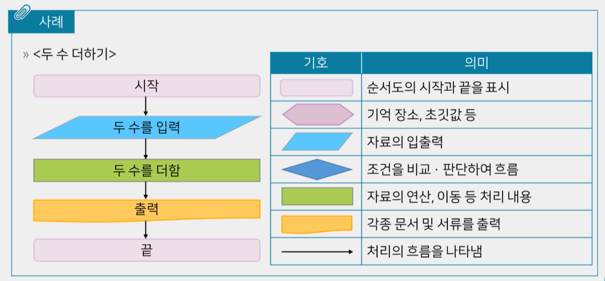

### 정의와 종류

> 문제해결을 하기 위해 논리적인 알고리즘을 코드로 구현한 것

프로그래밍 언어

- 저급언어

#### 기계가 잘 알아들을 수 있도록 작성

- 실행 속도가 빠름

:::info 기계어

- 0과 1의 형태로 작성된 언어
- 프로그래밍 언어 작성을 위해 전문적인 지식 필요
- 프로그램 유지보수가 어려움

:::

:::error 어셈블리어

- 기호코드를 통해 기계와 1대1로 대응
- 어셈블러를 통해 번역

:::

- 고급언어
  - 사람이 잘 알아들을 수 있도록 작성된 언어
  - 번역과정이 필요함
  - 다양한 종류 언어가 있음
    ex) FORTRAN, COBAL, ALGOL, LISP, PASCAL, BASIC, C, C++, JAVA, Python...

### 알고리즘

> 프로그램 설계를 위해 문제해결방법을 순차적을 제시한 것

#### 자연어

일상생활에서 우리가 사용하는 언어를 통해 알고리즘을 표현

> <두 수 더하기>
> 두 수를 키보드로 입력받기
> 두 수를 더하기
> 출력하기

#### 순서도

약속된 도형과 기호를 사옹하여 문제해결과정을 표현



#### 의사코드 (pseudo code)

의사코드를 사용하여 문제해결과정을 표현함

```
<두 수 더하기>
BEGIN
INPUT A,B;
ADD A,B;
PRINT A,B
END
```

### C언어의 기본 구성 요소

- 주석
- 변수
- 상수
- 입출력 함수
- 연산자

```c
#include <stdio.h> // 헤더파일
int main() // main 함수
/* 여러 줄 주석 */
// 한 줄 주석

const int i = 1; // (자료형) 상수
float j; // (자료형) 변수

scanf("%d%f", &i, &j); // 입출력 함수
return 0;
```
