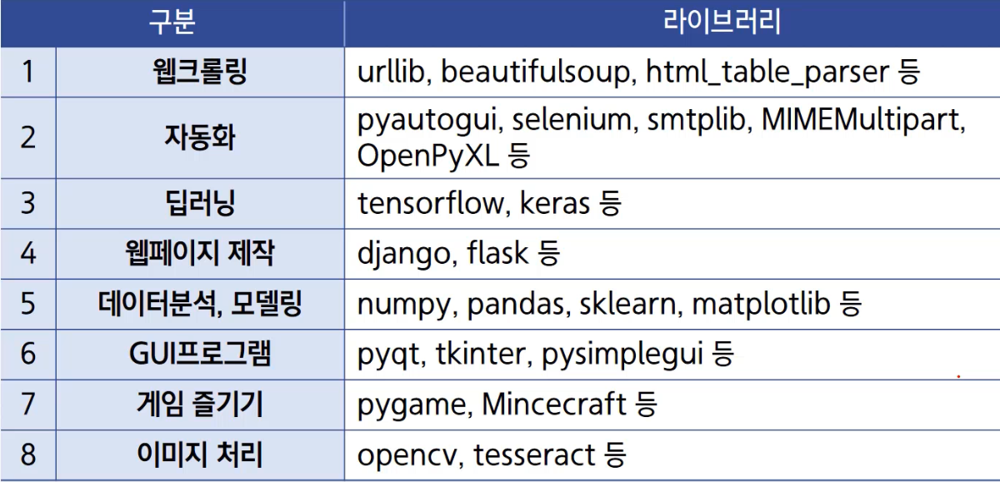

### 프로그래밍 언어

> 프로그램: 컴퓨터가 수행할 명령어를 적어놓은 문서
> 프로그램 언어 : 프로그램을 작성하는 도구

프로그래밍 언어의 종류 및 처리 방법

종류

- 고급 언어 : 인간에 가까운 언어  
   C, C++, Python, JAVA
- 저급 언어 : 기계에 가까운 언어  
   기계어, 어셈블리어

처리 방법

- 컴파일 : 많은 코드를 한꺼번에 실행
- 인터프리터 언어 : 코드 한 줄 한 줄 실행

### 파이썬

귀도 반 로섬이 1991년에 만든 대화형 프로그래밍 언어

- 대화형 프로그래밍 언어는 [ 컴파일, 인터프리터 ] 둘 다 가능
- 객체 지향 언어의 한 종류 - 클래스
- 타 언어보다 코드르 쉽게 작성하고, 바로 실행하여 결과를 빠르게 확인 가능
- 인공지능, 데이터 분석 등을 위한 다양한 라이브러리 존재

> 파이썬이 유용한 이유
>
> - 인공지능과 데이터 과학 분야의 핵심 언어로 사용됨
> - 최근 발표한 TIOBE 지수에 의하면 파이썬이 가장 인기있는 언어임
>   - TIOBE: 프로그래밍 언어의 인기를 나타내는 지표 (한 달에 한 번씩 업데이트)

[ 간결한 코드, 직관적인 코드, 쉬운 문법(구문 설탕), 풍부한 라이브러리 ]

### IDE

통합 개발 환경  
 코드작성, 테스트, 디버깅까지 통합적인 개발을 위한 환경 제공

- Pycharm
- VSC
- Spyder
- Atom
- **IDLE**
- Anaconda
- jupyter notebook
- Google Colab 등

실습 을 위해서는 **IDLE** 를 사용 ( 파이썬 제공 IDE )

### 파이썬 라이브러리

👉🏻 [파이썬 표준 라이브러리](https://docs.python.org/ko/3/library/index.html)
