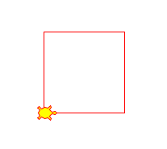
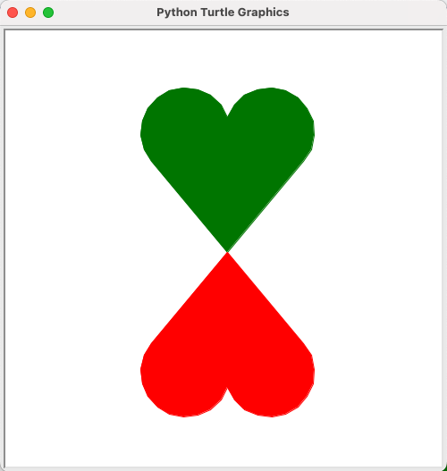
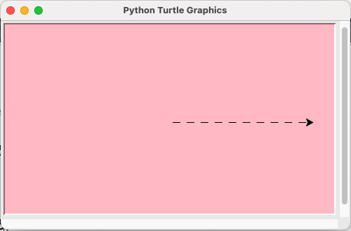
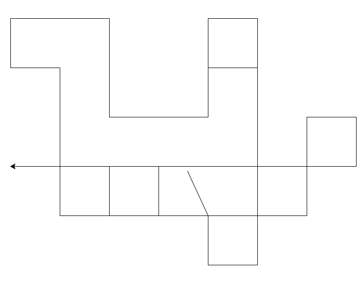

## turtle module 복습

### 개요

> 터틀 그래픽을 사용하는데 필요한 모듈

<br/ >

:::info 터틀 그래픽

터틀(거북이)를 이용하여 시각화하는 내용

- 파이썬 설치 시 자동으로 설치됨
- `import turtle` 후 turtle.함수이름 으로 호출하여 사용

:::

<br/ >

```py
# turtle 움직임을 위한 객체
import turtle as t
t. shape("turtle")
```

<br/ >

```py
# screen 설정을 위한 객체
import turtle as t
screen = t.Screen()
screen.bgColor("lightgreen")
```

<br/ >

### [turtle module 사용법 바로가기](02_02.md#기본-문법)

<br/ >

### 활용 예제

<br/ >

```py
from turtle import *

shape("turtle")
color("red")
fillcolor("yellow")

for i in range(4):
forward(100)
left(90)
```

<details>
<summary>실행 결과</summary>



</details>

<br/ >

```py
# 초록 하트, 빨간 하트
import turtle as t

t.setup(500, 500)
t.color("green")
t.begin_fill() # 채우기 시작
t.left(50)
t.forward(133)
t.circle(50, 200)
t.right(140)
t.circle(50, 200)
t.forward(133)
t.end_fill() # 채우기 끝

t.setup(500,500)
t.color("red")
t.begin_fill() # 채우기 시작
t.right(80)
t.forward(133)
t.circle(50, 200)
t.right(140)
t.circle(50, 200)
t.forward(133)
t.end_fill() # 채우기 끝
t.ht() # 터틀 숨기기
```

<details>
<summary>실행 결과</summary>



</details>

<br/ >

```py
import turtle as t
import time

t.setup(500, 300)

s = t.Screen()
s.bgcolor("pink")

for i in range(10):
    t.fd(10)
    time.sleep(0.3)
    t.penup()
    t.fd(10)
    t.pendown()


```

<details>
<summary>실행 결과</summary>



</details>

<br/ >

### 이벤트 사용하기

- 키에 의해 함수 내용 실행하기

  `turtle.onkeypress(함수, "키이름")`

- 키 입력모드 시 사용 하는 중요 함수

  ```py
  screen = t.getscreen() # 스크린을 사용할 수 있도록 함 (스크린 객체 가져오기)
  screen.listen() # 스크린이 이벤트를 감지하고 반응하도록 설정
  screen.mainloop() # 스크린 유지
  ```

- 예제

  ```py
  import turtle as t

  # 함수 프로토타입 선언
  def left():
      pass

  def right():
      pass

  def forwd():
      pass

  def backwd():
      pass

  screen = t.getscreen() # 스크린 객체 가져오기

  screen.onkeypress(left, "Left")
  screen.onkeypress(right, "Right")
  screen.onkeypress(forwd, "Up")
  screen.onkeypress(backwd, "Down")

  screen.listen() # 스크린 이벤트 감지

  # 함수 정의
  def left():
      t.left(90)
      t.fd(100)

  def right():
      t.right(90)
      t.fd(100)

  def forwd():
      t.fd(100)

  def backwd():
      t.bk(100)
  ```

  <details>
  <summary>실행 결과</summary>

  

  </details>

<br/ >

---

<br/ >

## 알아두면 좋은 고급 문법

<br/ >

### Lambda

> - 일회성 함수
> - 익명 함수라고도 부르며 이름 없이 **한번만 사용** 하거나 함수를 인자로 전달할 때 사용
> - 사용 방법: `lambda` 인자: 표현식

<br/ >

```py
def add(x, y):
  return x + y

sum = add(1, 2) # 3
```

위 코드를 lambda 로 변환 시

```py
add=lambda x, y: x + y

sum = add(3, 4) # 7
```

<br/ >

### map(함수, 처리할 리스트)

- 처리할 리스트의 값들을 하나씩 함수에 넣어 결과를 한꺼번에 출력

<br/ >

```py
numbers = [1, 2, 3, 4]
numbers2 = map(lambda x: x * 2, numbers)
print(list(numbers2))
```

<details>
<summary>실행 결과</summary>
```text
[2, 4, 6, 8]
```
</details>

<br/ >

### in

- 특정값이 리스트에 있는지 확인
- 결과는 true or false

<br/ >

```py
a = [1, 2, 3, 4]
value = 3
result = value in a
print(result)
```

<details>
<summary>실행 결과</summary>
```text
True
```
</details>

<br/ >

---

<br/ >
