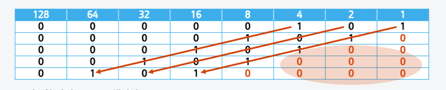
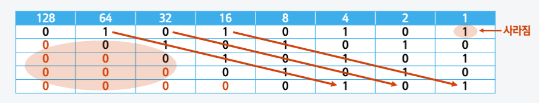

## 서식 문자

- [%s](#s-서식-문자)
- [%d](#d-서식-문자)
- [%f](#f-서식-문자)
- [%d 와 %f 비교](#d-와-f-비교)

  <br/ >

### %s 서식 문자

> 문자열을 표시하는 서식 문자

```py
temp = "I'm hyoloui"
print("%s" %temp)
```

<details>
<summary>실행 결과</summary>
```bash
I'm hyoloui
```
</details>

<br/ >

### %d 서식 문자

> 정수형을 표시하는 서식 문자

```py
money = 319282

ohManWon = money // 50000

print("5만원: %d 장" %ohManWon )
```

<details>
<summary>실행 결과</summary>
```bash
5만원: 6 장
```
</details>

<br/ >

### %f 서식 문자

> 실수형을 표시하는 서식 문자

:::info 연산자

- //: 몫
- %: 나머지
- /: 나누기

:::

```py
money = 319282

ohManWon = money / 50000 # / 연산자 사용

print("5만원: %f 장" %ohManWon )
```

<details>
<summary>실행 결과</summary>
```bash
5만원: 6.385640 장
```
</details>

<br/ >

### %d 와 %f 비교

- print 문 비교

  ```py
  money = 319282

  ohManWon = money % 50000 # % 연산자 사용

  print("잔돈: %d 원" %ohManWon )
  print("잔돈: %f 원" %ohManWon )
  ```

  <details>
  <summary>실행 결과</summary>
  ```bash
  잔돈: 19282 원
  잔돈: 19282.000000 원
  ```
  </details>

<br/ >

- 정수와 실수의 + 연산

  ```py
  num1 = 23
  num2 = 3.4
  print(num1 + num2)
  ```

  <details>
  <summary>실행 결과</summary>
  ```bash
  26.4
  ```
  </details>

<br/ >

---

## 자리이동 연산자

<br/ >

### `<<` 왼쪽으로 자리 이동 연산

> 2를 곱한 것과 같은 결과



:::warning
이동한 자리는 0으로 채워짐
:::

```py
print(5 << 0)
print(5 << 1)
print(5 << 2)
print(5 << 3)
print(5 << 4)
```

<details>
<summary>실행 결과</summary>
```bash
5
10
20
40
80
```
</details>

<br/ >

### `>>` 오른쪽으로 자리 이동 연산

> 2로 나눈 몫이 됨



- 오른쪽 끝자리가 1인 경우 값을 잃어버림

:::warning
이동한 자리는 0으로 채워짐
:::

```py
print(85 >> 0)
print(85 >> 1)
print(85 >> 2)
print(85 >> 3)
print(85 >> 4)
```

<details>
<summary>실행 결과</summary>
```bash
85
42
21
10
5
```
</details>

<br/ >

---

## 관계 연산자

> 두 변수가 같으면 참을 반환하고, 다르면 거짓을 반환하는 연산자

- = : 대입 연산자
- == : 관계 연산자 (같다)
- != : 관겨 연산자 (다르다)

<br/ >

```py
a = 10; b = 20;

if (a == b):
  print('같다.')
else :
  print('다르다.')
```

<details>
<summary>실행 결과</summary>
```bash
다르다.
```
</details>

```py
a = 10; b = 10;

if (a == b):
  print('같다.')
else :
  print('다르다.')
```

<details>
<summary>실행 결과</summary>
```bash
같다.
```
</details>

```py
a = 10; b = 10.0;

if (a == b):
  print('같다.')
else :
  print('다르다.')
```

<details>
<summary>실행 결과</summary>
```bash
같다.
```
</details>

```py
a = 10; b = 10.0;

if (a != b):
  print('다르다.')
else :
  print('같다.')
```

<details>
<summary>실행 결과</summary>
```bash
다르다.
```
</details>
