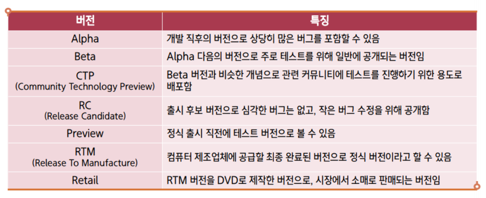

### DBMS (Database Management System)

- DBMS는 데이터베이스를 관리, 운영하는 역할
- 데이터 베이스는 여러 사용자나 응용프로그램이 공유하고 동시에 접근이 가능해야 함
- SQL Server는 '데이터베이스'를 자료가 저장되는 디스크 공간(주로 파일로 구성됨)으로 취급

#### 특징

- 무결성 (integrity)
- 독립성
- 보안 (security)
- 중복 최소화
- 응용프로그램 제작 및 수정 용이
- 안전성 향상

#### 분류

1. 계층형
   1. 트리구조
2. 망형
   1. 계층형구조랑 비슷해보이나, 하위 node간 서로 연결되어있음
3. ⭐ 관계형 ⭐ (RDBMS)
   1. table
   2. row(record) : 행 데이터
   3. col(field) : 열 데이터

---

### SQL (Structured Query Language)

- 구조적 질의 언어
- RDBMS에서 사용되는 언어

#### 특징

- DBMS제작사와 독립적
- 표준형을 지키며 + @ (= 모든 DBMS의 SQL문이 모두 같진 않음)
- 대화식 언어
- **분산형 클라이언트 / 서버 구조** → 추후 개념 자세히 다룰 예정

  

---

### 가상머신(Virtual Machine)

#### 가상머신 소개

현재 사용하는 운영체제를 변경 없이 그대로 사용하면서,  
안에 가상의 컴퓨터를 만들고, 그안에 또 다른 운영체제(게스트 OS)를 설치/운영할 수 있도록 제작된 소프트웨어

1. 호스트 운영체제(OS)
   실제 컴퓨터에 설치되어 있는 운영체제 - `1대`
2. 게스트 운영체제(OS)
   호스트 운영체제 외에 가상머신에 설치한 운영체제 - `여러대`

> 멀티부팅(Multi-Booting)과는 개념이 다름

#### 가상머신과 가상머신 소프트웨어의 활용

- 가상머신을 쉽게 **가짜 컴퓨터**로 생각해도 좋음
- 원래 CPU, RAM, 하드디스크 등이 이쓴ㄴ 진짜 컴퓨터에만 운영체제를 설치할 수 있음
- 가상머신 프로그램이 소프트웨어적으로 가짜[CPU, RAM, 하드디스크] 등을 가진 가짜 컴퓨터(가상머신)을 만들어서  
   그 안에 운영체제를 설치할 수 있게 해주는 것임
- 운영체제 모두 자신이 설치되는 곳이 가짜 컴퓨터인지, 진짜 컴퓨터인지 구분할 능력이 없기 때문에  
  가짜 진짜 관계 없이 충실히 설치되고 운영됨

---

> - **VMware Workstation Pro**는 **Windows**와 **Linux** 운영체제용으로 설계된 가상화 소프트웨어로, **Mac**에서는 지원 X
> - Mac에서 사용할 수 있는 VMware의 대체 제품인 **VMware Fusion**이 있음.
> - **VMware Fusion**은 Mac용으로 개발된 가상화 소프트웨어로, macOS에서 Windows나 Linux 등 다른 운영체제를 가상으로 실행할 수 있게 함.
> - Mac에서 VMware Workstation Pro를 직접 설치할 수는 없지만, **VMware Fusion**을 사용하면 비슷한 기능을 사용할 수 있음.
