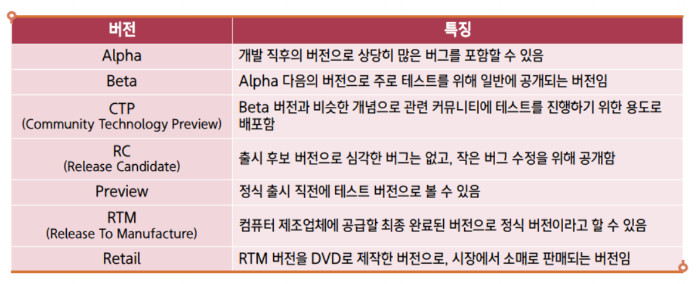

### DBMS (Database Management System)

#### 특징

- 무결성 (integrity)
- 독립성
- 보안 (security)
- 중복 최소화
- 응용프로그램 제작 및 수정 용이
- 안전성 향상

#### 분류

1. 계층형
   1. 트리구조
2. 망형
   1. 계층형구조랑 비슷해보이나, 하위 node간 서로 연결되어있음
3. ⭐ 관계형 ⭐ (RDBMS)
   1. table
   2. row = record
   3. col = field

---

### SQL (Structured Query Language)

- 구조적 질의 언어
- RDBMS에서 사용되는 언어

#### 특징

- DBMS제작사와 독립적
- 표준형을 지키며 + @ (= 모든 DBMS의 SQL문이 모두 같진 않음)
- 대화식 언어
- **분산형 클라이언트 / 서버 구조** → 추후 개념 자세히 다룰 예정

  

- **VMware Workstation Pro**는 **Windows**와 **Linux** 운영체제용으로 설계된 가상화 소프트웨어로, **Mac**에서는 지원 X
- Mac에서 사용할 수 있는 VMware의 대체 제품인 **VMware Fusion**이 있음.
- **VMware Fusion**은 Mac용으로 개발된 가상화 소프트웨어로, macOS에서 Windows나 Linux 등 다른 운영체제를 가상으로 실행할 수 있게 함.
- Mac에서 VMware Workstation Pro를 직접 설치할 수는 없지만, **VMware Fusion**을 사용하면 비슷한 기능을 사용할 수 있음.
