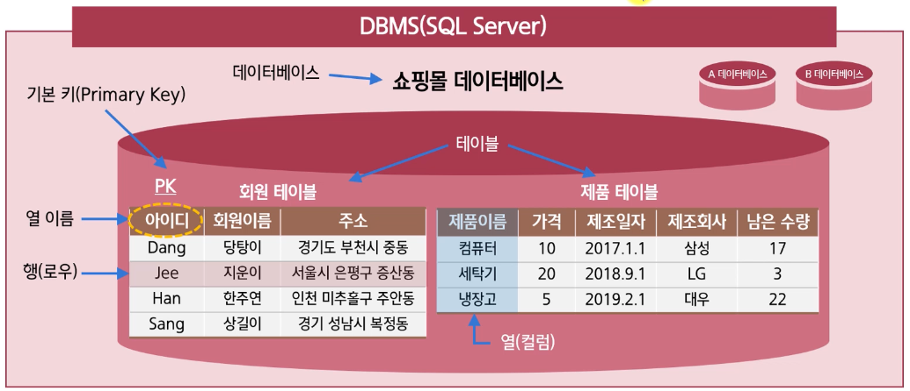

### 요구사항 분석 및 데이터베이스 구축 절차

#### 요구사항 분석, 설계, 모델링

정보 시스템의 5가지 단계

1. 분석
2. 설계
3. 구현
4. 시험
5. 유지보수

> 1, 2 단계인 분석과 설계는 대부분의 프로젝트에서 전체 공정의 **50% 이상**을 차지함

분석 : '무엇을(What)' 할 것인지를 결정하는 단계
설계 : 구축하고자 하는 시스템을 '어떻게(How)' 할 것인지를 결정하는 단계

데이터베이스 모델링

> 현실 세계에서 사용되는 데이터를 SQL Server에 어떻게 옮겨 놓을 것인지를 결정하는 과정

- 우리가 구현하고자 하는 인터넷 쇼핑몰에서는 사람(또는 회원)이 필요함
- 사람의 몸을 컴퓨터에 넣을 수는 없기 때문에 사람을 나타낼 수 있는 특성(속성)들을 추출해서 SQL Server에 넣어야 함  
   어떤 사람의 신분을 증명하기 위해서 신분증에 이름, 주민번호, 주소 등의 정보를 담는 것과 비슷함

DB 모델링과 필수 용어

- 데이터, 테이블, DB, DBMS, 열(컬럼, 필드), 열 이름, 데이터 형식, 행(로우, 레코드), 기본키, 외래키, SQL

#### SQL Server를 이용한 데이터베이스 구축 절차

1. DBMS 설치
2. 데이터베이스 구축
   1. 데이터베이스 생성
   2. 테이블 생성
   3. 데이터 입력
   4. 데이터 조회/활용
3. 테이블 외의 데이터 베이스 개쳬의 활용 > 데이터 백업 및 관리  
   응용프로그램에서 구축된 데이터 활용(웹 서비스/애플리케이션)
