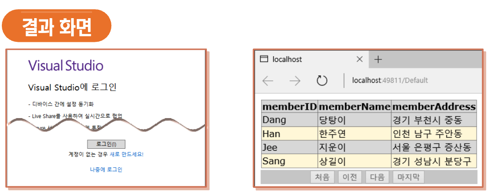
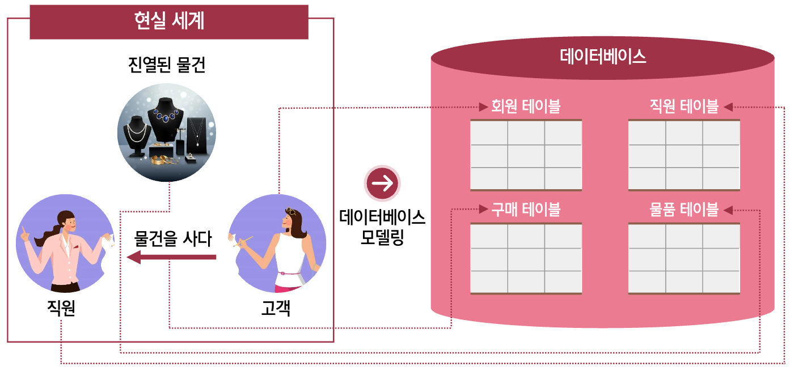

## SQL Server와 응용프로그램의 연결

<br/ >

---

<br/ >

## 데이터베이스 모델링

### 1) 프로젝트의 진행 단계

:::info 프로젝트(project)

- 현실세계의 업무를 컴퓨터 시스템으로 옮겨 놓는 일련의 과정
- 대규모의 프로그램을 작성하기 위한 전체 과정

:::

- 소프트웨어 분야의 몇몇 개발자에 의존하는 고질적인 문제 때문에 **소프트웨어 개발 방법론** 대두
- 해당 분야를 **소프트웨어 공학**이라 부름

#### 폭포수 모델

- 각 단계가 명확하게 구분되는 장점이 있음
- 문제점 발생 시 앞 단계로 돌아가기 어려움
- 대규모 프로젝트일수록 업무분석과 시스템 설계에 **최소 50% 이상**을 할당하는 것이 좋음

  > 1. 프로젝트 계획
  > 2. 업무 분석
  > 3. 시스템 설계
  > 4. 프로그램 구현
  > 5. 테스트
  > 6. 유지보수

<br/ >

### 2) 데이터베이스 모델링 개념

<br/ >

---

<br/ >

## SQL Server Management Studio (SSMS)

> SQL Server 2005 부터 제공되는 통합된 SQL Server의 클라이언트 툴

### 1) SSMS 실행

### 2) 서버 연결

1. 서버 유형
   - 데이터베이스 엔진
   - Analysis Services
   - Reporting Services
   - Integration Services
2. 서버 이름

   - SSMS를 통해서 접근하게 될 SQL Server의 이름 입력 또는 선택

3. 인증

   - 디폴트인 Windows 인증 모드로 접속
   - Windows 인증은 SQL Server가 설치된 컴퓨터에서만 SSMS를 사용
   - SQL Server 인증은 외부에서 SQL Server에 접근하고자 하는 경우에 사용

4. 사용자 및 비밀번호

   - Windows 인증은 윈도우에 접속한 사용자로 설정

5. 연결 속성

   - 특별한 경우가 아니면 지정하지 않음

6. 화면 구성

   - 도킹 윈도우 : 윈도우의 배치를 바꿀 수 있음
   - 개체 탐색기 : 개체들을 검색하고 관리하는 강력한 도구
     - 개체 탐색기에서 할 수 있는 일
       - 데이터베이스 및 데이터베이스 개체의 생성 및 관리
       - 데이터베이스의 삭제 및 속성 변경
       - 보안 관리
       - 권한 및 제한 사항 조절
       - 로그 전달 / 미러링 / 복제 등의 환경 조절
       - 백업의 생성 및 복원 수행
       - 정책 관리, 리소스 관리, 데이터 컬렉션
       - SQL Server 로그 기록의 조회 및 관리
       - SQL Server 에이전트의 관리
   - 쿼리 창 : 쿼리 문장(SQL 구문)을 입력하고 실행하는 텍스트 에디터
     - 쿼리창을 사용하는 순서
       1. 새쿼리 아이콘 클릭
       2. 작업할 데이터베이스 선택
       3. SQL 문 입력
       4. 구문 분석 아이콘을 사용해 SQL 문 검사(생략 가능)
       5. 이상 없다면 `<!실행>` 아이콘 클릭하여 SQL 문장 실행
       6. 결과창을 통해 결과 확인

<br/ >

> 디버깅 기능
>
> > Visual Studio와 비슷하게 쿼리에 대한 디버깅 가능

<br/ >

> 프로파일러(Profiler)
>
> > 발생하는 각종 이벤트를 추적하고 수집함으로써
> > 현재 어떤 SQL 문이 서버의 성능을 떨어뜨리는지 쉽게 확인하는 기능
