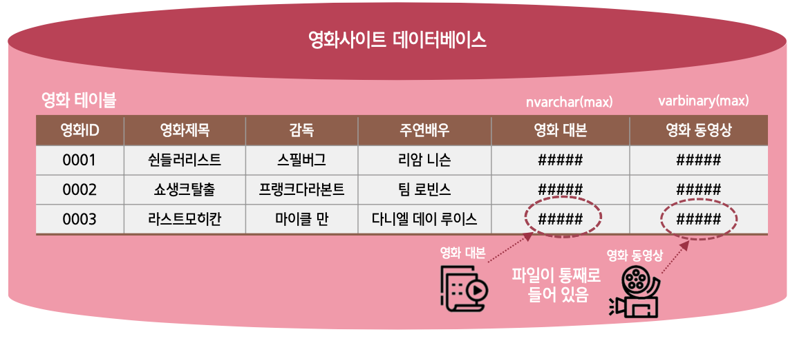

## 숫자형 데이터 형식

| 데이터 형식            | 바이트          | 숫자 범위            | 설명                                       |
| ---------------------- | --------------- | -------------------- | ------------------------------------------ |
| **`* BIT`**            | 1               | 0 또는 1             | Boolean 형인 참(True), 거짓 (False)에 사용 |
| **`* INT`**            | 4               | 약 -21억 ~ 21억      | 정수                                       |
| **`* SMALLINT`**       | 2               | -32,768 ~ 32,767     | 작은 정수                                  |
| **`* TINYINT`**        | 1               | 0 ~ 255              | 매우 작은 정수                             |
| **`* BIGINT`**         | 8               | -2^63 ~ +2^63-1      | 큰 정수                                    |
| **`* DECIMAL(p,[s])`** | 5 ~ 17 (가변적) | -10^38 +1 ~ 10^38 -1 | 고정 소수점 숫자                           |
| `NUMERIC`              | 5 ~ 17 (가변적) | N/A                  | 고정 소수점 숫자                           |
| `REAL`                 | 4               | -                    | 부동 소수점 숫자                           |
| `FLOAT[(n)]`           | 4 ~ 8 (가변적)  | -                    | 부동 소수점 숫자                           |
| `MONEY`                | 8               | -2^63 ~ +2^63-1      | 통화                                       |
| `SMALLMONEY`           | 4               | 약 -21억 ~ 21억      | 작은 통화                                  |

:::info

- 데이터 형식에서 꼭 필요한 만큼만 사용해서 설계해야 한다
- 일반적으로 `MONEY`, `SMALLMONEY`는 잘 사용하지 않고 `INT`, `BIGINT`를 사용한다

  :::

<br/ >

---

<br/ >

## 문자형 데이터 형식

| 데이터 형식           | 바이트 수 | 설명                                                                                                                          |
| --------------------- | --------- | ----------------------------------------------------------------------------------------------------------------------------- |
| **`* CHAR[(n)]`**     | 0 ~ 8,000 | 고정 길이                                                                                                                     |
| **`* NCHAR[(n)]`**    | 0 ~ 8,000 | 고정 길이 / **유니코드** 문자 데이터                                                                                          |
| **`* VARCHAR[(n)]`**  | 최대 2GB  | 가변 길이                                                                                                                     |
| **`* NVARCHAR[(n)]`** | 최대 2GB  | 가변 길이 / **유니코드** 문자 데이터                                                                                          |
| `TEXT`                | 최대 2GB  | 가변 길이<br/ >(SQL Server 2016부터는 사용되지 않고, `VARCHAR(MAX)` 사용을 권장)                                              |
| `NTEXT`               | 최대 2GB  | 가변 길이<br/ > 유니코드 문자 데이터 (SQL Server 2016부터는 사용되지 않고,<br/ > `NVARCHAR(MAX)` 사용을 권장)                 |
| `BINARY`              | 0 ~ 8,000 | 고정 길이 / 2진 데이터 값                                                                                                     |
| `VARBINARY[(n)]`      | 최대 2GB  | 가변 길이 / 2진 데이터 값<br/ >SQL Server 2000은 0 ~ 8,000                                                                    |
| `IMAGE[(n)]`          | 최대 2GB  | SQL Server 2000에서는 8,000자가 넘는 2진 데이터의 경우에 사용하였으나,<br/ >SQL Server 2005이후는 `VARBINARY(MAX)`사용을 권장 |

:::info

- VARCHAR 보다는 CHAR 의 데이터 접근이 빠르다

  - 속도가 중요한 경우 CHAR
  - 공간이 중요한 경우 VARCHAR

- CHAR, VARCHAR 영문은 데이터 크기에 맞는 글자수가 입력되지만 한글은 제한된다  
  (영문 1글자 = 1byte, 한글 1글자 = 2byte의 유니코드 이기 때문에)
  - 따라서, 한글 및 다른언어는 유니코드 문자데이터인 NCHAR, NVARCHAR 가 사용된다

:::

<br/ >

---

<br/ >

## 날짜와 시간 데이터 형식

| 데이터 형식      | 바이트 수 | 설명                                                                                                                                                                                     |
| ---------------- | --------- | ---------------------------------------------------------------------------------------------------------------------------------------------------------------------------------------- |
| **`* DATETIME`** | 8         | 1753-1-1 ~ 9999-12-31까지 저장<br/ >정확도는 1/1000초 단위 까지<br/ >"YYYY-MM-DD 시:분:초" 형식으로 사용                                                                                 |
| `DATETIME2`      | 6 ~ 8     | 0001-1-1 ~ 9999-12-31까지 저장<br/ >정확도는 100나노초 단위 까지<br/ >"YYYY-MM-DD 시:분:초" 형식으로 사용 ( DATETIME의 확장 형으로 생각하면 됨)                                          |
| **`* DATE`**     | 3         | 0001-1-1 ~ 9999-12-31까지 저장<br/ >날짜형식만 사용<br/ >"YYYY-MM-DD" 형식으로 사용                                                                                                      |
| **`* TIME`**     | 5         | 00:00:00.0000000 ~ 23:59:59.9999999 까지 저장<br/ >정확도는 100나노초 단위까지<br/ >"시:분:초" 형식으로 사용                                                                             |
| `DATETIMEOFFSET` | 10        | 표준 시간대를 인식하며 24시간제를 기준으로 하는 시간과 결합된 날짜를 정의<br/ >0001/1/1 ~ 9999/12/31까지 저장<br/ >정확도는 100나노초 단위 까지<br/ >"YYYY-MM-DD 시:분:초" 형식으로 사용 |
| `SMALLDATETIME`  | 4         | ~ 2079/1/6까지 저장<br/ >정확도는 분 단위까지                                                                                                                                            |
|                  |           | DATETIME2, DATE, TIME, DATETIMEOFFSET 형식은 SQL Server 2008부터 지원                                                                                                                    |

<br/ >

---

<br/ >

## 기타 데이터 형식

| 데이터 형식                               | 바이트 수 | 설명                                                                                                               |
| ----------------------------------------- | --------- | ------------------------------------------------------------------------------------------------------------------ |
| `ROWVERSION`                              | 8         | VARBINARY(8)과 동일하며 데이터베이스 내에서 자동적으로 생성된 고유 이진 숫자 표시 <br/ >SQL Server 내부적으로 사용 |
| `SYSNAME`                                 | 128       | NVARCHAR(128)과 동일하며 데이터베이스 개체의 이름에 사용 <br/ >SQL Server 내부적으로 사용                          |
| **`* CURSOR`**                            | 1         | T-SQL 커서를 변수로 처리                                                                                           |
| **`* TABLE`**                             | N/A       | 테이블 자체를 저장 <br/ >임시테이블과 비슷한 기능                                                                  |
| `UNIQUEIDENTIFIER`                        | 16        | 복제(replication)에서 사용되는 자료형으로,<br/ >유일성을 보장하기 위한 GUID 값을 지정                              |
| `SQL_VARIANT`                             | N/A       | 다른 데이터 형식의 저장이 가능한 데이터형(예외도 있음)                                                             |
| `HIERARCHYID`                             | N/A       | 계층 구조가 있는 테이블을 만들거나 다른 위치에 있는 데이터의 계층 구조를 참조                                      |
| **`* XML`**                               | N/A       | XML 데이터를 저장하기 위한 형식                                                                                    |
| **`* GEOMETRY`** <br/ > **`* GEOGRAPHY`** | N/A       | 공간 데이터 형식으로 선, 점 및 다각형 같은 공간 데이터개체를 저장하고 조작                                         |
|                                           |           | XML은 SQL Server 2005부터,<br/ >HIERARCHYID, GEOMETRY/ GEOGRAPHY 형식은 SQL Server 2008부터 지원                   |

<br/ >

---

<br/ >

## 사용자 정의 데이터 형식

기존 데이터 형식에 별칭을 붙이는 것으로, 사용의 편의성을 위해 사용함

```sql
CREATE TYPE 사용자데이터형식_이름 FROM 기존데이터형식 NULL 또는 NOT NULL

-- 예시
CREATE TYPE myTypeName FROM nchar(10) NULL
```

<br/ >

---

<br/ >

## `VARCHAR(MAX)`, `NVARCHAR(MAX)`, `VARBINARY(MAX)`

### LOB(Large Object: 대량의 데이터)를 저장하기 위해서 지원하는 형식



<br/ >

---

<br/ >

## FILESTREAM과 FILETABLE / 유니코드 데이터

### FILESTREAM과 FILETABLE

- BLOB 데이터를 저장하려면 VARBINARY(MAX) 형식을 사용하면 되는데,  
  VARBINARY(MAX)는 최대 크기가 2GB까지의 파일만 저장할 수 있음
- 2GB 크기 이상의 파일을 저장하려면 FILESTREAM을 사용해야 함
- FILESTREAM은 SQL Server 2008부터 제공
- FILESTREAM 기반 >> SQL Server 2012부터 FILETABLE이라는 테이블도 제공됨

### 유니 코드 데이터

- 문자 데이터를 저장하고 관리할 경우, 각 국가별 코드 페이지가 달라 서로 호환되지 않는 문제점을 해결함
- 데이터 형식은 `nchar`, `nvarchar`, `ntext` 가 있음
- 입력 시에는 `N'문자열'` 형식으로 사용하는 것을 권장
