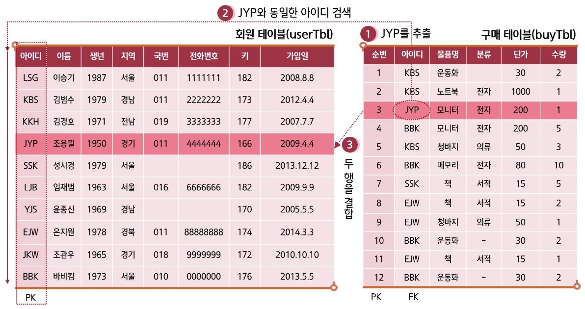
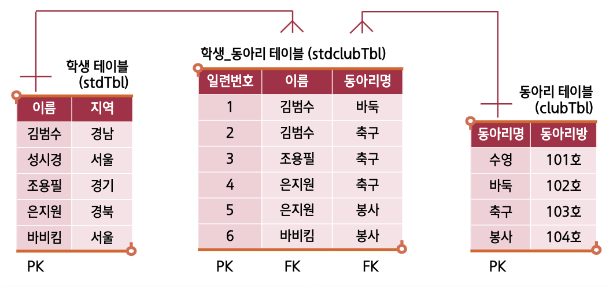
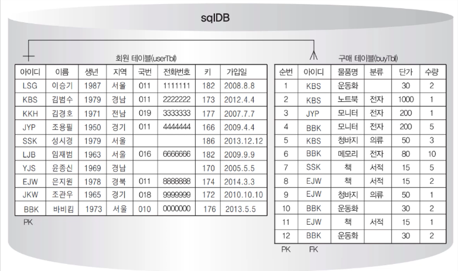
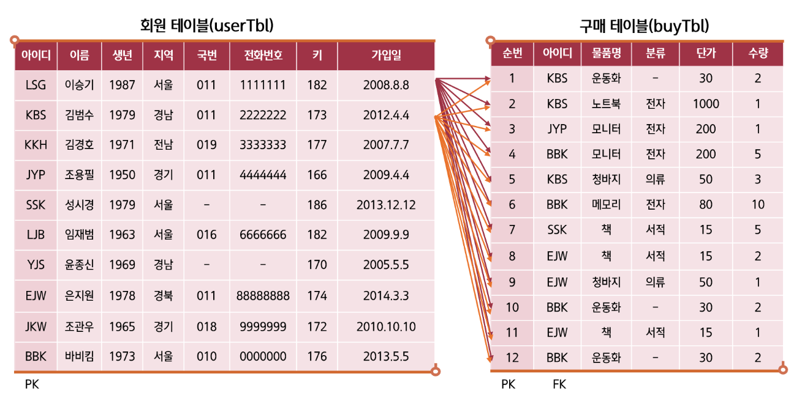
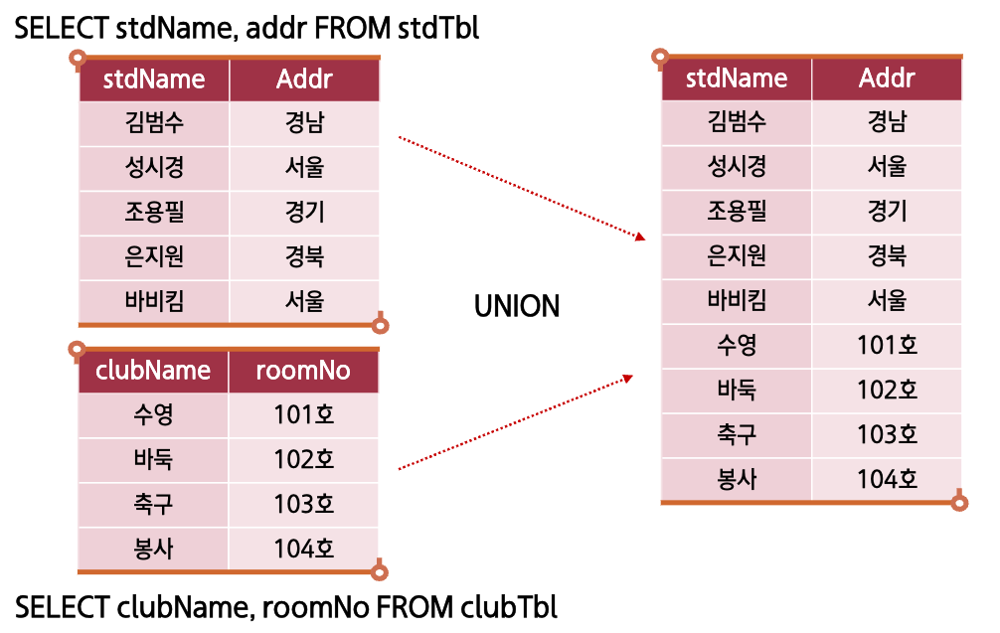

### JOIN의 개념

:::info 두 개 이상의 테이블을 서로 묶어서 하나의 결과집합으로 만들어 내는 것
:::

## INNER JOIN (내부 조인)

> 조인 중 가장 많이 사용됨
> 일반적인 조인은 INNER JOIN을 의미함

### 문법

```sql
SELECT <열 목록>
FROM <첫 번째 테이블>
  INNER JOIN <두 번째 테이블>
  ON <조인될 조건>
[WHERE 검색조건] -- 선택
```

<br/ >

### 예제



```sql
SELECT *
FROM buyTbl
  INNER JOIN userTbl
  ON buyTbl.userid = userTbl.userid
WHERE buyTbl.userid = 'JYP';
```

<details>
<summary>실행 결과</summary>

| num | userid | prodName | groupName | price | amount | userID | name   | birthYear | addr | mobile1 | mobile2  | height | mDate      |
| --- | ------ | -------- | --------- | ----- | ------ | ------ | ------ | --------- | ---- | ------- | -------- | ------ | ---------- |
| 3   | JYP    | 모니터   | 전자      | 200   | 1      | JYP    | 조용필 | 1950      | 경기 | 011     | 44444444 | 166    | 2024-10-28 |

</details>

<br/ >

### 별칭(Alias)의 사용

- 테이블의 별칭을 사용함으로써 코드를 간결화

#### 사용 예제

```sql
SELECT B.userid, U.name, B.productName, U.addr,
U.mobile1 + U.mobile2 AS [연락처]
FROM buyTbl B -- Alias
  INNER JOIN userTbl U -- Alias
  ON B.userid = U.userid
```

<br/ >

### 세 개 테이블 내부 조인



<br/ >

#### 사용 예제

```sql
SELECT S.stdName, S.addr, C.clubName, C.roomNo
FROM stdTbl S
  INNER JOIN stdclubTbl SC
    ON S.stdName = SC.stdName
  INNER JOIN clubTbl C
    ON C.clubName = SC.clubName
ORDER BY S.stdName;
```

<details>
<summary>실행 결과</summary>

|     | stdName | addr | clubName | roomNo |
| --- | ------- | ---- | -------- | ------ |
| 1   | 김범수  | 경남 | 바둑     | 102호  |
| 2   | 김범수  | 경남 | 축구     | 103호  |
| 3   | 바비킴  | 서울 | 봉사     | 104호  |
| 4   | 은지원  | 경북 | 축구     | 103호  |
| 5   | 은지원  | 경북 | 봉사     | 104호  |
| 6   | 조용필  | 경기 | 축구     | 103호  |

</details>

<br/ >

---

<br/ >

## OUTER JOIN (외부 조인)

> 내부 조인은 조인의 조건이 만족되지 않는 행을 출력되지 않지만,  
> 외부 조인은 조건이 만족되지 않는 행까지 출력함

### 문법

```sql
SELECT <열 목록>
FROM <첫 번째 테이블(LEFT 테이블)>
  <LEFT | RIGHT | FULL> OUTER JOIN <두 번째 테이블(RIGHT)>
  ON <조인될 조건>
[WHERE 검색조건] -- 선택
```

### 내부조인과 외부 조인의 비교

#### 내부 조인 결과


```sql
SELECT U.userid, U.name, B.prodName,
  U.addr, U.mobile1 + U.mobile2 AS [연락처]
FROM userTbl U
  INNER JOIN buyTbl B
  ON U.userid = B.userid
ORDER BY U.userid
```

<details>
<summary>실행 결과</summary>

구매한 사람만 출력 됨

| userid | name   | prodName | addr | 연락처      |
| ------ | ------ | -------- | ---- | ----------- |
| BBK    | 바비킴 | 모니터   | 서울 | 01000000000 |
| BBK    | 바비킴 | 메모리   | 서울 | 01000000000 |
| BBK    | 바비킴 | 운동화   | 서울 | 01000000000 |
| BBK    | 바비킴 | 운동화   | 서울 | 01000000000 |
| EJW    | 은지원 | 책       | 경북 | 01188888888 |
| EJW    | 은지원 | 책       | 경북 | 01188888888 |
| EJW    | 은지원 | 청바지   | 경북 | 01188888888 |
| JYP    | 조용필 | 모니터   | 경기 | 01188888888 |
| KBS    | 김범수 | 청바지   | 경남 | 01122222222 |
| KBS    | 김범수 | 운동화   | 경남 | 01122222222 |
| KBS    | 김범수 | 노트북   | 경남 | 01122222222 |
| SSK    | 성시경 | 책       | 서울 | NULL        |

</details>

<br/ >

#### 외부 조인 결과



```sql
SELECT U.userid, U.name, B.prodName,
  U.addr, U.mobile1 + U.mobile2 AS [연락처]
FROM userTbl U
  LEFT OUTER JOIN buyTbl B
  ON U.userid = B.userid
ORDER BY U.userid
```

<details>
<summary>실행 결과</summary>

buyTbl(구매 테이블) 에서 구매하지 않은 userTbl(회원 테이블) 도 포함된 JOIN 이 된다

| userid | name   | prodName   | addr | 연락처      |
| ------ | ------ | ---------- | ---- | ----------- |
| BBK    | 바비킴 | 모니터     | 서울 | 01000000000 |
| BBK    | 바비킴 | 메모리     | 서울 | 01000000000 |
| BBK    | 바비킴 | 운동화     | 서울 | 01000000000 |
| BBK    | 바비킴 | 운동화     | 서울 | 01000000000 |
| EJW    | 은지원 | 책         | 경북 | 01188888888 |
| EJW    | 은지원 | 책         | 경북 | 01188888888 |
| JKW    | 조관우 | _--NULL--_ | 경기 | 01899999999 |
| EJW    | 은지원 | 청바지     | 경북 | 01188888888 |
| JYP    | 조용필 | 모니터     | 경기 | 01188888888 |
| KBS    | 김범수 | 청바지     | 경남 | 01122222222 |
| KBS    | 김범수 | 운동화     | 경남 | 01122222222 |
| KBS    | 김범수 | 노트북     | 경남 | 01122222222 |
| KKH    | 김경호 | _--NULL--_ | 경남 | 01933333333 |
| LJB    | 임재범 | _--NULL--_ | 경남 | 01666666666 |
| LSG    | 이승기 | _--NULL--_ | 경남 | 01111111111 |
| SSK    | 성시경 | 책         | 서울 | _--NULL--_  |
| YJS    | 윤종신 | _--NULL--_ | 경남 | _--NULL--_  |

</details>

<br/ >

### 세 개 테이블 내부 조인


<br/ >

#### LEFT OUTER JOIN 예제

```sql
SELECT S.stdName, S.addr, C.clubName, C.roomNo
FROM stdTbl S
  LEFT OUTER JOIN stdclubTbl SC
    ON S.stdName = SC.stdName
  LEFT OUTER JOIN clubTbl C
    ON C.clubName = SC.clubName
ORDER BY S.stdName;
```

<details>
<summary>실행 결과</summary>

|     | stdName | addr | clubName   | roomNo     |
| --- | ------- | ---- | ---------- | ---------- |
| 1   | 김범수  | 경남 | 바둑       | 102호      |
| 2   | 김범수  | 경남 | 축구       | 103호      |
| 3   | 바비킴  | 서울 | 봉사       | 104호      |
| 4   | 성시경  | 서울 | _--NULL--_ | _--NULL--_ |
| 5   | 은지원  | 경북 | 축구       | 103호      |
| 6   | 은지원  | 경북 | 봉사       | 104호      |
| 7   | 조용필  | 경기 | 축구       | 103호      |

</details>

<br/ >

#### RIGHT OUTER JOIN 예제

```sql
SELECT S.stdName, S.addr, C.clubName, C.roomNo
FROM stdTbl S
  LEFT OUTER JOIN stdclubTbl SC
    ON S.stdName = SC.stdName
  RIGHT OUTER JOIN clubTbl C
    ON C.clubName = SC.clubName
ORDER BY S.stdName;
```

<details>
<summary>실행 결과</summary>

|     | stdName    | addr       | clubName | roomNo |
| --- | ---------- | ---------- | -------- | ------ |
| 1   | _--NULL--_ | _--NULL--_ | 수영     | 101호  |
| 2   | 김범수     | 경남       | 바둑     | 102호  |
| 3   | 김범수     | 경남       | 축구     | 103호  |
| 4   | 바비킴     | 서울       | 봉사     | 104호  |
| 5   | 은지원     | 경북       | 축구     | 103호  |
| 6   | 은지원     | 경북       | 봉사     | 104호  |
| 7   | 조용필     | 경기       | 축구     | 103호  |

</details>

<br/ >

#### FULL OUTER JOIN 예제

```sql
SELECT S.stdName, S.addr, C.clubName, C.roomNo
FROM stdTbl S
  FULL OUTER JOIN stdclubTbl SC
    ON S.stdName = SC.stdName
  FULL OUTER JOIN clubTbl C
    ON C.clubName = SC.clubName
ORDER BY S.stdName;
```

<details>
<summary>실행 결과</summary>

stdclubTbl 테이블과 clubTbl 테이블이 모두 출력된다

|     | stdName    | addr       | clubName   | roomNo     |
| --- | ---------- | ---------- | ---------- | ---------- |
| 1   | _--NULL--_ | _--NULL--_ | 수영       | 101호      |
| 2   | 김범수     | 경남       | 바둑       | 102호      |
| 3   | 김범수     | 경남       | 축구       | 103호      |
| 4   | 바비킴     | 서울       | 봉사       | 104호      |
| 5   | 성시경     | 서울       | _--NULL--_ | _--NULL--_ |
| 6   | 은지원     | 경북       | 축구       | 103호      |
| 7   | 은지원     | 경북       | 봉사       | 104호      |
| 8   | 조용필     | 경기       | 축구       | 103호      |

</details>

<br/ >

---

<br/ >

## CROSS JOIN (상호 조인)

> 한쪽 테이블의 모든 행들과 다른 쪽 테이블의 모든 행을 조인시키는 기능
> 주로 테스트 용도로 대용량의 테이블을 생성 시에 사용함

### 문법

```sql
SELECT * FROM buyTbl CROSS JOIN userTbl
```

### 예제



- 의미적으로는 무의미 하지만, 많은 샘플데이터를 만들기에 적합하다
- 부하테스트를 확인하는 용도로도 사용된다

<br/ >

---

<br/ >

## SELF JOIN (자체 조인)

> 자기자신과 자기자신이 조인한다는 의미
> 주로 조직도 등에서 활용

### 사용 예제

```sql
SELECT A.emp AS [부하직원], B.emp AS [직속상관],
  B.department AS [직속상관부서]
FROM empTbl A
  INNER JOIN empTbl B
  ON A.manager = B.emp
```

<br/ >

---

<br/ >

## UNION / UNION ALL / EXCEPT / INTERSECT

### UNION

- UNION은 두 쿼리의 결과를 행으로 합치는 것을 의미함(단, 중복 제거)
- UNION ALL은 중복까지 허용함
- EXCEPT는 두 번째 쿼리에 해당하는 것을 제외함



<br/ >

### EXCEPT

- 두 번째 쿼리에 해당하는 것을 제외함

```sql
SELECT name, mobile1 + mobile2 AS [전화번호] FROM userTbl
EXCEPT
SELECT name, mobile1 + mobile2 FROM userTbl
  WHERE mobile1 IS NULL; -- 전화번호가 없는 사람은 제외
```

<details>
<summary>실행 결과</summary>

|     | name   | 전화번호    |
| --- | ------ | ----------- |
| 1   | 김경호 | 01933333333 |
| 2   | 김범수 | 01122222222 |
| 3   | 바비킴 | 01000000000 |
| 4   | 은지원 | 01188888888 |
| 5   | 이승기 | 01111111111 |
| 6   | 임재범 | 01666666666 |
| 7   | 조관우 | 01899999999 |
| 8   | 조용필 | 01144444444 |

</details>

<br/ >

### INTERCEPT

- EXCEPT 와는 반대로 INTERCEPT는 두 번째 쿼리에 해당하는 것만 조회함

```sql
SELECT name, mobile1 + mobile2 AS [전화번호] FROM userTbl
INTERCEPT
SELECT name, mobile1 + mobile2 FROM userTbl
  WHERE mobile1 IS NULL; -- 전화번호가 없는 사람만 조회
```

<details>
<summary>실행 결과</summary>

|     | name   | 전화번호   |
| --- | ------ | ---------- |
| 1   | 성시경 | _--NULL--_ |
| 2   | 윤종신 | _--NULL--_ |

</details>
