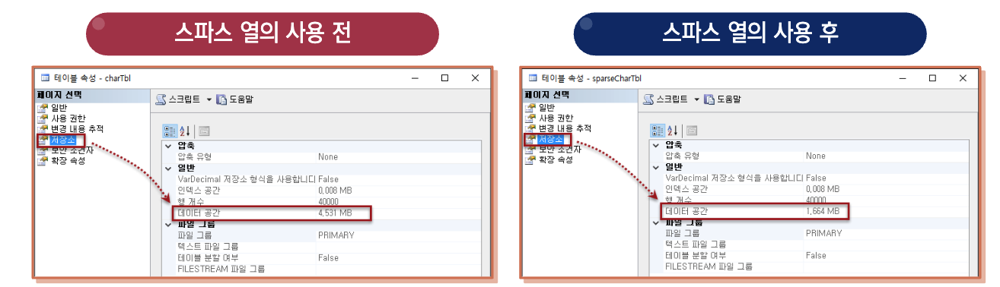

## 스파스 열

:::info 스파스 열
NULL 값에 대해 최적화된 저장소가 있는 일반 열
:::

- NULL 값이 많이 들어갈 것으로 예상되는 열이라면 **스파스 열**로 지정해 놓을 경우에  
  **많은 공간 절약 효과**가 있다
- 스파스 열로 지정할 때, 약 40%의 공간 절약이 되는 주요 데이터 형식의 NULL비율

| 데이터 형식 | NULL 비율 |
| ----------- | --------- |
| bit         | 98%       |
| smallint    | 86%       |
| int         | 64%       |
| bigint      | 52%       |
| float       | 52%       |
| datetime    | 52%       |
| date        | 69%       |
| datetime2   | 57%       |
| varchar     | 60%       |
| char        | 60%       |
| nvarchar    | 60%       |
| nchar       | 60%       |

<br/ >

### 구문 형식

```sql
CREATE TABLE sparseCharTbl(
  id int identity,
  data char(100) SPARSE NULL
);
```

<br/ >

### 공간 비교결과



<br/ >
<br/ >
<br/ >

---

## 임시 테이블

:::info 임시 테이블
임시로 잠깐 동안 사용되는 테이블
:::

- 종류
  - `#`을 앞에 붙인 테이블은 **로컬 임시 테이블**
  - `##`을 앞에 붙인 테이블은 **전역 임시 테이블**
- 임시 테이블은 tempdb에 생성될 뿐 나머지 사용법 등은 일반 테이블과 동일하다

<br/ >

### 임시 테이블이 삭제되는 시점

1. 사용자가 `DROP TABLE`로 직접 삭제
2. SQL Server가 재시작 되면 삭제
3. 로컬 임시 테이블의 경우, 생성한 사용자의 연결이 끊기면 삭제
4. 전역 임시 테이블의 경우, 생성한 사용자의 연결이 끊기고 이 테이블을 사용중인 사용자가 없을 때 삭제

<br/ >

### 테이블의 삭제

#### 구문 형식

```sql
DROP TABLE 테이블이름
```

:::warning

- 외래 키(FOREIGN KEY) 제약 조건의 **기준 테이블**은 삭제가 불가함
- 먼저 외래 키가 생성된 **외래 키 테이블**을 삭제해야 함

:::

<br/ >

### 테이블의 수정

- 열의 추가 - `ADD`

  ```sql
  ALTER TABLE 테이블이름
    ADD 열이름 데이터 형식
  ```

- 열의 삭제 - `DROP COLUMN`

  ```sql
  ALTER TABLE 테이블이름
    DROP COLUMN 열이름
  ```

- 열의 데이터 형식 변경 - `ALTER COLUMN`

  ```sql
  ALTER TABLE 테이블이름
    ALTER COLUMN 열이름 새로운_데이터형식
  ```

- 열의 제약 조건 추가

  ```sql
  ALTER TABLE 테이블이름
    ADD CONSTRAINT 제약조건이름 제약조건
  ```

- 열의 제약 조건 삭제

  ```sql
  ALTER TABLE 테이블이름
    DROP CONSTRAINT 제약조건이름
  ```
