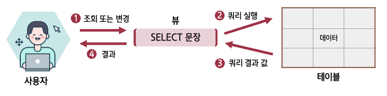

## 메모리 테이블

- 메모리 엑세스에 최적화된 테이블(memory-optimized)은 SQL-server 2014에서  
  처음 지원되었으며, 버전이 올라가면서 그 기능이 더욱 개선되고 향상
- 메모리 테이블은 디스크가 아닌 메모리 테이블에 존재함
- 테이블에 읽기 / 쓰기 속도가 획기적으로 향상됨
- 메모리 테이블의 보조 복사본이 디스크에서도 유지 관리됨

:::info 메모리 테이블을 사용하기 위한 전제 조건

1. 64bit SQL Server 2014 이후 버전의 Enterprise, Developer, Evaluation 에디션
2. 충분한 RAM이 장착된 컴퓨터(일반적으로 32GB 이상 권장)
3. 메모리 테이블 크기에 2배에 해당하는 디스크 여유 공간
4. 테이블에 기본 키 및 비클러스터형 인텍스

:::

<br/ >

---

## 스키마

:::info
데이터베이스 내에 있는 개체들을 관리하는 묶음
:::

- 스키마 이름을 생략하면 자동으로 디폴트 스키마인 **dbo**를 자동으로 붙여 줌
- 사용자가 직접 스키마를 생성하고 지정할 수 있음

### 구문 형식

```sql
데이터베이스_이름.스키마_이름.개체_이름
```

<br/ >

---

## 뷰

:::info 뷰

- [x] SELECT 문으로 구성된 데이터베이스 개체
- [x] 가상의 테이블(생성한 후에는 테이블과 동일하게 취급)

:::

<br/ >

### 뷰 생성과 사용

```sql
CREATE VIEW v_userTbl
AS
  SELECT userid, name, addr FROM userTbl
GO
SELECT * FROM v_userTbl -- 뷰를 테이블이라고 생각해도 무방
```

### 작동 방식



### 뷰의 장점

1. 보안에 도움이 됨
2. 복잡한 쿼리를 단순화 시킬 수 있음

<br/ >

### 뷰의 종류

- [표준 뷰](#표준-뷰)
- [분할 뷰](#분할-뷰)
- [인덱싱된 뷰](#인덱싱된-뷰)
- [시스템 뷰](#시스템-뷰)

#### 표준 뷰

- [x] 한 개 또는 그 이상의 테이블을 이용해서 만든 뷰

#### 분할 뷰

- [x] 한 대 또는 여러 대의 서버에 있는 테이블을 조인해서  
       하나의 테이블처럼 보이게 하는 뷰
- [x] 로컬 분할 뷰(local partitioned view)와  
       분산형 분할 뷰(distributed partitioned view)로 나눌 수 있음

#### 인덱싱된 뷰

- [x] 인덱스를 구성하려면 실제 데이터를 가지고 있는 뷰
- [x] 경우에 따라 큰 성능 향상이 있음

#### 시스템 뷰

- [x] SQL Server의 상태 등에 관한 정보를 보여주는 뷰
- [x] 카탈로그 뷰, 정보 스키마 뷰, 호환성 뷰, 복제 뷰, 동적 관리 뷰 및 함수 등으로 나뉨
