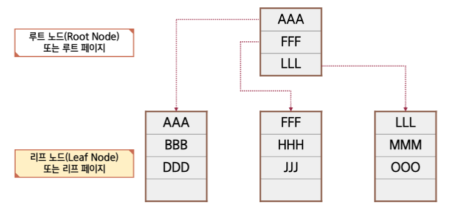
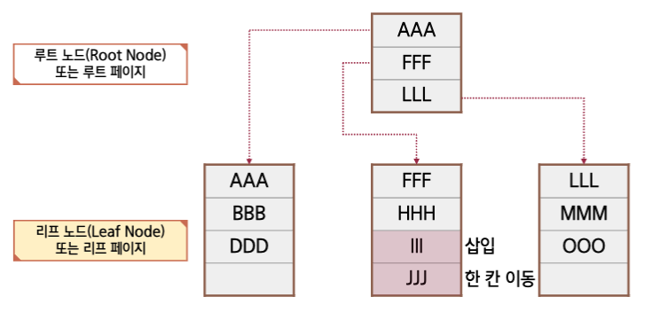
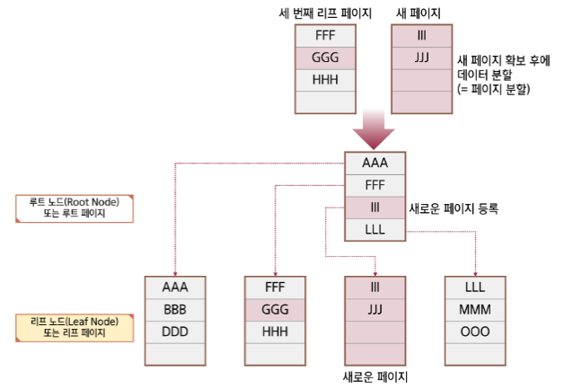
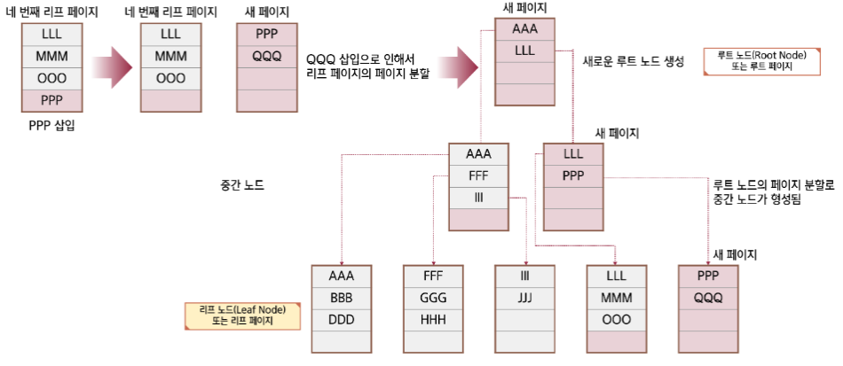
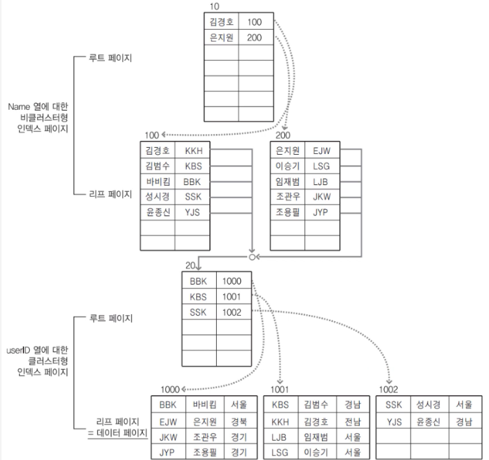

## B-Tree

> - Balanced_Tree, 균형 트리
> - 범용적으로 사용되는 데이터 구조

- 인덱스를 표현할 때 많이 사용됨
- 데이터의 검색(`SELECT`)시에 뛰어난 성능을 보일 수 있음
- 데이터의 변경(`INSERT`, `UPDATE`, `DELETE`)시에 성능이 저하됨

### 개념

- 루트 노드(Root Node)
- 리프 노드(Leaf Node)

<br/ >

---

## 페이지 분할

### 분할 1(III 삽입 후 변화)

- 위의 경우에는 많은 작업이 필요하지 않음

### 분할 2(GGG 삽입 후 변화)

- 위의 경우에는 많은 작업이 필요

1. 리프 노드의 공간이 4개 밖에 없다
2. 때문에 루트 노드에 새로운 페이지를 등록한다
3. 새로운 페이지 확보 후에 데이터를 분할 한다
4. GGG 삽입으로 인해 루트 노드, 페이지가 새로 생성된다

<br/ >

### 분할 3(PPP,QQQ 삽입 후 변화)

- 위의 경우에는 더 많은 작업이 필요

1. 루트 노드의 공간이 4개 밖에 없다
2. 때문에 새로운 루트 노드가 생성된다
3. 생성된 루트 노드와 기존의 노드의 상위 루트 노드 페이지가 생성된다
4. 중간 노드인 새 페이지의 하위로 PPP와 QQQ 를 리프 노드에 저장한다

<br/ >

---

## CL/NCL 인덱스구조

### CL(cluster): 클러스터 인덱스

> - 클러스터형 인덱스의 생성시에는 데이터 페이지 전체를 다시 정렬하게 됨
>   - 클러스터형 인덱스의 생성시은 심각한 시스템 부하를 줄 수 있음
> - 클러스터형 인덱스는 인덱스 자체의 리프 페이지가 곧 데이터임
>   - 비클러스터형 보다 **검색속도는 더 빠름**
>   - 비클러스터형 보다 데이터의 입력 / 수정 / 삭제는 더 느림
> - 클러스터형 인덱스는 성능이 좋지만, 테이블에 한 개밖에 생성하지 못함
>   - 어느 열에 클러스터형 인덱스를 생성하느냐에 따라서 시스템의 성능이 달라질 수 있음

### NCL(none cluster): 비클러스터 인덱스

> - 비클러스터형 인덱스 생성 시에는 데이터 페이지는 그냥 둔 상태에서 별도의 페이지에 인덱스를 구성함
> - 비클러스터형 인덱스는 인덱스 자체의 리프 페이지는 데이터가 아니라 **데이터가 위치하는 포인터(RID)**임
>   - 클러스터형 보다 검색속도는 덜 빠르지만, 데이터의 변경은 덜 느리다
> - 비클러스터형 인덱스는 **여러 개 생성**할 수가 있음
>   - 함부로 남용할 경우에는 오히려 시스템의 성능을 떨어뜨리는 결과를 초래함

<br/ >

:::info 검색 실행 계획

  
이름으로 테이블 내부에서 username 과 같은 데이터 검색 시  
비클러스터형 인덱스를 찾고, 찾은 인덱스의 포인터를 통해  
해당 클러스터형 인덱스의 데이터 페이지를 가져온다

:::
