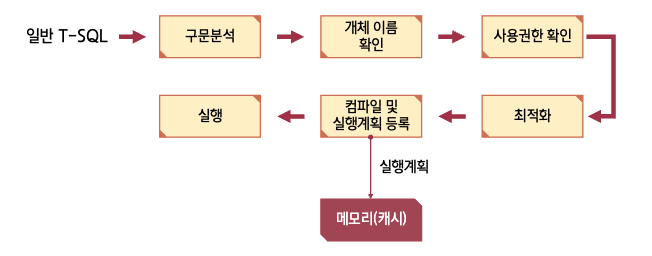
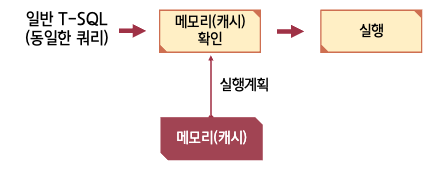
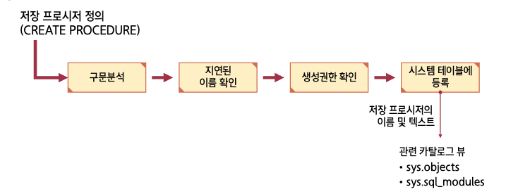
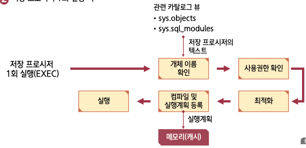

## 1. 저장 프로시저의 개요

### 개념

> Stored Procedure  
> SQL Server에서 제공되는 프로그래밍 기능

- 쿼리문의 집합으로 어떠한 동작을 일괄 처리하기 위한 용도

### 구문 형식

```sql
CREATE { PROC | PROCEDURE } [schema_name]
  procedure_name[; number]
    [
      { @parameter[type_schema_name.] data_type }
      [VARYING][= default][OUT | OUTPUT]
      [READONLY]
    ][, ...n]
[WITH <procedure_option>[, ...n]]
[FOR REPLICATION]
AS { [BEGIN sql_statement[;][, ...n][END]]}
[;]
```

### 생성 및 사용

```sql
USE sqlDB;
GO
CREATE PROCEDURE usp_users
AS
  SELECT * FROM userTbl;
GO

EXEC usp_users;
```

- 수정과 삭제
  - 수정 : `ALTER PROCEDURE`
  - 삭제 : `DROP PROCEDURE`

### 매개변수의 사용

```sql title="구문 형식의 정의"
@입력매개변수이름 데이터형식 [ = 디폴트값 ]
@출력매개변수이름 데이터형식 OUTPUT
```

```sql title="구문 형식의 실행"
EXECUTE 프로시저이름 [전달값]
EXECUTE 프로시저이름 @변수명 OUTPUT
```

- 프로그래밍 기능
  - 프로그래밍 기능을 이용해 유연한 기능으로 확장 가능

#### 리턴 값의 이용

- `RETURN`문을 사용해서 성공 및 실패 여부를 확인

#### 저장 프로시저 내 오류 처리

- `@@ERROR 함수` 및 `TRY/CATCH`문을 이용함

#### 임시 저장 프로시저

- `#` 또는 `##`을 붙임
- `TEMPDB`에 저장됨

### 실습 요약

```sql title="사용된 저장 프로시저"
CREATE PROCEDURE usp_users3
  @userBirth INT = 1970,
  @userHeight INT = 178
AS
  SELECT * FROM userTbl
  WHERE birthYear > @userBirth AND height > @userHeight;
```

<br/ >

---

## 2. 저장 프로시저의 특징

### 1. SQL Server의 성능 향상

> 동일 저장 프로시저가 자주 사용될 경우에는 일반 쿼리를 반복해서 실행하는 것보다  
> SQL Server의 성능이 크게 향상될 수 있음

### 2. 모듈식 프로그래밍이 가능함

> 저장 프로시저를 생성해 놓으면 언제든지 실행 가능 (ex. 함수)

### 3. 보안을 강화할 수 있음

> 사용자 별로 테이블에 접근 권한을 주지 않고,  
> 저장 프로시저에 접근 권한을 줌으로써 좀 더 보안을 강화함

### 4. 네트워크 전송량을 감소시킴

> 저장 프로시저 이름 및 매개변수 등 몇 글자의 텍스트만 전송하면 되므로  
> 네트워크의 부하를 줄일 수 있음

<br/ >

---

## 3. 저장 프로시저의 종류

### 사용자 정의 저장 프로시저

- T-SQL 저장 프로시저
  - 사용자가 직접 `CREATE PROCEDURE` 문을 이용해서 생성한 프로시저
- CLR 저장 프로시저
  - .NET Framework 어셈블리의 클래스에 공용의 정적 메소드로 구현

### 확장 저장 프로시저

> C언어 등을 이용하여 데이터베이스에서 구현하기 어려운 것들을 구현한 저장 프로시저

### 시스템 저장 프로시저

> 시스템을 관리하기 위해서 SQL Server가 제공해주는 저장 프로시저

<br/ >

---

## 4. 저장 프로시저의 작동

### 일반 T-SQL의 작동

#### 일반 T-SQL의 1회 실행 시



- 1회 실행 시

  ```text
  SQL Server 구문 분석 및 컴파일 시간 :
  CPU 시간 = 140ms, 경과 시간 = 46ms.
  ```

<br/ >

#### 일반 T-SQL의 2회 실행 시(동일한 T-SQL 실행)



- 2회 실행 시

  ```text
  SQL Server 구문 분석 및 컴파일 시간 :
  CPU 시간 = 0ms, 경과 시간 = 0ms.
  ```

<br/ >

### 저장 프로시저의 작동 방식

#### 저장 프로시저를 정의할 때



<br/ >

#### 저장 프로시저 1회 실행 시



- 1회 실행 시

  ```text
  SQL Server 구문 분석 및 컴파일 시간 :
  CPU 시간 = 31ms, 경과 시간 = 58ms.
  ```

<br/ >

#### 저장 프로시저 2회 실행 시


- 2회 실행 시

  ```text
  SQL Server 구문 분석 및 컴파일 시간 :
  CPU 시간 = 0ms, 경과 시간 = 0ms.
  ```

<br/ >

### WITH RECOMPILE 옵션과 문제점

:::danger 저장 프로시저의 문제점

처음 수행 시 최적화가 이루어지기 때문에  
두 번째 수행 시에는 그 최적화가 **더 안 좋은 성능**을 내더라도  
이미 컴파일이 된 저장 프로시저를 계속 사용하게 됨

:::

:::tip 저장 프로시저의 해결책

**재컴파일** 하는 방법이 있음

:::

<br/ >

### 재컴파일 방법

- 실행 시에 `WITH RECOMPILE` 옵션을 사용함
- 실행 시마다 자동으로 재컴파일 되도록 프로시저를 생성함
- `sp_recompile 테이블이름` 시스템 저장 프로시저를 사용함
- `DBCC FREEPROCCACHE` 를 사용함

```sql title="사용된 저장 프로시저"
CREATE PROC usp_ID
  @id INT
WITH RECOMPILE
AS
  SELECT * FROM spTbl WHERE CustomerId < @id;
GO;
```
