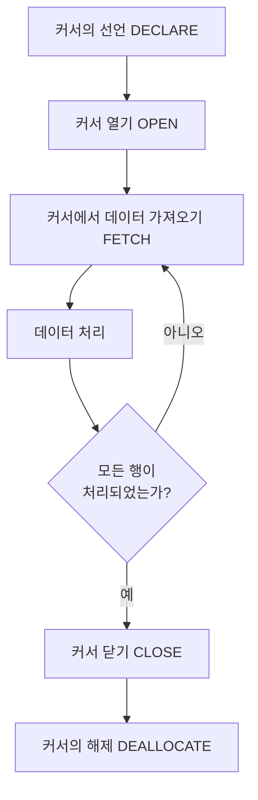
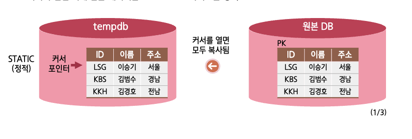
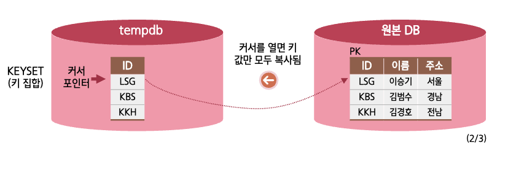
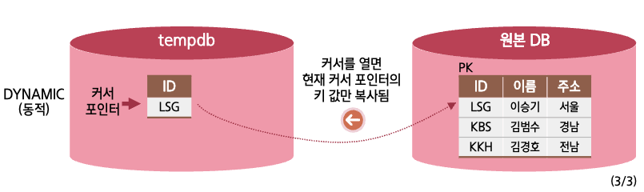

## 1. 커서의 개요

> 행의 집합을 다루는 데 제공해주는 편리한 기능

- SQL Server의 성능을 느리게 하는 요인이 될 수 있으므로,  
  특별한 경우가 아니라면 되도록 사용하지 않는 것이 좋다
- 파일처리 시의 파일 포인터와 비슷한 작동

| 파일의 시작 | BOF |
| ----------- | --- |
| 파일 포인터 | v   |
| 파일 포인터 | v   |
| 파일 포인터 | v   |
| ..          | ..  |
| 파일의 끝   | EOF |

<br/ >

---

## 2. 커서의 처리 순서

1. 커서의 선언 `DECLARE`
2. 커서 열기 `OPEN`
3. 커서에서 데이터 가져오기 `FETCH`
4. 데이터 처리
5. 커서 닫기 `CLOSE`
6. 커서의 해제 `DEALLOCATE`

- 3, 4 에서 WHILE문으로 모든 행이 처리될 때까지 반복



<br/ >

```sql title="커서 실습 코드"
DECLARE userTbl_cursor CURSOR GLOBAL ...
OPEN userTbl_cursor;

...

FETCH NEXT FROM userTbl_cursor
INTO @height
WHILE @@FETCH_STATUS = 0
BEGIN
  ...
  FETCH NEXT FROM userTbl_cursor
  INTO @height

CLOSE userTbl_cursor;

DEALLOCATE userTbl_cursor;
```

<br/ >

```sql title="커서의 선언"
DECLARE cursor_name CURSOR
  [ LOCAL | GLOBAL ]
  [ FORWARD_ONLY | SCROLL ]
  [ STATIC | KEYSET | DYNAMIC | FAST_FORWARD ]
  [ READ_ONLY | SCROLL_LOCKS | OPTIMISTIC ]
  [ TYPE_WARNING ]
  FOR select_statement
  [ FOR UPDATE [ OF column_name [,...n] ] ]
```

<br/ >

```sql title="커서 열기"
OPEN { { [ GLOBAL ] cursor_name } | @cursor_variable_name };
```

<br/ >

```sql title="데이터 가져오기 및 처리"
FETCH
  [
    [ NEXT | PRIOR | FIRST | LAST | ABSOLUTE { n | @nvar } ]
    FROM
  ]
```

<br/ >

```sql title="커서 닫기"
CLOSE { { [ GLOBAL ] cursor_name } | @cursor_variable_name };
```

<br/ >

```sql title="커서 할당 해제"
DEALLOCATE { { [ GLOBAL ] cursor_name } | @cursor_variable_name };
```

<br/ >

## 3. 커서의 내부 동작방식

:::danger LOCAL(지역 커서)
커서가 살아있는 범위가  
커서가 선언된 부분에 국한됨
:::

:::info GLOBAL(전역 커서)
모든 프로시저 등에서  
커서의 이름을 참조할 수 있음
:::

### STATIC / DYNAMIC / KEYSET

> 커서의 선언 시에 원본 데이터를 TEMPDB로 가져오는 방식






xw
