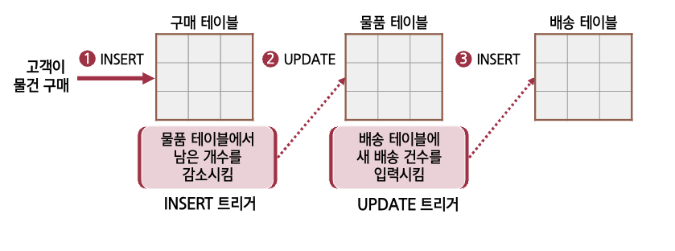
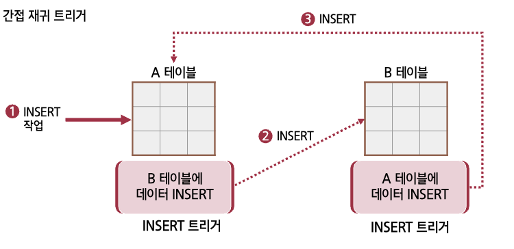
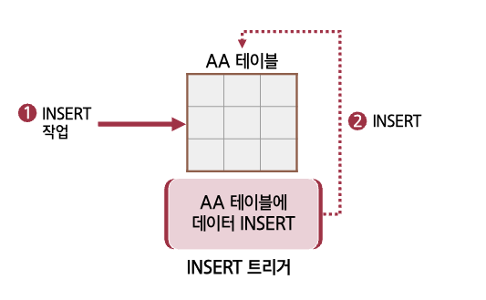

## 1. 트리거의 개요

- 제약 조건과 더불어 데이터의 무결성을 위한 또 다른 기능임
- DML 트리거, DDL 트리거, LOGON 트리거 세 가지가 있음
- 테이블 또는 뷰에 부착(Attach)되는 프로그램 코드임
- 저장 프로시저와 비슷하게 작동하지만 직접 실행시킬 수는 없고,  
  오직 해당 테이블이나 뷰에 이벤트(입력, 수정, 삭제)가 발생할 경우에만 실행됨
- 저장 프로시저와 달리 매개변수나 리턴 값을 사용할 수 없음

:::danger DDL 트리거는 2005부터, LOGON 트리거는 2008부터 지원함
:::

<br/ >

```sql title="생성 SQL"
CREATE TRIGGER testTrg -- 트리거 이름
ON testTbl -- 트리거를 부착할 테이블
AFTER DELETE, UPDATE -- 삭제, 수정후에 작동하도록 지정
AS
  PRINT("트리거가 작동"); -- 트리거 실행 시 작동 코드
```

<br/ >

---

## 2. 트리거의 종류

### `AFTER` 트리거

- 테이블에 `INSERT`, `UPDATE`, `DELETE` 등의 작업이 일어났을 때 작동함
- 해당 작업 후에(After) 작동함
- 테이블에만 작동하며 뷰에는 작동하지 않음

### `INSTEAD OF` 트리거

- `BEFORE` 트리거라고도 부름
- 테이블이나 뷰에 이벤트가 작동하기 전에 작동함
- 테이블 뿐 아니라 뷰엗 작동이 되며, 주로 뷰가 업데이트가 가능하도록 사용함
- `INSERT`, `UPDATE`, `DELETE` 세 가지 이벤트로 작동함

### `CLR` 트리거

- T-SQL 저장 프로시저 대신 .NET Framework에서 생성되는 트리거

<br/ >

---

## 3. 트리거의 사용

### 구문 형식

```sql
CREATE TRIGGER 트리거이름
ON { 테이블이름 | 뷰이름 }
[ WITH ENCRYPTION ]
{ FOR | AFTER | INSTEAD OF }
{ [INSERT][,][UPDATE][,][DELETE] }
AS
  실행할 SQL 문
```

<br/ >

### 트리거가 생성하는 임시테이블

:::danger INSERTED 테이블
`INSERT`와 `UPDATE` 작업 시에  
**변경 후의 행 데이터**와 동일한 데이터가 저장
:::

:::info DELETE 테이블
`DELETE`와 `UPDATE` 작업이 수행되면  
우선 해당 테이블에 삭제 또는 변경된 후에,  
삭제 또는 변경되기 전의 데이터가 저장
:::

<br/ >

### INSTEAD OF 트리거(BEFORE 트리거)

> 테이블에 변경이 가해지기 전에 작동되는 트리거

- 주로 뷰에 행이 삽입되거나 변경, 삭제될 때 사용함
- INSTEAD OF 트리거가 작동하면 시도된 `INSERT`, `UPDATE`, `DELETE` 문은 무시됨

<br/ >

```sql title="실습 sql문"
CREATE TRIGGER  trg_insert
ON uv_deliver
INSTEAD OF INSERT
AS
BEGIN
  INSERT INTO userTbl(userid, name, birthYear, addr, mDate)
    SELECT userid, name, 1900, addr, GETDATE() FROM inserted
  INSERT INTO buyTbl(userid, prodName, price, amount)
    SELECT userid, prodName, price, amount FROM inserted
END;
```

---

## 4. 기타 트리거에 관한 사항

### 다중 트리거

> 하나의 테이블에 동일한 트리거가 여러 개 부착되어 있는 트리거

### 중첩 트리거

> 트리거가 또 다른 트리거를 작동시키는 트리거



### 간접 재귀 트리거



### 직접 재귀 트리거



### 지연된 이름 확인

- 트리거를 정의할 때 해당 개체(주로 테이블)가 없더라도 트리거가 정의되는 것임
- 실제로 개체가 있는지는 트리거를 실행할 때 체크함

### 트리거의 작동 순서

- 처음(FIRST)과 끝(LAST)에 작동할 트리거 2개를 지정할 수 있음
- `INSERT` / `UPDATE` / `DELETE` 트리거마다 FIRST, LAST를 지정할 수 있으므로 총 6개를 지정함

```sql title="예제 코드"
sp_settriggerorder
  @triggername = 'dbo.trgA',
  @order = 'First',
  @stmttype = 'INSERT';

sp_settriggerorder
  @triggername = 'dbo.trgD',
  @order = 'Last',
  @stmmttype = 'INSERT';
```

```sql title="실습 sql 코드"
CREATE TRIGGER trg_recuA
ON recuA
AFTER INSERT
AS
  DECLARE @id INT
  SELECT @id = trigger_nestlevel() -- 현재 트리거 레벨값

  PRINT '트리거레벨==>' + CAST(@id AS CHAR(5))
  INSERT INTO recuB VALUES('간접재귀트리거')
```
