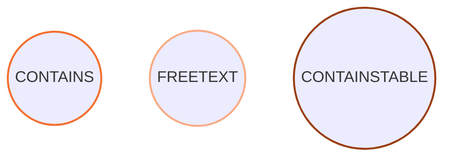
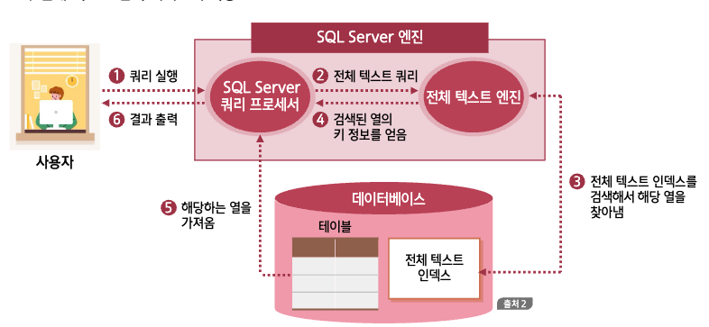

## 전체 텍스트 인덱스 개념

### 전체 텍스트 검색 서비스

:::info 개념

- Full Text Search Service
- 긴 문장으로 구성된 열의 내용을 검색할 때,  
   전체 텍스트 인덱스를 사용해서 빠른 시간에 검색하는 기능

:::

- 기존 인덱스가 중간에 들어있는 글자로 검색할 때는 인덱스를 사용하지 못하는 문제점을 해결해 줌
- SQL Full-text Filter Daemon Launcher 라는 서비스가 등록되고 가동되어야 함

### 전체 텍스트 인덱스

:::info 개념

신문기사와 같이 텍스트로 이루어진 문자열 데이터의 내용을 가지고 생성한 인덱스

:::

- SQL Server의 인덱스와 차이점
  - 전체 텍스트 인덱스는 **테이블 당 하나만 생성**할 수 있음
  - 전체 텍스트 인덱스에 데이터를 추가하는 **채우기(POPULATION)는 일정 예약이나 특별한 요청**에 의해서 수행되거나 새로운 데이터를 **INSERT할 때 자동으로 수행**되게 할 수도 있음
  - 전체 텍스트 인덱스는 char, varchar, nchar, nvarchar, text, ntext, image, XML, varbinary(max), FILESTREAM 등의 열에 생성 가능함
  - 전체 텍스트 인덱스를 생성할 테이블에는 **PRIMARY KEY**나 **UNIQUE KEY**가 있어야 함

### 전체 텍스트 카탈로그

> 전체 텍스트 인덱스가 저장되는 가상의 공간

- 전체 텍스트 인덱스가 생성되기 전에 생성해 놓아야 함

:::warning

SQL Server 2008부터는 전체 텍스트 인덱스가 데이터베이스 내부에 저장되기 때문에  
전체 텍스트 카탈로그의 의미가 별로 중요하지 않음

:::

### 전체 텍스트 인덱스 채우기

:::info 개념
전체 텍스트 인덱스를 생성하고 관리하는 것
:::

#### 채우기 방법

- 전체 체우기

  - 처음 전체 텍스트 인덱스를 생성할 때 지정한 열의 모든 데이터 행에 대해서 인덱스를 생성하는 것을 말함

- 변경 내용 추적 기반 채우기

  - 전체 채우기를 수행한 이후에, 변경된 내용을 채우는 것을 말함

- 증분 타임스탬프 기반 채우기
  - 증분 채우기는 마지막 채우기 후 추가, 삭제, 수정된 행에 대해서 전체 텍스트 인덱스를 업데이트 함

### 중지 단어 및 중지 목록

:::info 중지 단어
실제로 검색에서 무시할 만한 단어들은 아예 전체 텍스트 인덱스로 생성하지 않기 위한 것
:::

:::info 중지 목록
중지 단어들을 관리하기 위한 집합(stoplist)
:::

#### 중지 단어의 예시

| 이번 | 선거는 | 아주 | 중요한 | 행사이므로 | 모두 | 꼭  | 참여 | 바랍니다 |
| ---- | ------ | ---- | ------ | ---------- | ---- | --- | ---- | -------- |
| 1    | 2      | 3    | 4      | 5          | 6    | 7   | 8    | 9        |

- 별 의미가 없는 1, 3, 6, 7번을 중지 단어로 지정함
- 각 언어 별로 기존에 많이 사용되는 **중지 단어**들을 제공해 줌

### 전체 텍스트 검색을 위한 쿼리

#### 개요

- 일반 SELECT 문의 WHERE 절 또는 FROM 절에 키워드를 사용하면 됨



### 전체 텍스트 검색 서비스의 작동



<br/ >

<!-- ## 전체 텍스트 인덱스 실습 -->

---

## XML

### 개요

> - eXtensible Markup Language
> - HTML과 같은 마크업 언어의 한 종류이며 데이터를 어떻게 표현할지를 나타내는 방식

- XML은 운영체제, 하드웨어 플랫폼, 프로그래밍 언어에 종속되지 않는 **중립적인 위치**를 하게 됨
- 다양한 운영체제와 어플리케이션 간의 **데이터를 주고 받는 역할**을 함
- HTML과 비슷하지만 훨씬 **엄격한 문법**을 지켜서 작성됨

<br/ >

### 기본적 구조

```xml title="간단한 XML의 예"
<?xml version="1.0" ?>
<document>
  <userTblname="이승기" birthYear="1987" addr="서울" />
  <userTblname="김범수" birthYear="1979" addr="경북" />
  <userTblname="김경호" birthYear="1971" addr="서울" />
  <userTblname="조용필" birthYear="1950" addr="충남" />
</document>
```

<br/ >

### 기본과 활용

#### XML 데이터형식

- SQL Server는 XML 데이터 형식을 지원함
- 저장(INSERT)할 때, XML 데이터로 이상이 있는지를 자동 검사함

#### 형식화된 XML과 XML 스키마

> XML 데이터를 저장할 형식을 규정한 데이터

- 형식화 된 XML(typed XML)을 사용하려면 XML 스키마(schema)를 지정해야 함

#### XML 인덱스

- XML 데이터 형식에도 인덱스를 생성할 수 있음
  - 기본 XML 인덱스
  - 보조 XML 인덱스
