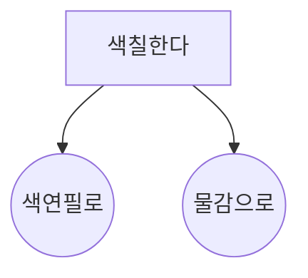

<br/ >

---

## template

> \_double_tab

---

<br/ >

## template

```c title="_double_tab"
#define F_CPU16000000UL
#include <avr/io.h>
#include <util/delay.h>
#include <util/LCD.h>
_double_tab;
```

<details>
<summary>실행 결과</summary>

```bash
_double_tab
```

</details>

---



---

:::note

Some **content** with _Markdown_ `syntax`. Check [this `api`](#).

:::

:::tip

Some **content** with _Markdown_ `syntax`. Check [this `api`](#).

:::

:::info

Some **content** with _Markdown_ `syntax`. Check [this `api`](#).

:::

:::warning

Some **content** with _Markdown_ `syntax`. Check [this `api`](#).

:::

:::danger

Some **content** with _Markdown_ `syntax`. Check [this `api`](#).

:::
