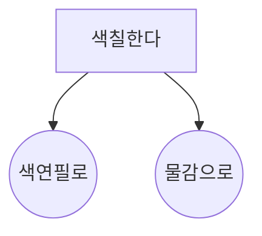

<br/ >

---

## template

> \_double_tab

---

<br/ >

## template

```c title="_double_tab"
#define F_CPU16000000UL
#include <avr/io.h>
#include <util/delay.h>
#include <util/LCD.h>
_double_tab;
```

<details>
<summary>실행 결과</summary>

```bash
_double_tab
```

</details>

---



---

:::note

Some **content** with _Markdown_ `syntax`. Check [this `api`](#).

:::

:::tip

Some **content** with _Markdown_ `syntax`. Check [this `api`](#).

:::

:::info

Some **content** with _Markdown_ `syntax`. Check [this `api`](#).

:::

:::warning

Some **content** with _Markdown_ `syntax`. Check [this `api`](#).

:::

:::danger

Some **content** with _Markdown_ `syntax`. Check [this `api`](#).

:::

문서는 아래와 같이 작성을 시작합니다.

```md
---
title: "**"
description: "**"
---
```

자료에서 도출된 주요 주제와 아이디어를 종합한 포괄적인 브리핑 문서를 작성하십시오.
가장 중요한 핵심 내용을 선두에 제시하는 [간결한 요약본(Executive Summary)] + [일상 속 예시]로 시작하십시오.
문서 본문은 [자료에서 발견된 주요 주제, 증거 및 결론]에 대한 상세하고 철저한 검토를 제공해야 합니다.
이 분석은 명확성을 보장하기 위해 [제목과 글머리 기호]로 논리적으로 구성되며,
내용은 [상황에 맞는 markdown 문법]을 사용하여 작성합니다.
어조는 [객관적이고 날카로워야 합니다].
개인 보관용으로 [출처를 밝히지 않습니다].
