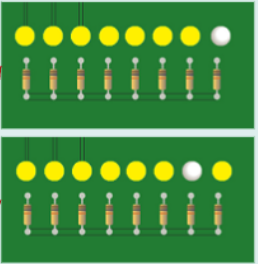
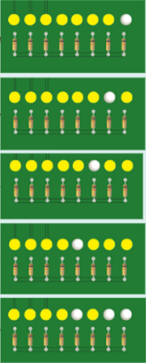
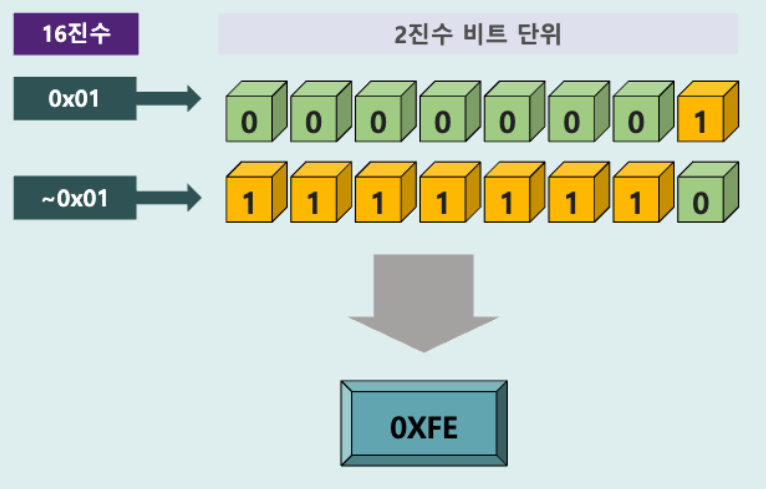

## LED 구동 기본 프로그램

```c title="코드 작성"
# define F_CPU 16000000UL // CPU 클럭 시간 16MHz 설정

#include <avr/io.h> // DDRA, PORTA
#include <util/delay.h> // _delay_ms() 함수

int main(void){
  DDRA = 0xFF; // PORTA 출력으로 사용 (16진수)

// highlight-start
  while(1){ // 무한 loop
    PORTA = 0x01; // 0b00000001 (16진수 > 2진수)
    _delay_ms(3000); // 3초(3000ms) 지연

    PORTA = 0x02; // 0b00000010 (16진수 > 2진수)
    _delay_ms(3000); // 3초(3000ms) 지연
  }
// highlight-end
  return 0;
}
```

<details>
<summary>실행 결과</summary>

  
^ 이미지와 같이 동작이 무한 반복된다

</details>

<br/ >

## 10진수와 16진수 LED 구동 관계

```c title="코드 작성"
# define F_CPU 16000000UL

#include <avr/io.h>
#include <util/delay.h>

int main(void){
  DDRA = 0xFF;

  while(1){

    PORTA = 0x01; // 10진수 1 2진수 0b0001
    _delay_ms(1000);

    PORTA = 0x02; // 10진수 2 2진수 0b0010
    _delay_ms(1000);

    PORTA = 0x04; // 10진수 4 2진수 0b0100
    _delay_ms(1000);

    PORTA = 0x08; // 10진수 8 2진수 0b1000
    _delay_ms(1000);

    PORTA = 0x0b; // 10진수 11 2진수 0b1011
    _delay_ms(1000);
  }

  return 0;
}
```

<details>
<summary>실행 결과</summary>

  
^ 이미지와 같이 동작이 무한 반복된다

</details>

<br/ >

## 비트 단위 부정 연산자

> `~` 연산자는 비트 단위로 부정하여 0은 1로 1은 0으로 변환함



```c
#define F_CPU 16000000UL

#include <avr/io.h>
#include <util/delay.h>

int main(void){
  DDRA = 0xFF;

  int i = 0;

  while(1) {

    for (i = 0; i < 256; i++){
      PORTA = ~i;
      _delay_ms(500);
    }
  }
}
```

<br/ >

## 배열을 이용한 LED 이동 프로그램

```c
#define F_CPU 16000000UL

#include <avr/io.h>
#include <util/delay.h>

int main(void){
  DDRA = 0xFF;
  int i = 0;

  unsigned char ledTable[] = {
    0x01, 0x02, 0x04, 0x08, 0x10, 0x20, 0x40,
    0x80, 0x40, 0x20, 0x10, 0x08, 0x04, 0x02
  }

  while(1){
    for (i = 0; i < 14; i++){
      PORTA = ~ledTable[i];
      _delay_ms(2000);
    }
  }

  return 0;
}
```

<br/ >

## `<<` 연산자를 이용한 LED 이동 프로그램

```c
#define F_CPU 16000000UL

#include <avr/io.h>
#include <util/delay.h>

int main(void){
  DDRA = 0xFF;
  int i = 0;
  int value = 0x01;

  while(1){
    PORTA = ~value;
    _delay_ms(500);
    value <<= 1;
    if(value == 0x100) value = 0x01;
  }

  return 0;
}
```

<br/ >

## LED 상하 이동 프로그램

```c
#define F_CPU 16000000UL

#include <avr/io.h>
#include <util/delay.h>

int main(void){
  DDRA = 0xFF;
  int i = 0;
  int value = 0x01;
  int direction = 1;

  while(1) {
    if (direction) {
      PORTA = ~value;
      _delay_ms(500);
      value <<= 1;
      if (value == 0x100) {
        value = 0x80;
        direction = 0;
      }
    } else {
      PORTA = ~value;
      _delay_ms(500);
      value >>= 1;
      if (value == 0x00) {
        value = 0x01;
        direction = 1;
      }
    }
  }

  return 0;
}
```
