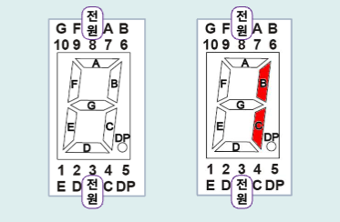
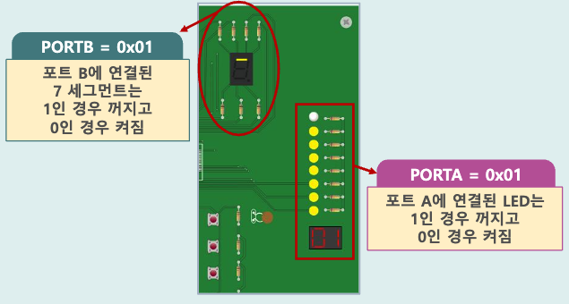

## 소개

:::info 7 Segment

길쭉한 모양의 7개의 LED를 붙여서  
숫자, 기호 등을 표시할 수 있도록 만든 소자로  
각 LED는 A ~ G까지 기호가 붙어있음

:::

- 위, 아래로 10개의 핀이 있으며 이 핀들은 각각 A ~ G까지의 LED와 점(DP)와 연결됨

- 1을 만들고 싶으면 B, C에 불이 들어오게 하면 됨  
  

- 7 세그먼트를 on 시키려면 PORTB에 1을 출력하면 됨

<br/ >

---

## 기본 프로그램

- PORTA 와 PORTB 에 1을 전달하여 출력했을 때

  - 코드

  ```c title="PORTA 와 PORTB 비교"
  #define F_CPU16000000UL
  #include<util/delay.h>
  #include<avr/io.h>

  int main(void){
    DDRA = 0b11111111;
    DDRB = 0b11111111;

    while(1){
      PORTA = 0b11111111;
      PORTB = 0b11111111;
    }

    return 0;
  }

  ```

  - 결과

  

<br/ >

---

## 연결 확인

<br/ >

---

## 숫자 0을 출력

<br/ >

---

## 숫자 5부터 숫자 9를 출력

<br/ >

---

## 배열을 이용하여 0부터 9까지 출력

<br/ >

---

## 배열을 이용하여 A부터 F까지 출력

<br/ >

---

```

```
