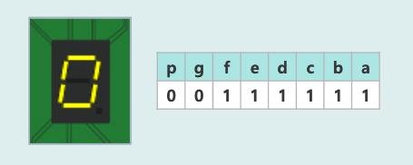

## 소개

:::info 7 Segment

길쭉한 모양의 7개의 LED를 붙여서  
숫자, 기호 등을 표시할 수 있도록 만든 소자로  
각 LED는 A ~ G까지 기호가 붙어있음

:::

- 위, 아래로 10개의 핀이 있으며 이 핀들은 각각 A ~ G까지의 LED와 점(DP)와 연결됨

- 1을 만들고 싶으면 B, C에 불이 들어오게 하면 됨  
  

- 7 세그먼트를 on 시키려면 PORTB에 1을 출력하면 됨

<br/ >

---

## 기본 프로그램

- PORTA 와 PORTB 에 1을 전달하여 출력했을 때

  - 코드

  ```c title="PORTA 와 PORTB 비교"
  #define F_CPU16000000UL
  #include<util/delay.h>
  #include<avr/io.h>

  int main(void){
    DDRA = 0b11111111;
    DDRB = 0b11111111;

    while(1){
      PORTA = 0b11111111;
      PORTB = 0b11111111;
    }

    return 0;
  }

  ```

  - 결과

  

<br/ >

---

## 연결 확인

```c title="7 Segment 모두 출력"
 #define F_CPU16000000UL
 #include<util/delay.h>
 #include<avr/io.h>

 int main(void){
   DDRA = 0b11111111; // 0xFF
   DDRB = 0b11111111; // 0xFF

   while(1){
     PORTA = 0b00000001; // 0x01
     PORTB = 0b00000001; // 0x01
     _delay_ms(3000);

     PORTA = 0b00000010; // 0x02
     PORTB = 0b00000010; // 0x02
     _delay_ms(3000);

     PORTA = 0b00000100; // 0x04
     PORTB = 0b00000100; // 0x04
     _delay_ms(3000);

     PORTA = 0b00001000; // 0x08
     PORTB = 0b00001000; // 0x08
     _delay_ms(3000);

     PORTA = 0b00010000; // 0x10
     PORTB = 0b00010000; // 0x10
     _delay_ms(3000);

     PORTA = 0b00100000; // 0x20
     PORTB = 0b00100000; // 0x20
     _delay_ms(3000);

     PORTA = 0b01000000; // 0x40
     PORTB = 0b01000000; // 0x40
     _delay_ms(3000);

     PORTA = 0b10000000; // 0x80
     PORTB = 0b10000000; // 0x80
     _delay_ms(3000);
   }
   return 0;
 }
```

<br/ >

```c title="7 Segment << 연산자를 사용"
 #define F_CPU16000000UL
 #include<util/delay.h>
 #include<avr/io.h>

 int main(void){
   DDRA = 0b11111111;
   DDRB = 0b11111111;
   int data = 0x01; // 0b00000001

   while(1){
     PORTA = data;
     PORTB = data;
     _delay_ms(2000);
     data = data << 1; // data <<= 1
     if (data == 0x100) data = 0x01; // 초기화
   }
   return 0;
 }
```

<br/ >

---

## 숫자 0을 출력

```c title="7 Segment로 0을 출력"
 #define F_CPU16000000UL
 #include<util/delay.h>
 #include<avr/io.h>

 int main(void){
   DDRA = 0xFF;
   DDRB = 0xFF;

   while(1){
     PORTA = 0b00111111;
     PORTB = 0b00111111;
     _delay_ms(2000);
   }
   return 0;
 }
```

- 숫자 0을 만들기 위해 `abcdef`를 on 시킨다



<br/ >

---

## 숫자 0부터 숫자 4를 출력

```c title="7 Segment로 0 ~ 4 출력"
 #define F_CPU16000000UL
 #include<util/delay.h>
 #include<avr/io.h>

 int main(void){
   DDRA = 0xFF;
   DDRB = 0xFF;

   while(1){
             //pgfedcba
     PORTA = 0b00111111; // 0
     PORTB = 0b00111111;
     _delay_ms(2000);
             //pgfedcba
     PORTA = 0b00000110; // 1
     PORTB = 0b00000110;
     _delay_ms(2000);
             //pgfedcba
     PORTA = 0b01011011; // 2
     PORTB = 0b01011011;
     _delay_ms(2000);
             //pgfedcba
     PORTA = 0b01001111; // 3
     PORTB = 0b01001111;
     _delay_ms(2000);
             //pgfedcba
     PORTA = 0b01100110; // 4
     PORTB = 0b01100110;
     _delay_ms(2000);

   }
   return 0;
 }
```

<br/ >

---

## 숫자 5부터 숫자 9를 출력

```c title="7 Segment로 5 ~ 9 출력"
 #define F_CPU16000000UL
 #include<util/delay.h>
 #include<avr/io.h>

 int main(void){
   DDRA = 0xFF;
   DDRB = 0xFF;

   while(1){
             //pgfedcba
     PORTA = 0b01101101; // 5
     PORTB = 0b01101101;
     _delay_ms(2000);
             //pgfedcba
     PORTA = 0b01111101; // 6
     PORTB = 0b01111101;
     _delay_ms(2000);
             //pgfedcba
     PORTA = 0b00100111; // 7
     PORTB = 0b00100111;
     _delay_ms(2000);
             //pgfedcba
     PORTA = 0b01111111; // 8
     PORTB = 0b01111111;
     _delay_ms(2000);
             //pgfedcba
     PORTA = 0b01100111; // 9
     PORTB = 0b01100111;
     _delay_ms(2000);

   }
   return 0;
 }
```

<br/ >

---

## 배열을 이용하여 0부터 9까지 출력

```c title="배열로 하드코딩을 개선"
#define F_CPU16000000UL
#include<util/delay.h>
#include<avr/io.h>

int main(void){
  int i = 0;
  DDRA = 0xFF;
  DDRB = 0xFF;

  unsigned char seg[] = {
    0b00111111, // 0
    0b00000110, // 1
    0b01011011, // 2
    0b01001111, // 3
    0b01100110, // 4
    0b01101101, // 5
    0b01111101, // 6
    0b00100111, // 7
    0b01111111, // 8
    0b01100111, // 9
  }

  while(1){
    PORTA = seg[i];
    PORTB = seg[i];
    _delay_ms(2000);
    i++;
    if ( i > 9 ) i = 0; // reset
  }
  return 0;
}
```

<br/ >

---

## 배열을 이용하여 A부터 F까지 출력

```c title="배열로 하드코딩을 개선"
#define F_CPU16000000UL
#include<util/delay.h>
#include<avr/io.h>

int main(void){
  int i = 0;
  DDRA = 0xFF;
  DDRB = 0xFF;

  unsigned char seg[] = {
    0x77,
    0x7C,
    0x58,
    0x5E,
    0x79,
    0x71
  }

  while(1){
    PORTA = seg[i];
    PORTB = seg[i];
    _delay_ms(2000);
    i++;
    if ( i > 5 ) i = 0; // reset
  }
  return 0;
}
```

<br/ >
