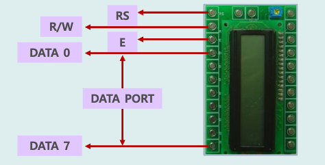

## LCD 소개



- RS(입력) : Read/Write 신호로 제어하기 LCD 자체 명령과 데이터 입력을 제어함
- R/W : Read/Write 신호를 관장함
- E(입력) : Enable 신호로 명령이 하나 입력될 때마다 펄스를 하나씩 내주어야 함
- DB0 ~ D87 : 데이터 버스

<br/ >

## LCD에 한 문자 출력

```c title="문자 s 출력"
#define F_CPU16000000UL
#include <avr/io.h>
#include <util/delay.h>
#include <util/LCD.h>

int main(void){
  icd_init();
  icd_write_char('s');

  return 0;
}
```

<details>
<summary>실행 결과</summary>

```bash
s
```

</details>

<br/ >

## LCD에 두 문자 출력

```c title="문자 sT 출력"
#define F_CPU16000000UL
#include <avr/io.h>
#include <util/delay.h>
#include <util/LCD.h>

int main(void){
  icd_init();
  icd_write_char('s');
  icd_write_char('T');

  return 0;
}
```

<details>
<summary>실행 결과</summary>

```bash
sT
```

</details>

<br/ >

## 커서에 위치 이동하고 두 문자 출력학

- LCD 좌표
  - x 좌표는 0 ~ 15
  - y 좌표는 0, 1

| 0,0 | 1,0 | 2,0 | 3,0 | 4,0 | 5,0 | 6,0 | 7,0 | 8,0 | 9,0 | 10,0 | 11,0 | 12,0 | 13,0 | 14,0 | 15,0 |
| --- | --- | --- | --- | --- | --- | --- | --- | --- | --- | ---- | ---- | ---- | ---- | ---- | ---- |
| 0,1 | 1,1 | 2,1 | 3,1 | 4,1 | 5,1 | 6,1 | 7,1 | 8,1 | 9,1 | 10,1 | 11,1 | 12,1 | 13,1 | 14,1 | 15,1 |

```c title="문자 sT 출력"
#define F_CPU16000000UL
#include <avr/io.h>
#include <util/delay.h>
#include <util/LCD.h>

int main(void){
  icd_init();
  lcd_position(3, 0);
  icd_write_char('s');
  icd_write_char('T');

  return 0;
}
```

<details>
<summary>실행 결과</summary>

```bash
   sT
```

</details>

<br/ >

## 상단에 년, 월, 일, 요일 출력

```c title="2024 Dec 07 Sat"
#define F_CPU16000000UL
#include <avr/io.h>
#include <util/delay.h>
#include <util/LCD.h>

int main(void){
  icd_init();
  icd_write_char('2');
  icd_write_char('0');
  icd_write_char('2');
  icd_write_char('4');

  lcd_position(5, 0);
  icd_write_char('D');
  icd_write_char('e');
  icd_write_char('c');

  lcd_position(9, 0);
  icd_write_char('0');
  icd_write_char('7');

  lcd_position(12, 0);
  icd_write_char('S');
  icd_write_char('a');
  icd_write_char('t');

  return 0;
}
```

<details>
<summary>실행 결과</summary>

```bash
2024 Dec 07 Sat
```

</details>

<br/ >

## 하단에 오전, 오후, 시, 분, 초 출력하기

```c title="PM 02H 38M 59S"
#define F_CPU16000000UL
#include <avr/io.h>
#include <util/delay.h>
#include <util/LCD.h>

int main(void){
  icd_init();
  lcd_position(0, 1);
  icd_write_char('P');
  icd_write_char('M');

  lcd_position(4, 1);
  icd_write_char('0');
  icd_write_char('2');
  icd_write_char('H');

  lcd_position(8, 1);
  icd_write_char('3');
  icd_write_char('8');
  icd_write_char('M');

  lcd_position(12, 1);
  icd_write_char('5');
  icd_write_char('9');
  icd_write_char('S');

  return 0;
}
```

<details>
<summary>실행 결과</summary>

```bash

PM 02H 38M 59S
```

</details>

<br/ >

## 초 출력하기

| 문자 | 0   | 1   | 2   | 3   | 4   | 5   | 6   | 7   | 8   | 9   |
| ---- | --- | --- | --- | --- | --- | --- | --- | --- | --- | --- |
| 코드 | 48  | 49  | 50  | 51  | 52  | 53  | 54  | 55  | 56  | 57  |

```c title="second가 58 일 때"
#define F_CPU16000000UL
#include <avr/io.h>
#include <util/delay.h>
#include <util/LCD.h>

int main(void){
  icd_init();
  int second = 58;

  while(1){
    lcd_position(12, 1);

    // 10의 자리 5에 0 의 아스키코드 값을 더해 숫자를 문자로 출력
    icd_write_char(second / 10 + '0'); // 5 + 48
    // 1의 자리 8에 0 의 아스키코드 값을 더해 숫자를 문자로 출력
    icd_write_char(second % 10 + '0'); // 8 + 48

    icd_write_char('S');
    _delay_ms(1000);
    second++;

    if (second >= 60) second = 0; // 60초인 경우 0으로 초기화
  }

  return 0;
}
```

<details>
<summary>실행 결과</summary>

```bash

           58S
```

</details>

<br/ >

## 분 초 출력하기

```c title="58분 59초 >> 59분 00초 >> 59분 01초 ..."
#define F_CPU16000000UL
#include <avr/io.h>
#include <util/delay.h>
#include <util/LCD.h>

int main(void){
  icd_init();
  int minute = 58;
  int second = 59;

  while(1){
    lcd_position(12, 1);

    icd_write_char(second / 10 + '0'); // 5 + 48
    icd_write_char(second % 10 + '0'); // 9 + 48
    icd_write_char('S');
    _delay_ms(1000);
    second++;

    if (second >= 60) {
      second = 0;
      minute++; // 1분 증가
    }

    lcd_position(8, 1);
    lcd_write_char(minute / 10 + '0');
    lcd_write_char(minute % 10 + '0');
    icd_write_char('M');
  }


  return 0;
}
```

<details>
<summary>실행 결과</summary>

```bash

    58M 59S
```

```bash

    59M 00S
```

```bash

    59M 01S
```

</details>

<br/ >

## 시 분 초 출력하기

```c title="12시 59분 59초 >> 01시 00분 00초 ..."
#define F_CPU16000000UL
#include <avr/io.h>
#include <util/delay.h>
#include <util/LCD.h>

int main(void){
  icd_init();
  int hour = 12;
  int minute = 59;
  int second = 59;

  while(1){
    lcd_position(12, 1);

    icd_write_char(second / 10 + '0'); // 5 + 48
    icd_write_char(second % 10 + '0'); // 9 + 48
    icd_write_char('S');
    _delay_ms(1000);
    second++;

    if (second >= 60) {
      second = 0;
      minute++; // 1분 증가
    }

    lcd_position(8, 1);
    lcd_write_char(minute / 10 + '0');
    lcd_write_char(minute % 10 + '0');
    icd_write_char('M');

    if (minute >= 60) {
      minute = 0;
      hour++;
    }

    lcd_position(4, 1);
    lcd_write_char(hour / 10 + '0');
    lcd_write_char(hour % 10 + '0');
    icd_write_char('H');

    if (hour >= 13) hour = 1;
  }

  return 0;
}
```

<details>
<summary>실행 결과</summary>

```bash

   12H 59M 59S
```

```bash

   01H 00M 00S
```

```bash

   01H 00M 01S
```

</details>

<br/ >

## AM/PM 시 분 초 출력하기

```c title="12시 59분 59초 >> 01시 00분 00초 ..."
#define F_CPU16000000UL
#include <avr/io.h>
#include <util/delay.h>
#include <util/LCD.h>

int main(void){
  icd_init();
  int hour = 12;
  int minute = 59;
  int second = 59;
  int AMPM = 0;

  while(1){
    lcd_position(12, 1);

    icd_write_char(second / 10 + '0'); // 5 + 48
    icd_write_char(second % 10 + '0'); // 9 + 48
    icd_write_char('S');
    _delay_ms(1000);
    second++;

    if (second >= 60) {
      second = 0;
      minute++; // 1분 증가
    }

    lcd_position(8, 1);
    lcd_write_char(minute / 10 + '0');
    lcd_write_char(minute % 10 + '0');
    icd_write_char('M');

    if (minute >= 60) {
      minute = 0;
      hour++;
    }

    lcd_position(4, 1);
    lcd_write_char(hour / 10 + '0');
    lcd_write_char(hour % 10 + '0');
    icd_write_char('H');

    if (hour >= 13) hour = 1;

    if ( (hour == 12) & (minute == 0) & (second == 0) ){
      AMPM++;
      if (AMPM >= 2) AMPM = 0;
    }

    lcd_position(1, 1);

    if (AMPM) lcd_write_char('P');
    else lcd_write_char('A');
    lcd_write_char('M');
  }

  return 0;
}
```

<details>
<summary>실행 결과</summary>

```bash

 AM 12H 59M 59S
```

```bash

 PM 01H 00M 00S
```

```bash

 PM 01H 00M 01S
```

</details>

<br/ >

## 년, 월, 일 출력

```c title="2024 12 07"
#define F_CPU16000000UL
#include <avr/io.h>
#include <util/delay.h>
#include <util/LCD.h>

int main(void){
  icd_init();
  int year = 2024;
  int month = 12;
  int date = 30;

  while(1){
    lcd_position(1, 0);
    lcd_write_char(year / 1000 + '0');
    lcd_write_char((year / 100) % 10 + '0');
    lcd_write_char((year / 10) % 10 + '0');
    lcd_write_char(year % 10 + '0');

    lcd_position(6, 0);
    lcd_write_char(month / 10 + '0');
    lcd_write_char(month % 10 + '0');

    lcd_position(9, 0);
    lcd_write_char(date / 10 + '0');
    lcd_write_char(date % 10 + '0');
  }
  return 0;
}
```

<details>
<summary>실행 결과</summary>

```bash

```

</details>

<br/ >

## 년, 월, 일 AM/PM 시, 분, 초 출력

```c title="2024 12 07 PM 01H 00M 00S"
#define F_CPU16000000UL
#include <avr/io.h>
#include <util/delay.h>
#include <util/LCD.h>

int main(void){
  icd_init();
  int year = 2024;
  int month = 12;
  int date = 30;
  int hour = 11;
  int minute = 59;
  int second = 59;
  int AMPM = 0;

  while(1){
    _delay_ms(1000);
    second++;

    if (second >= 60) {
      second = 0;
      minute++;
    }
    if (minute >= 60) {
      minute = 0;
      hour++;
    }

    // date
    lcd_position(1, 0);
    lcd_write_char(year / 1000 + '0');
    lcd_write_char((year / 100) % 10 + '0');
    lcd_write_char((year / 10) % 10 + '0');
    lcd_write_char(year % 10 + '0');

    lcd_position(6, 0);
    lcd_write_char(month / 10 + '0');
    lcd_write_char(month % 10 + '0');

    lcd_position(9, 0);
    lcd_write_char(date / 10 + '0');
    lcd_write_char(date % 10 + '0');

    // time
    lcd_position(12, 1);
    icd_write_char(second / 10 + '0'); // 5 + 48
    icd_write_char(second % 10 + '0'); // 9 + 48
    icd_write_char('S');

    lcd_position(8, 1);
    lcd_write_char(minute / 10 + '0');
    lcd_write_char(minute % 10 + '0');
    icd_write_char('M');

    lcd_position(4, 1);
    lcd_write_char(hour / 10 + '0');
    lcd_write_char(hour % 10 + '0');
    icd_write_char('H');

    if (hour >= 13) hour = 1;

    if ( (hour == 12) & (minute == 0) & (second == 0) ){
      AMPM++;
      if (AMPM >= 2) AMPM = 0;
    }

    lcd_position(1, 1);

    if (AMPM) lcd_write_char('P');
    else lcd_write_char('A');
    lcd_write_char('M');
  }
  return 0;
}
```

<details>
<summary>실행 결과</summary>

```bash
2024 12 30
AM 12H 59M 59S
```

```bash
2024 12 30
PM 01H 00M 00S
```

</details>
