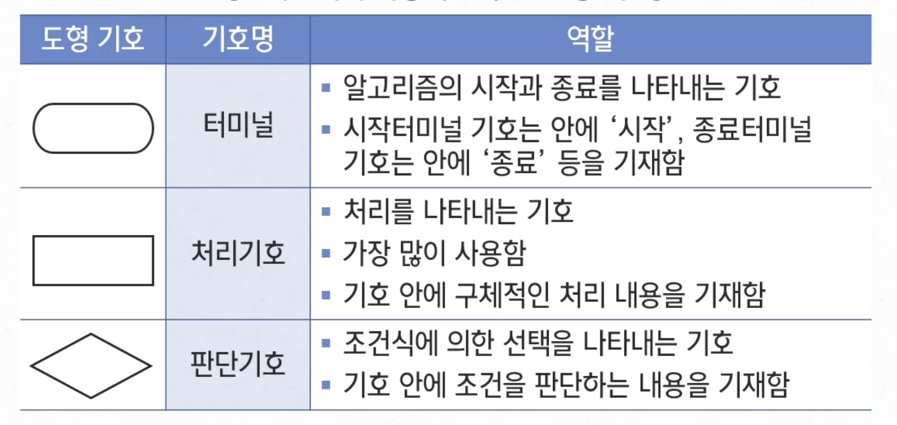
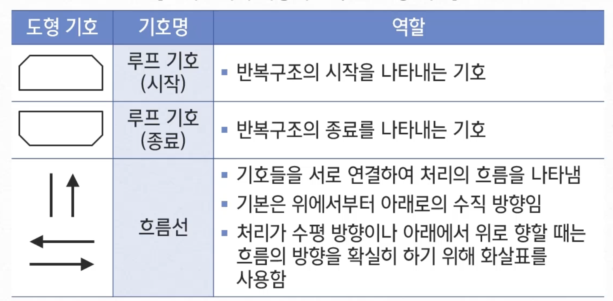

## 자료구조

| 일상 생활에서의 예  | 자료구조 |
| ------------------- | -------- |
| 매표소의 줄         | 큐       |
| 계획 리스트         | 리스트   |
| 책을 쌓아두는 것    | 스택     |
| 영어사전            | 탐색구조 |
| 웹사이트 탐색, 지도 | 그래프   |
| 조직도              | 트리     |

위처럼 자료(data)를 담는 구조

접근 및 수정을 가능하게 하는 자료의 조직, 관리, 저장

대량의 데이터를 효율적으로 관리할 수 있는 데이터의 구조

코드 상에서 효율적으로 데이터를 처리하기 위해
데이터 특성에 따라 체계적으로 데이터를 구조화해야 한다

<br/ >

---

<br/ >

## 알고리즘

- 어떤 문제를 해결하기 위한 방법의 절차
- 컴퓨터 과학, 수학 등의 분야에서 어떤 문제를 풀어내기 위해 <br/ >
  정해진 일련의 절차나 방법을 공식화한 형태로 표현한 것

<br/ >

### 기본형

#### 순차 구조

> - 처음부터 순서대로 처리
> - 원하는 처리를 차례대로 작성

1. 학교에 간다
2. 수업을 듣는다
3. 집으로 돌아온다

#### 선택 구조

> - 조건식으로 판단하여 실행할 처리를 전환
>   - 예상하지 못한 상황을 가정하여 이를 회피할 수 있도록 함
>   - 선택 구조에 있어서 조건 판단을 실행하는 식을 '조건식'이라 함

1. 마트에 간다
2. 라면이 있는가?
   1. 있다, 라면을 산다
   2. 없다, 우동을 산다
3. 집으로 돌아온다

#### 반복 구조

> 조건을 만족하는 동안 같은 처리를 반복

1. 학교에 간다
2. 수업을 듣는다
3. 다음 수업을 확인한다
   1. 있다, 2번으로 돌아간다
   2. 없다, 4번으로 넘어간다
4. 집으로 돌아온다

<br/ >

### 기술 방법

#### 순서도

> 순서도에서 사용하는 주요 도형

<br/ >

#### 프로그래밍 언어

- C
- C++
- Java
- PHP
- Java Script
- Python

<br/ >

#### 의사 코드(pseudo code)

> 1. 학교에 간다
> 2. 수업을 듣는다
> 3. 집으로 돌아온다

> 1. 마트에 간다
> 2. 라면이 있는가?
>    > 있다, 라면을 산다 <br/ >
>    > 없다, 우동을 산다
> 3. 집으로 돌아온다

<br/ >

---

<br/ >

## 자료구조와 알고리즘에 대한 이해

- 배워야할 기술을 난이도별로 배우는 것이 아닌 중요한 것 위주로 학습
  - 필요한 기술이 있다면 기본적인 부분은 최대한 설명
  - 프로그래밍 문법에 대해서는 개인적으로 학습을 해야 함
- 스스로 이해해보려고 노력
  - 검색과 다양한 자료를 통해 동일한 기수릉ㄹ 설명하는 여러 정보들 확인

#### 자료구조

- 데이터를 어떠한 형태로 저장하고 관리할 것인지에 대한 방법
- 어떻게 효율적으로 자료를 저장할 것인가에 대한 고민

:::info 종류

- 배열
- 스택
- 큐
- 링크드 리스트
- 힙
- 해쉬 테이블

:::

#### 알고리즘

- 저장된 데이터를 찾거나 변형 및 수정할 때 필요한 방법
- 문제를 해결하기 위한 절차에 대한 고민

:::info 종류

- 정렬
- 탐색
- 동적
- 그래프
- 탐욕
- 분할정복
- 백트래킹

:::

<br/ >

---

<br/ >

## 자료구조와 알고리즘이 중요한 이유

- 어떤 자료구조와 알고리즘을 사용하느냐에 따라 성능은 많은 차이를 보일 수 있음
  - 좋은 프로그래밍을 만들기 위해
  - 프로그램의 좋고 나쁨을 판단하기 위해
  - 프로그래밍을 할 수 있는 능력을 향상시키기 위해

<br/ >

---

<br/ >

## 프로그램

:::info 정의
프로그램 : 컴퓨터에서 실행될 때 특정 작업을 수행하는 일련의 명령어들의 집합
:::

프로그램 작성에서의 알고리즘

1. 프로그램 설계하기
2. 프로그래밍
3. 프로그래밍 디버깅
4. 프로그램 문서 작성

<br/ >

---

<br/ >

## 알고리즘의 성능 분석

### 처리 시간 측정

- 2개의 알고리즘의 실제 처리 시간을 측정함
- 실제 구현을 하여 테스트를 함
- 동일한 하드웨어 사용

### 알고리즘의 복잡도 분석

- 직접 구현하지 않고서도 처리 시간을 분석할 수 있음
- 알고리즘이 수행하는 연산의 횟수를 측정하여 비교함
- 연산의 횟수는 n의 함수

  - 시간복잡도 분석 : 처리 시간 분석
  - 공간 복잡도 분석 : 처리 시 필요로 하는 메모리 공간 분석

- 시간 복잡도는 알고리즘에서 연산들이 몇 번 수행되는지 숫자로 표시
- 알고리즘이 수행하는 연산의 개수를 계산하여 두 개의 알고리즘을 비교
- 연산의 수행 횟수는 입력의 개수 n에 대한 함수 T(n)으로 표기
