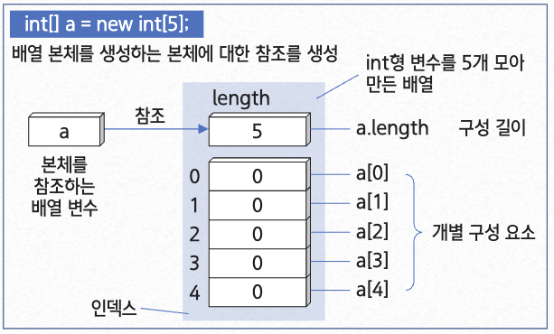
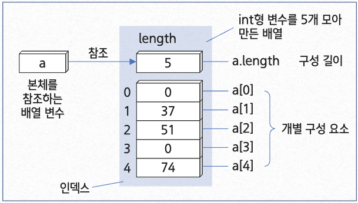
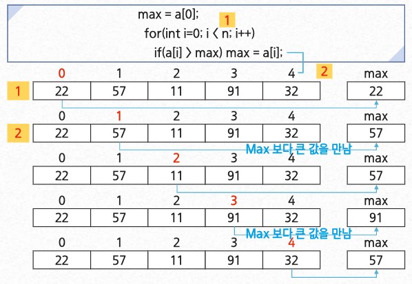
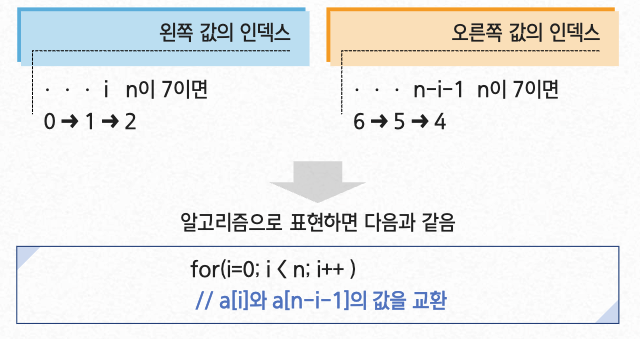
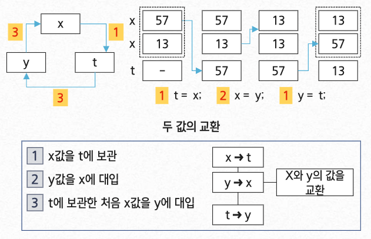
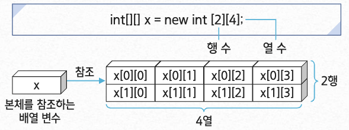

:::info 배열

데이터를 나열하고, 각 데이터를 인덱스에 대응하도록 구성한 데이터 구조

- 파이썬에서는 리스트 타입이 배열 기능을 제공함

:::

<br/ >

---

<br/ >

### 배열의 필요성

배열은 왜 필요할까?

- 같은 종류의 데이터를 **효율적으로 관리**하기 위해 사용
- 같은 종류의 데이터를 **순차적으로 저장**하기 위해 사용

> 장점
>
> - 빠른 접근이 가능
> - 첫 데이터의 위치에서 상대적인 위치로 데이터 접근

> 단점
>
> - 데이터 추가 / 삭제가 어려움
> - 미리 최대 길이를 지정해야 함

<br/ >

---

<br/ >

### Primitive 자료형과 Wrapper 클래스

JAVA에서는 int와 integer와 같이,
Primitive 자료형과 Wrapper 클래스가 있음

Wrapper 클래스를 주로 사용함

> Wrapper 클래스를 사용하는 이유
>
> - Null을 용이하게 처리 가능
> - ArrayList 등 객체만을 핸들링하는 기능 사용을 위함

<br/ >

---

<br/ >

### 배열이란?

> 같은 자료형의 변수로 이루어진 구성 요소(Component)가 모인 것

- 데이터가 많아진다면 변수 이름을 잘못 입력할 수 있음
- 저장할 변수 이름을 학번처럼 '몇 번 째'로 지정하면 편리함

<br/ >

---

<br/ >

### 배열의 선언

- int형인 배열임을 명확하게 나타내는 타입 A가 많이 사용됨

  > `int[] a; // a는 자료형이 int형인 배열 : 타입 A` <br/ >
  > `int a[]; // a는 자료형이 int형인 배열 : 타입 B`

- 구성 요소의 수가 5개인 배열은 아래와 같이 선언됨
  > A = new int[5];
  >
  > - int형의 배열을 생성하고, 변수 a가 **참조**하도록 설정함

<br/ >

---

<br/ >

### 배열 변수와 배열 본체

- 배열은 같은 형의 구성 요소가 직선 모양으로 연속하여 줄지어 있는 단순한 구조로 되어있음



- 0으로 초기화된 배열

<br/ >

---

<br/ >

### 배열의 특성 실습

```java
class IntArray {
  public static void main(String[] args){
    int[] a = new int[5]; // 배열 선언

    a[1] = 37;
    a[2] = 51;
    a[4] = a[1] * 2;

    for(int i = 0; i < a.length; i++){
      System.out.printIn("a[" + i + "]=" + a[i]);
    }
  }
}
```

<details>
  <summary>실행 결과</summary>
    ```text
    a[0]=0
    a[1]=37
    a[2]=51
    a[3]=0
    a[4]=74
    ```
</details>

<br/ >

---

<br/ >

### 실습에 선언된 배열

> 배열의 구성 요소는 자동으로 0으로 초기화 됨



<br/ >

---

<br/ >

### 배열의 값을 초기화하며 배열 선언하기

- 배열 본체
  - 배열 초기화를 사용하면 배열 본체의 생성과 동시에 각 요소의 초기화가 가능함

```java
class IntArrayInit {
  public static void main(String[] args) {
    int[] a = {1, 2, 3, 4, 5}; // 배열 초기자에 의해 생성

    for(int i = 0; i < a.length; i++){
      System.out.printIn("a[" + i + "]=" + a[i]);
    }
  }
}
```

<details>
  <summary>실행 결과</summary>
    ```text
    a[0]=1
    a[1]=2
    a[2]=3
    a[3]=4
    a[4]=5
    ```
</details>

<br/ >

---

<br/ >

### 배열의 최댓값 구하기

- 배열 a의 구성 값이 3개일 때

  ```java
  max = a[0];
  if (a[1] > max) max = a[1];
  if (a[2] > max) max = a[2];
  ```

- 배열 a의 구성 값이 4개일 때

  ```java
  max = a[0];
  if (a[1] > max) max = a[1];
  if (a[2] > max) max = a[2];
  if (a[3] > max) max = a[3];
  ```

- 배열 a의 구성 값이 n개일 때

  ```java
  max = a[0];
  for(int i = 0; i < n; i++){
    if(a[i] > max) max = a[i]
  }
  ```

  

<br/ >

---

<br/ >

### 배열 값을 역순으로 정렬하기



- 두 값의 교환을 위해 총 n/2회가 필요함

  

- 코드로 표현

  ```ts
  t = a[idx1];
  a[idx1] = a[idx2];
  a[idx2] = t;
  ```

- 메서드 swap

  ```java
  Statid void swap(int[] a, int idx1, int idx2){
    int t = a[idx1];
    a[idx1] = a[idx2];
    a[idx2] = t
  }
  ```

  1. x값을 t에 보관
  2. y값을 x에 대입
  3. t에 보관한 처음 x값을 y에 대입

<br/ >

---

<br/ >

### 다차원 배열

#### 2차원 배열과 3차원 배열

- 2차원 배열

  - 배열을 구성 값을 하는 것

> 다차원 배열 중 가장 간단한 것이 2차원 배열<br/ >
> `int[][] x = new int [2][4];`



<br/ >

- 3차원 배열
  - 2차원 배열을 구성값으로 하는 것
  - 3차원 배열의 선언
    - `int y[][][] = new long[2][4];`
    - Long형을 구성 자료형으로 하는 배열을 구성 자료형으로 하는 배열
      - `int y[][][] = new long[2][3][4];`
