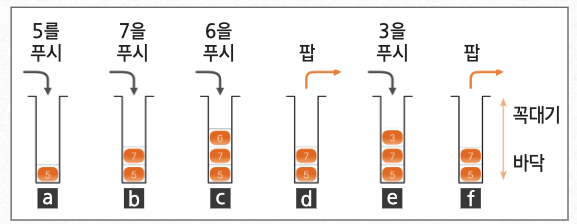
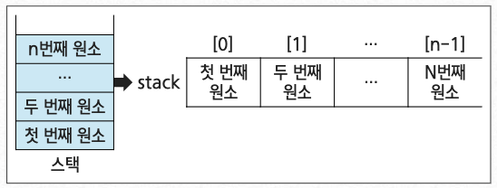
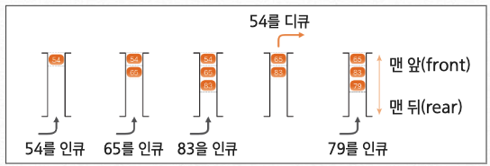
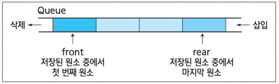
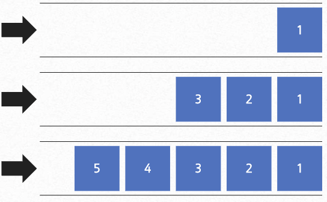
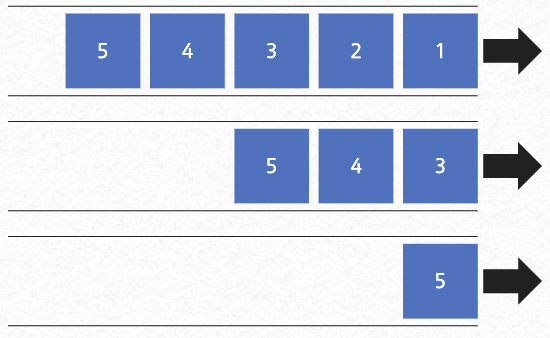
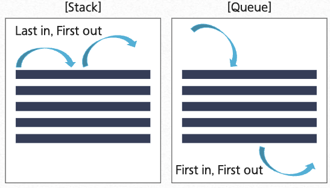
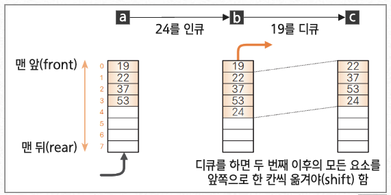
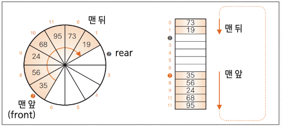

## 스택

### 스택이란?

> 데이터를 일시적으로 쌓아 놓는 자료구조

- 데이터의 입력과 출력 순서 : LIFO(Last in, First Out)
  - 가장 나중에 넣은 데이터를 가장 먼저 추출하는 정잭
  - 후입선출
- 스택 활용의 예
  - 컴퓨터 내부 프로세스 구조의 함수 동작 방식
  - 재귀 프로그램
  - 빨래통
  - 책 쌓기

### 주요 기능

:::info push()

스택에 데이터를 넣는 작업

:::

:::warning pop()

스택에 데이터를 꺼내는 작업

:::



### 메서드 호출과 스택

> 자바 프로그램에서 메서드를 호출, 실행 시 내부에서 스택을 사용함

```java
void x() { /* ... */ }
void y() { /* ... */ }

void z(){
  x();
  y();
}

void main(){
  z();
}
```

1. main 메서드가 실행되기 전의 상태
2. main 메서드가 호출되어 실행을 시작
3. z 메서드 호출
4. x 메서드 호출
5. x 메서드 실행 종료, z 메서드로 돌아옴
6. y 메서드 호출
7. y 메서드 실행 종료, z 메서드로 돌아옴
8. z 메서드 실행 종료, main 메서드로 돌아옴
9. main 메서드가 실행을 종료

### 장/단점

> 장점
>
> - 구조가 단순하여 구현이 용이함
> - 데이터의 저장/읽기 속도가 빠름

> 단점
>
> - 데이터의 최대 개수를 미리 정해야 함
> - 저장 공간의 낭비가 발생함
> - 사용하려는 데이터의 최대 개수만큼 저장 공간을 확보해야 함

:::tip

스택은 빠른 성능을 위해 사용되므로, 배열을 활용해 구현하는 것이 일반적임

:::

### Java의 스택

#### 스택의 push 알고리즘

- `top <- top + 1;`
  - 스택에서 top이 마지막 데이터를 가리키고 있으므로 그 위에 자료를 삽입하려면 먼저 top의 위치를 하나 증가시킴
  - 이때 top의 위치가 스택의 크기(stack_size)보다 크다면 오버플로우(overflow) 상태가 되므로 삽입 연산을 수행하지 못하고 연산 종료
- `stack(top) <- x;`
  - 오버플로우 상태가 아니라면 스택의 top이 가리키는 위치에 x를 삽입함

#### 스택의 pop 알고리즘

- return stack(top);
  - 비어있는 스택이 아니라면 top이 가리키는 데이터를 먼저 반환함
- `top <- top -1;`
  - 스택의 top 데이터를 반환하였으므로 top의 위치는 그 아래 데이터로 변경하기 위해 top의 위치를 하나 감소함

### 배열을 사용한 스택 구현

> 순차 자료구조인 배열을 사용하여 스택을 구현

- 스택의 사이즈 : 배열의 사이즈

- 스택에 저장된 데이터의 순서 : 배열 데이터의 인덱스

  - 인덱스 0번 : 스택의 첫번째 데이터
  - 인덱스 n-1번 : 스택의 n번째 데이터

    

- 스택에 저장된 데이터의 순서 : 배열 데이터의 인덱스

  - 변수 top : 스택에 저장된 마지막 데이터에 대한 인덱스 저장
    - 공백 상태
      > top = -1(초기값)
    - 포화 상태
      > top = n - 1

- 데이터 사이즈가 5인 배열의 스택에서의 연산 과정

> 1. 공백 스택 생성 : `create(stack, 5);`
> 2. 원소 A 삽입 : `push(stack, A);`
> 3. 원소 B 삽입 : `push(stack, B);`
> 4. 원소 C 삽입 : `push(stack, C);`
> 5. 원소 삭제 : `pop(stack);`

### 스택의 search 알고리즘

```java
Stack<integer> stack = new Stack<>();
  for (int i = 0; i < 5 i++) {
    stack.push(i + 1);
  }

System.out.printIn(stack.search(1));
```

<br/ >

---

<br/ >

## 큐(queue)

### 큐 알아보기

> 스택과 마찬가지로 데이터를 일시적으로 쌓아두는 기본 자료구조

- 가장 먼저 넣은 데이터를 가장 먼저 꺼내는 선입선출 구조

  - 영화관에서 가장 먼저 줄을 선 사람이 먼저 입장하는 것과 동일함 (선착순)
  - FIFO(First-In, First-Out) 방식으로 스택과 꺼내는 순서가 반대임
  - 너비 우선 탐색(BFS), 캐시(cache) 구현

    

<br/ >

### 구조



- 큐의 연산

:::info Enqueue

큐에 데이터를 넣는 작업

:::

<br/ >



:::warning Dequeue

큐에 데이터를 꺼내는 작업

:::



<br/ >

### 스택과 큐의 비교

- 구조

  

- 연산

  | ---  | 연산자  | 삽입 위치 | 연산자  | 삽입 위치 |
  | ---- | ------- | --------- | ------- | --------- |
  | 스택 | push    | top       | pop     | top       |
  | 큐   | enQueue | rear      | deQueue | front     |

<br/ >

### 배열로 큐 만들기

> 스택과 마찬가지로 큐 또한 배열을 사용하여 구현할 수 있음



<br/ >

### 링 버퍼로 큐 만들기

- 배열 요소를 앞쪽으로 옮기지 않는 큐

  - 이를 위해 사용하는 자료구조를 '링 버퍼(ring buffer)'라고 함

- 배열의 맨 뒤가 맨 앞과 연결되었다고 보는 자료구조



> - 프런트(front) : 논리적으로 맨 앞 요소의 인덱스
> - 리어(rear) : 논리적인 맨 뒤 요소 하나 뒤의 인덱스(다음 요소를 인큐할 위치의 인덱스)
