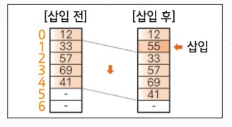

## 리스트

### 리스트(list)란?

> 순서를 가지고 일렬로 나열한 항목(item)들의 모임

- 집합

  - 항목 간의 **순서**의 개념이 없음

- 리스트

  - **순서**를 갖도록 데이터를 나열한 것

<br/ >

### 구조

- 선형구조

  - 스택(Stack)

  - 큐(Queue)

  - 디큐(Deque)

  - 리스트

    - 선형 리스트(Linear List)

    - 연결 리스트(Linked List)

    

<br/ >

### 종류

- 선형 리스트(Linear List)

  - 데이터가 배열처럼 연속하는 메모리 공간에 저장되어 순서를 가짐

- 연결 리스트(Linked List)

  - 데이터가 메모리 공간에 연속적으로 저장되어 있지 않더라도 각각의 데이터 안에  
    다음 데이터에 대한 정보를 갖고 있어 서로 연결됨

<br/ >

### 연결 리스트의 장단점

- 장점

  - 데이터를 넣을 공간을 미리 할당하지 않아도 됨

- 단점

  - 연결을 위한 별도의 데이터 공간이 필요함

  - 연결 정보를 찾을 시간이 필요하며, 접근 속도가 느림

  - 중간의 데이터가 삭제되면 앞/뒤 데이터를 연결해야 하는 작업이 추가로 필요함

<br/ >

### 구현


<br/ >

---

<br/ >

## 연결 리스트

### 배열로 선형 리스트 만들기

> 비상 연락망을 선형 리스트로 저장하기 위해 간단한 배열로 구현

```java
public class Person {
  int Num;
  String name;
  String phoneNum;
  // 생략

  Person [] data = {
    new Person(12, "Lee", "010-0000-0001");
    new Person(33, "Kim", "010-0000-0002");
    new Person(57, "Park", "010-0000-0003");
    new Person(69, "Yang", "010-0000-0004");
    new Person(41, "Jung", "010-0000-0005");
    new Person(0, "", "");
    new Person(0, "", "");
  }
}
```


- 다음 노드 꺼내기

  - 배열의 각 요소에는 연락할 순서대로 데이터가 저장되어 있음

  - 전화를 걸기 위해 필요한 '다음 노드 꺼내기'는 1만큼 큰 인덱스를 갖는 요소에 접근하면 됨

- 노드의 삽입과 삭제

  - 회원 번호가 55인 회원이 새로 가입하여 이 회원의 정보를 회원번호 12와 33 사이에 삽입

  - 이때 삽입한 후에는 33부터 모든 요소를 한 칸씩 뒤로 밀어야 함  
    

  - 삭제할 때도 삭제한 요소 이후의 모든 요소를 앞으로 당겨야 함

  - 이런 별도의 작업이 필요하기 때문에 배열로 구현한 선형 리스트는 다음과 같은 문제를 가짐

    1. 쌓이는 데이터의 최대 크기를 미리 알아야 함

    2. 데이터를 삽입, 삭제할 때마다 많은 데이터를 옮겨야 하므로 효율이 좋지 않음

<br/ >

### 포인터로 연결 리스트 만들기

- 리스트에 데이터 삽입

  - 노드용 객체를 만듦

- 리스트에서 데이터를 삭제할 때

  - 노드용 객체를 없앰

:::info
배열로 리스트를 만들 때 발생하는 문제(비효율)를 해결할 수 있음
:::

<br/ >

#### `Node<E>`

- 데이터용 필드인 data와는 별도로 자기 자신과 같은 클래스형의 인스턴스를 참조하는(가리키는) 참조용 필드 next를 가짐

  - 이런 클래스 구조를 자기 참조형이라 함

<br/ >

#### 연결 리스트를 구현하기 위한 노드의 구조

```java
class Node<E> {
  P data;
  Node<E> // 자신과 같은 자료형의 인스턴스를 가리킴
}
```

<br/ >

#### `Node<E>`는 제네릭으로 구현되므로 데이터형 P는 임의의 클래스형이 허용됨

```java
import java.util.Comparator;

public class ArrayLinkedList<E> {
  //---노드---//
  class Node<E> {
    private E data; // 데이터
    private int next; // 리스트의 뒤쪽포인터

    //---생성자---//
    Node(E data, Node<E> next) {
      this.data= data;
      this.next= next;
    }
  }

  private int head; // 머리노드
  private int crnt; // 선택노드
}
```

<br/ >

#### 노드 클래스 `Node<E>`

- 연결 리스트 클래스 `Linked List<E>` 안에 선언되어 있음

- 이 클래스는 다음과 같이 두 필드(data, next)와 생성자가 있음

```java
//---노드---//
class Node<E> {
  private E Data;
  private int next;

   Node(E data, Node<E> next) {
    this.data= data;
    this.next= next;
  }
}
```

- data : 데이터(데이터 참조 : 형은 E)를 나타냄

- next : 뒤쪽 포인터(다음 노드 참조 : `Node<E>`)를 나타냄

- 생성자 : `Node<E>`의 생성자는 매개변수 data, next에 전달받은 값을 해당 필드에 대입함

<br/ >

#### 연결 리스트 클래스 `LinkedList<P>`

```java
private int head; // 머리 노드
private int crnt; // 선택 노드
```

- head : 머리 노드를 가리킴

- crnt : 현재 선택한 노드를 가리킴  
  리스트에서 노드를 '검색'하고 해당 노드를 선택한 뒤,  
  바로 그 노드를 '삭제' 하는 등의 용도로 사용됨

- 연결 리스트 클래스가 갖는 데이터는 실질적으로 머리 포인터 head 뿐임  
  
