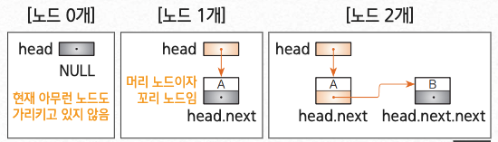

## 포인터로 연결 리스트 만들기

### 생성자 LinkedList

- 연결 리스트 클래스 `LinkedList<E>`의 생성자는  
  노드가 하나도 없는 비어있는 연결 리스트를 생성함

- 머리 포인터 head에 null을 대입함



1. 연결 리스트가 비어 있는지 판단하는 방법

   > - (a)는 노드가 하나도 없는 상태 (빈 연결 리스트)  
   >   `head == null`

2. 노드가 1개인 연결 리스트를 판단하는 방법

   > - (b)는 head가 가리키는 노드가 갖고 있는 뒤쪽 포인터값이  
   >   null이므로 연결 리스트의 노드가 1개 뿐인지 판단하는 방법은 다음과 같음  
   >   `head.next == null`

3. 노드가 2개인 연결 리스트를 판단하는 방법

   > - (c)는 머리 노드는 A, 꼬리 노드는 B
   > - 꼬리 노드 B의 next는 null 값을 가지고 있기 때문에  
   >   연결 리스트의 노드가 2개인지 판단하는 방법은 다음과 같음
   >   `head.next.next == null`

4. 꼬리 노드인지 판단하는 방법

   > - `Node<P>` 형의 변수 p가 리스트의 노드 중 하나를 가리킬 때
   >   변수 p가 가리키는 노드가 연결리스트의 꼬리 노드인지  
   >   판단하는 방법은 다음과 같음
   >   `p.next == null`

<br/ >

### 검색을 수행하는 메서드 search

- 검색에 사용하는 알고리즘은 선형 검색이고 검색하는 노드를 만날 때까지
  머리 노드부터 순서대로 스캔함

  ```java
  public P search(E obj, Comparator<? super P>c) {
    Node<P> ptr = head;

    while (ptr != null) {
      if (c.compare(obj, ptr.data) == 0) {
        crnt = ptr
        return ptr.data;
      }
      ptr = ptr.next;
    }

    return null;
  }
  ```

- 노드 스캔은 다음 조건 중 어느 하나가 성립하면 종료됨

  1. 종료 조건 1  
     검색 조건을 만족하는 노드를 찾지 못하고 꼬리 노드를 지나가기 직전인 경우

  2. 종료 조건 2  
     검색 조건을 만족하는 노드를 찾은 경우

<br/ >

### 머리에 노드를 삽입하는 메서드 addFirst

```java
public void addFirst(E obj) {
  Node<E> ptr = head;
  head = crnt = new Node<E>(obj, ptr);
}
```


<br/ >

### 꼬리에 노드를 삽입하는 메서드 addLast

- 리스트가 비어 있는지 아닌지(head == null) 먼저 확인하고 경우에 따라 다음과 같이 처리함

```java
public void addLast(E obj) {
  if (head == null)
    addFirst(obj);
  else {
    Node<E> ptr = head;
    while (ptr.next != null)
      ptr = ptr.next;
    ptr.next = crnt = new Node<E>(obj, null);
  }
}
```


:::info 리스트가 비어 있는 겨웅

- 리스트 머리에 노드를 삽입함
  - addFirst 메서드로 처리함

:::

:::warning 리스트가 비어 있지 않은 경우

- 리스트 꼬리에 노드 G를 삽입함

:::

<br/ >

### 머리 노드를 삭제하는 메서드 removeFist

- removeFirst 메서드는 머리 노드를 삭제함
- 리스트가 비어 있지 않을(head != null) 때만 삭제할 수 있음

```java
public void removeFirst() {
  if (head != null)
    head = crnt = head.next;
}
```


<br/ >

### 꼬리 노드를 삭제하는 메서드 removeLast

```java
public void removeFirst() {
  if (head != null) {
    if (head.next == null)
      head = crnt = null;
    else {
      Node<E> ptr = head;
      Node<E> pre = head;

      while (ptr.next != null) {
        pre = ptr;
        ptr = ptr.next;
      }
      pre.next = null;
      crnt = pre;
    }
  }
}
```


:::info 리스트에 노드가 1개만 있는 경우

- 머리 노드를 삭제함
  - removeFirst 메서드로 처리함

:::

:::warning 리스트가 비어 있지 않은 경우

- 리스트 꼬리에 노드 F를 삭제함

:::

<br/ >

#### remove 메서드는 임의의 노드를 삭제함

#### 선택한 노드가 머리 노드인지 아닌지에 따라 다음과 같이 처리함

:::info v가 머리 노드인 경우

- 머리 노드를 삭제하면 됨
  - removeFirst 메서드로 처리함

:::

:::warning v가 머리 노드가 아닌 경우

- 연결 리스트에서 v가 참조하는 노드 D를 삭제함

:::

```java
public void remove(Node v) {
  if (head != null) {
    if (v == head) {
      removeFirst();
    } else {
      Node<P> ptr = head;

      while (ptr.next != v) {
        ptr = ptr.next;
        if (ptr === null) return;
      }
      ptr.next = v.next;
      crnt = ptr;
    }
  }
}
```


<br/ >

## 원형 리스트(Circular linked list)

> 꼬리 노드가 머리 노드를 가리키는 연결 리스트
>
> - 고리 모양으로 나열된 데이터를 저장할 때 알맞은 자료구조


<br/ >

## 이중 연결 리스트(Doubly linked list)

> 연결 리스트의 가장 큰 단점을 개선한 자료구조
>
> - 다음 노드는 찾기 쉽지만 앞쪽 노드는 찾기 어려운 것

### 각 노드에는 다음 노드에 대한 포인터와 앞쪽 노드에 대한 포인터가 주어짐


<br/ >

### 구현

- 이중 연결 리스트는 3개의 필드가 있는 클래스로 구현할 수 있음

  - data: 데이터(데이터 참조 : 형(type)은 E)kaka
  - prev: 이전 포인터(앞쪽 노드 참조: 형(type)은 `Node<E>`)
  - next: 다음 포인터(다음 노드 참조: 형(type)은 `Node<E>`)

  ```java
  class Node<E> {
    E data;
    Node<E> prev;
    Node<E> next;
  }
  ```

<br/ >

### 원형 리스트와 이중 연결 리스트의 조합


1. 생성자 Double Linked List 메서드
   - 비어있는 원형 이중 연결 리스트를 생성함
   - 이 노드는 노드의 삽입과 삭제를 원활하게 처리하기 위해 리스트의 머리에 계속 존재하는 더미노드  
     
2. 리스트가 비어있는가(더미 노드만 있는가)를 조사하는 메서드
3. 노드를 검색하는 메서드 search
   - 노드를 선형 검색하는 메서드
   - 머리 노드부터 시작하여 뒤쪽 포인터를 차례로 따라가며 스캔하는 과정은 연결 리스트의 메서드와 같음
   - 다만 실제 머리노드가 더미 노드의 다음 노드이므로 검색을 시작하는 곳이 다름  
     
4. 노드를 삽입하는 메서드 add
   - 선택 노드의 바로 뒤에 노드를 삽입하는 메서드로, 다른 메서드의 요청을 받아 삽입을 대신 처리하기도 함  
     
   - 더미 노드만 있는 경우, 비어있는 리스트에 노드 A 를 삽입하는 과정  
     
5. 노드를 삭제하는 메서드 remove
   - 선택 노드를 삭제하는 메서드로, 연결 리스트에서 특정 노드를 제거하는 기능을 수행함
   - 더미 노드는 삭제할 수 없으므로 먼저 리스트가 비어 있는지 확인하고 리스트가 비어 있지 않을 때만 삭제함  
     
