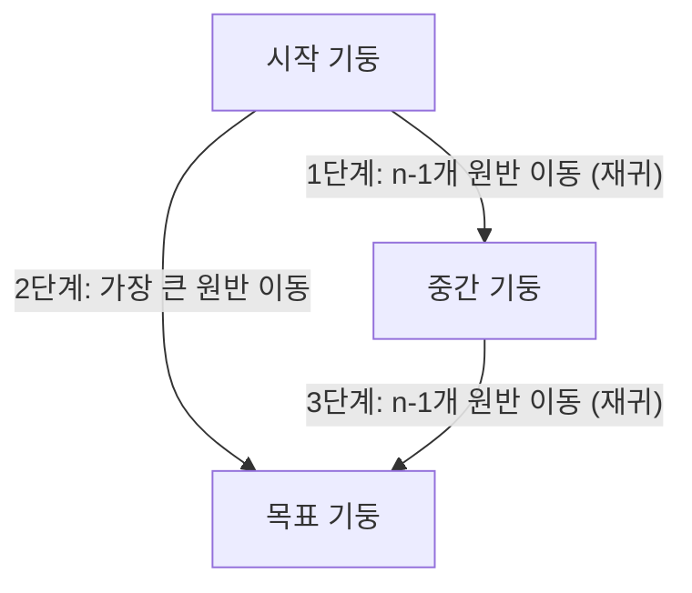

## 1. 재귀 알고리즘의 기본 개념

재귀(recursion)는 "함수가 정의될 때 자기 자신의 함수를 호출이 가능"하며, 이러한 자기 자신의 함수 호출을 **재귀 호출(recursive call)** 이라고 합니다. 이는 **되부름 또는 순환** 이라고도 표현됩니다. 재귀 알고리즘은 "어떤 사건이 자신을 다시 호출하여 작업을 수행하는 방식의 알고리즘"이며, 함수 형태로 많이 사용됩니다. 재귀를 효과적으로 사용하면 **프로그램을 간결하고 효율성 있게 작성** 할 수 있습니다.

### 주요 특징

- **자기 참조적 특성:** 함수 내부에서 자기 자신의 함수를 호출합니다.
- **문제 해결 용이성:** "재귀 함수를 이용하면 보다 쉽게 문제해결을 할 수 있"습니다.
- **효율성 저하 가능성:** "계속적인 함수 호출로 인해 시간과 메모리 공간의 효율성이 떨어짐"이라는 단점이 있습니다.
- **반복문 변환 가능성:** "일반적으로 반복문을 이용한 함수로 변환이 가능"합니다.

### 재귀 알고리즘의 속성 및 사용 방법

- **하위 문제 해결:** "어떤 사건을 해결하기 위해 사건의 범위보다 약간 좁은 하위 문제를 해결"합니다.
- **종료 조건 필수:** "재귀 알고리즘의 호출은 더 이상 반복되지 않을 때까지 계속됨"으로, 종료 조건 설정이 중요합니다.
- **구현 단계:**
  1. 반복되는 작업을 찾습니다.
  2. 반복되는 작업을 함수로 작성하고 입력값과 결과값의 형식을 결정합니다.
  3. "입력값은 한 단계씩 점진적으로 변하며, 마지막으로 더 이상 변화가 없는 입력값은 종료 조건으로 사용"됩니다.

### 재귀 알고리즘에 적합한 경우

- 풀어야 할 문제, 계산할 메서드, 처리할 자료구조가 재귀적으로 정의되는 경우에 적합합니다.

### 재귀의 종류

- **직접 재귀:** "자신과 동일한 메서드를 호출하는 것"을 의미합니다.

  ```typescript
  // 직접 재귀 예시
  function directRecursion(n: number): number {
    if (n <= 0) return 0;
    return n + directRecursion(n - 1);
  }
  // directRecursion(3) → 3 + 2 + 1 + 0 = 6
  ```

- **간접 재귀:** "메서드 a가 메서드 b를 호출하고, 다시 메서드 b가 메서드 a를 호출하는 구조로 이루어지는 것"을 의미합니다. 즉, "다른 메서드를 통해 자기 자신과 같은 메서드를 호출"합니다.

  ```typescript
  // 간접 재귀 예시
  function indirectA(n: number): number {
    if (n <= 0) return 0;
    return n + indirectB(n - 1);
  }
  function indirectB(n: number): number {
    if (n <= 0) return 0;
    return n + indirectA(n - 2);
  }
  // indirectA(3) → 3 + indirectB(2)
  // indirectB(2) → 2 + indirectA(0) → 2 + 0 = 2
  // indirectA(3) → 3 + 2 = 5
  ```

---

## 2. 재귀 알고리즘의 적용 사례

### 팩토리얼(n!) 구하기

음이 아닌 정수 n의 팩토리얼은 재귀를 사용하여 구할 수 있는 대표적인 예시입니다.

- 0! = 1
- n > 0이면 n! = n × (n - 1)!

**예시 코드 (TypeScript):**

```typescript
function factorial(n: number): number {
  if (n > 0) return n * factorial(n - 1);
  else return 1;
}
```

위 코드는 n이 0보다 클 때 n \* factorial(n-1)을 반환하여 재귀적으로 호출하고, n이 0이 되면 1을 반환하여 재귀를 종료합니다.

### 유클리드 호제법 (최대공약수 구하기)

두 정수의 최대공약수를 재귀적으로 구하는 방법입니다. 이는 직사각형을 정사각형으로 채우는 비유로 설명됩니다. 짧은 변의 길이를 한 변으로 하는 정사각형으로 채운 후 남은 직사각형에 같은 작업을 반복하며, 최종적으로 정사각형만으로 구성되었을 때 변의 길이가 최대 공약수가 됩니다.

**최대공약수 계산 공식:**

- 정수 x, y의 최대 공약수를 구할 때:
  - y = 0일 때 최대 공약수는 x입니다.
  - y ≠ 0일 때 최대 공약수는 gcd(y, x % y)입니다.

**예시 코드 (TypeScript):**

```typescript
function gcd(x: number, y: number): number {
  if (y === 0) return x;
  else return gcd(y, x % y);
}
```

---

## 3. 재귀 알고리즘 분석

재귀 알고리즘을 분석하는 방법에는 크게 두 가지가 있습니다.

### 하향식 분석 (Top-down analysis)

"메서드를 호출하는 것부터 시작하여 계단식으로 자세히 조사해 나가는 분석 기법"입니다. 예를 들어 recur(4)를 호출할 때, 호출이 발생한 순서대로 스택에 쌓이는 과정을 추적합니다.

### 상향식 분석 (Bottom-up analysis)

"아래쪽부터 쌓아 올리며 분석하는 방법"입니다. 이는 재귀 호출의 가장 낮은 단계부터 시작하여 결과가 어떻게 반환되고 쌓이는지 역으로 추적하는 방식입니다.

> 재귀 알고리즘은 **스택 구조로 저장되며, 종료된 후 마지막 값부터 pop되어 출력됨**을 이해하는 것이 중요합니다. 또한, **재함수를 작성할 때는 함수가 끝날 때까지 함수 호출 이후의 명령문이 실행되지 않**습니다.

---

## 4. 하노이의 탑: 재귀 알고리즘 구현의 대표적 예시

하노이의 탑은 재귀 알고리즘의 구현을 이해하는 데 매우 유용한 고전적인 문제입니다. 목표는 **쌓아둔 원반을 최소 횟수로 옮기**는 것입니다.

### 하노이의 탑 아이디어 (n개의 원반)

하노이의 탑 문제는 큰 원반을 먼저 옮기는 것이 아니라, 가장 큰 원반을 제외한 나머지 원반 그룹을 먼저 옮기는 방식으로 재귀적으로 해결됩니다.



#### 하노이의 탑 3단계 이동 시각화

- **1단계:** n-1개 원반을 시작 기둥(A)에서 중간 기둥(B)로 이동 (재귀 호출)
- **2단계:** 가장 큰 원반을 시작 기둥(A)에서 목표 기둥(C)로 이동
- **3단계:** n-1개 원반을 중간 기둥(B)에서 목표 기둥(C)로 이동 (재귀 호출)

이러한 3단계 과정은 원반의 개수와 관계없이 동일하게 적용될 수 있습니다. move 메서드의 실행 과정을 통해 재귀 호출이 어떻게 단계적으로 진행되고 원반이 이동하는지 시각적으로 확인할 수 있습니다.

#### 하노이의 탑 TypeScript 예시 코드

```typescript
function hanoiMoves(
  n: number,
  from: string,
  to: string,
  via: string
): string[] {
  if (n === 1) {
    return [`${from} → ${to}`];
  }
  return [
    ...hanoiMoves(n - 1, from, via, to),
    `${from} → ${to}`,
    ...hanoiMoves(n - 1, via, to, from),
  ];
}

// 사용 예시: 3개의 원반을 A에서 C로 옮기기
const moves = hanoiMoves(3, "A", "C", "B");
console.log(moves);
/*
moves: [
  'A → B',
  'A → C',
  'B → C',
  'A → B',
  'C → A',
  'C → B',
  'A → B'
]
*/
```
