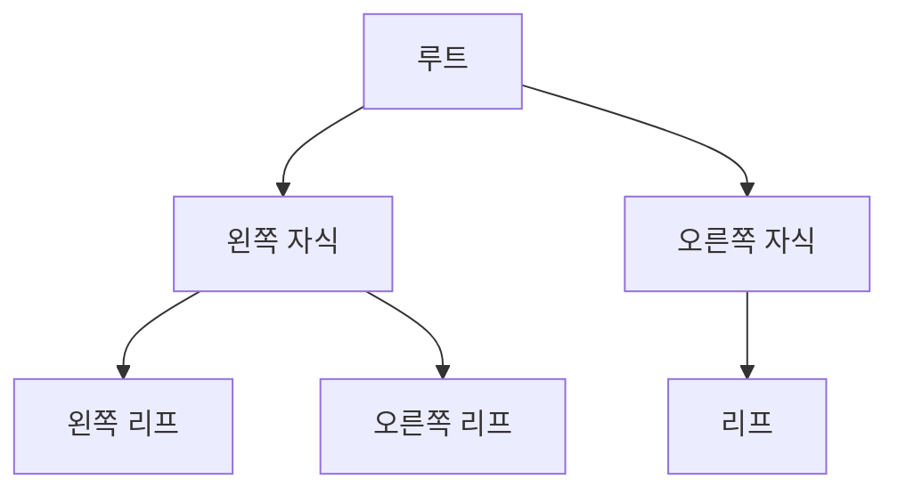
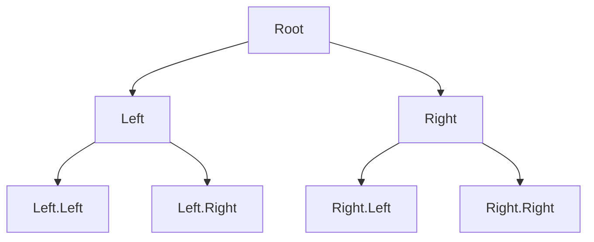
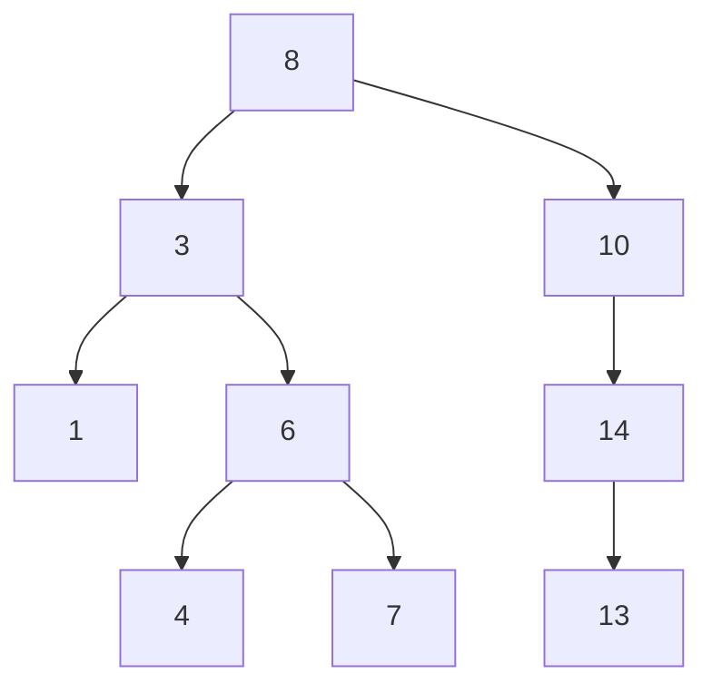

## 1. 트리(Tree)

### 트리 구조 예시 (mermaid)

트리는 **노드들 간의 계층적 구조**를 나타내는 자료구조입니다. 파일 시스템, 인공지능의 결정 트리 등 다양한 분야에 활용됩니다.

### 주요 용어

| 용어         | 설명                                    |
| ------------ | --------------------------------------- |
| 루트(Root)   | 부모가 없는 노드, 트리의 최상단         |
| 서브트리     | 하나의 노드와 그 자손들로 이루어진 트리 |
| 리프(Leaf)   | 자식이 없는 노드(단말 노드)             |
| 비단말 노드  | 적어도 하나의 자식을 가지는 노드        |
| 레벨(Level)  | 트리의 각 층 번호, 루트는 0             |
| 높이(Height) | 트리의 최대 레벨                        |
| 차수(Degree) | 노드가 가진 자식 노드의 개수            |

### 트리 분류

- **순서 트리(Ordered Tree):** 형제 노드의 순서가 중요
- **무순서 트리(Unordered Tree):** 형제 노드의 순서가 중요하지 않음

### 트리 탐색 방법

- **너비 우선 탐색(BFS):** 낮은 레벨부터 왼→오 순서로 탐색, 한 레벨 끝나면 다음 레벨로
- **깊이 우선 탐색(DFS):** 리프까지 내려가며 탐색, 더 이상 없으면 부모로 돌아가 다음 자식 탐색

### 트리 순회(Traversal)

트리의 모든 노드를 방문하여 데이터를 처리하는 연산

- **전위 순회(Preorder, CLR):** 루트 → 왼쪽 자손 → 오른쪽 자손
- **중위 순회(Inorder, LCR):** 왼쪽 자손 → 루트 → 오른쪽 자손
- **후위 순회(Postorder, LRC):** 왼쪽 자손 → 오른쪽 자손 → 루트

> **수식 트리:** 산술식을 트리로 표현, 전위/중위/후위 순회 결과가 각각 Prefix/Infix/Postfix 표기법

## 2. 이진 트리(Binary Tree)

### 이진 트리 예시 (mermaid)

이진 트리는 **각 노드가 최대 2개의 자식(왼쪽, 오른쪽)을 가지는 트리**입니다.

- 노드 n개 → 간선 n-1개
- 높이 h → 최소 h개, 최대 2^(h+1)-1개 노드

### 이진 트리의 종류

- **완전 이진 트리:** 마지막 레벨을 제외한 모든 레벨이 가득 차 있고, 마지막 레벨은 왼쪽부터 채워짐
- **포화 이진 트리:** 모든 레벨이 완전히 채워진 트리 (노드 수: 2^(h+1)-1)
- **편향 이진 트리:** 한쪽(좌/우) 자식만 계속 이어지는 트리

### 이진 트리의 구현

- **배열:** 각 노드에 번호를 매겨 인덱스로 사용 (부모: i/2, 왼쪽: 2i, 오른쪽: 2i+1)
  - 포화/완전 이진 트리가 아니면 메모리 낭비, 높이 커지면 배열 크기 문제
- **연결 리스트:** 각 노드가 데이터와 왼쪽/오른쪽 자식 포인터를 가짐 (메모리 효율, 삽입/삭제 유연)

## 3. 이진 탐색 트리(Binary Search Tree, BST)

### 이진 탐색 트리 예시 (mermaid)

> 위 예시에서, 각 노드는 다음과 같은 BST 규칙을 따릅니다:
>
> - 왼쪽 자식은 부모보다 작고, 오른쪽 자식은 부모보다 큽니다.
> - 예시 트리의 중위 순회 결과: 1, 3, 4, 6, 7, 8, 10, 13, 14 (오름차순)

이진 탐색 트리는 **이진 트리에 탐색 조건을 추가한 구조**입니다.

### BST의 조건

- 모든 노드는 서로 다른 유일한 키(key)를 가짐
- 왼쪽 서브트리의 키 < 루트의 키 < 오른쪽 서브트리의 키
- 왼쪽/오른쪽 서브트리도 BST여야 함

### 주요 연산

- **탐색(Search):**
  1. 루트에서 시작, 찾는 키(key1)와 현재 노드의 키(key2) 비교
  2. key1 < key2 → 왼쪽, key1 > key2 → 오른쪽, key1 = key2 → 성공
  3. 더 이상 이동할 노드 없으면 실패
- **삽입(Insertion):**
  1. 삽입할 위치를 탐색(존재하지 않아야 함)
  2. 현재 노드보다 작으면 왼쪽, 크면 오른쪽으로 이동, 자식 없으면 삽입
- **삭제(Deletion):**
  1. 삭제할 노드 탐색
  2. 삭제 후에도 BST 속성 유지해야 하므로 재구성 필요
     - 자식 없음: 부모가 NULL로 연결
     - 자식 1개: 부모가 자식 노드로 직접 연결
     - 자식 2개: 왼쪽 서브트리 최대/오른쪽 서브트리 최소 노드를 후계자로 복사 후 삭제

### 성능(시간 복잡도)

- **최선:** 트리가 균형적일 때 h = log₂n → O(log n)
- **최악:** 한쪽으로 치우친 트리(h = n) → O(n) (순차 탐색과 동일)

### 특징

- 구조가 단순
- **중위 순회 시 키값 오름차순**
- 이진 검색과 유사하게 빠른 검색
- 노드 삽입이 비교적 쉬움
