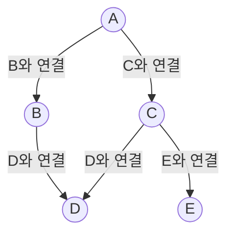
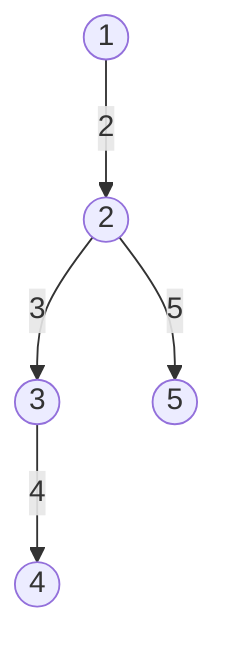
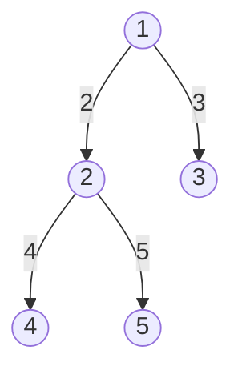
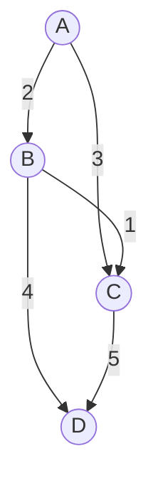

## 1. 그래프(Graph)의 기본 개념

그래프는 **정점(vertex, node)과 간선(edge)의 집합** 으로,<br/ >
객체 간의 관계를 표현하는 자료구조입니다. 전기회로, 지도, 네트워크 등 다양한 분야에 활용됩니다.

### 표기 및 용어

- **표기:** G = (V, E) (정점 집합 V, 간선 집합 E)
- **인접(adjacent):** 두 정점이 간선으로 연결되어 있으면 인접

| 용어              | 설명                                                         |
| ----------------- | ------------------------------------------------------------ |
| 무방향 그래프     | 간선에 방향 없음, `(A, B) = (B, A)`                          |
| 방향 그래프(유향) | 간선에 방향 있음, `<A, B> ≠ <B, A>`                          |
| 가중치 그래프     | 간선마다 가중치(비용) 부여                                   |
| 연결 그래프       | 모든 노드가 항상 경로로 연결                                 |
| 비연결 그래프     | 일부 노드가 경로로 연결되지 않음                             |
| 비순환 그래프     | 사이클이 없음                                                |
| 완전 그래프       | 모든 노드가 서로 연결, 무방향: n(n-1)/2, 방향: n(n-1)개 간선 |
| 경로(path)        | 임의의 노드에서 다른 노드로 가는 간선들의 집합               |
| 단순 경로         | 처음과 끝 제외 중복 정점 없음                                |
| 사이클(cycle)     | 시작과 끝이 같은 단순 경로                                   |
| 차수(degree)      | 무방향: 인접 정점 수, 방향: 진입/진출 차수                   |
| 경로 길이         | 경로를 구성하는 간선의 수                                    |

> **트리는 그래프의 한 종류** 로, 방향성/사이클/루트/부모-자식 관계 등에서 차이가 있습니다.

#### 그래프와 트리의 차이

- **트리:** 방향성 O, 사이클 X, 루트 O, 부모/자식 O
- **그래프:** 방향성 O/X, 사이클 O/X, 루트 X, 부모/자식 X

#### 그래프 예시 (mermaid)

---

## 2. 그래프 탐색(Graph Traversal)

그래프의 모든 정점을 체계적으로 방문하는 방법으로, **DFS(깊이 우선 탐색)** , **BFS(너비 우선 탐색)** 이 대표적입니다.

### 깊이 우선 탐색(DFS: Depth-First Search)

- 한 방향으로 깊게 탐색, 더 이상 갈 곳 없으면 되돌아가 다른 분기로 이동
- 트리의 전위 순회 등도 DFS의 일종
- 재귀/스택 사용, 방문 여부 체크 필수(무한 루프 방지)
- 모든 노드 방문에 적합, 구현이 간단

#### DFS 예시 (mermaid)

### 너비 우선 탐색(BFS: Breadth-First Search)

- 시작 정점에서 가까운 정점부터 단계별로 탐색
- 큐(Queue) 사용, 반복적 구현(FIFO)
- 방문 여부 체크 필수
- 최단 경로 탐색, Prim/Dijkstra 등과 유사

#### BFS 예시 (mermaid)

---

## 3. 최소 신장 트리(MST) 알고리즘

**신장 트리(Spanning Tree):** 그래프의 모든 노드를 포함하며, 트리의 속성을 만족하는 부분 그래프(사이클 없음, 모든 정점 연결)

**최소 신장 트리(MST):** 신장 트리 중 간선 가중치의 합이 최소인 트리

| 알고리즘 | 특징 및 원리                                                          |
| -------- | --------------------------------------------------------------------- |
| 크루스칼 | 간선 비용 오름차순 정렬, 사이클 발생 X면 트리에 포함, Union-Find 사용 |
| 프림     | 임의의 정점에서 시작, 인접한 최소 비용 간선 선택 반복                 |

#### MST 예시 (mermaid)

### 크루스칼 알고리즘(Kruskal's algorithm)

- **탐욕적(greedy) 방법:** 선택 가능한 최소 비용 간선을 계속 선택
- 모든 간선 오름차순 정렬 → 사이클 발생 X면 트리에 포함, 발생 시 제외
- 두 정점의 집합이 다르면 연결(Union), 같으면 사이클이므로 제외

### Union-Find 알고리즘

- **서로소 집합(Disjoint Set) 자료구조**
- **Find:** 노드가 속한 집합(루트) 찾기
- **Union:** 두 집합 합치기
- **초기화:** 각 노드는 자기 자신만의 집합
- **성능 개선:**
  - Union by rank: 높이 작은 트리를 큰 트리에 붙임 → O(log N)
  - Path compression: find 시 경로상의 노드들을 루트에 직접 연결
  - 둘 다 사용 시 실제로는 거의 O(1)
