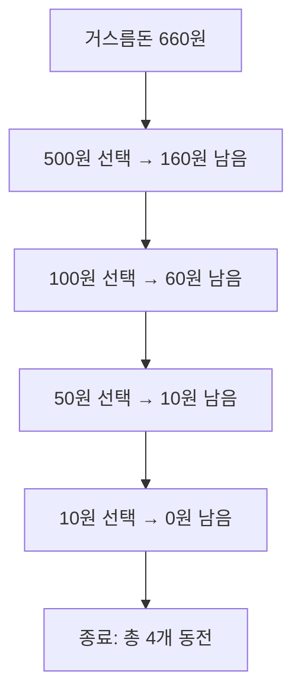
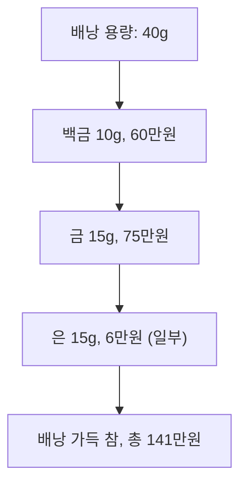
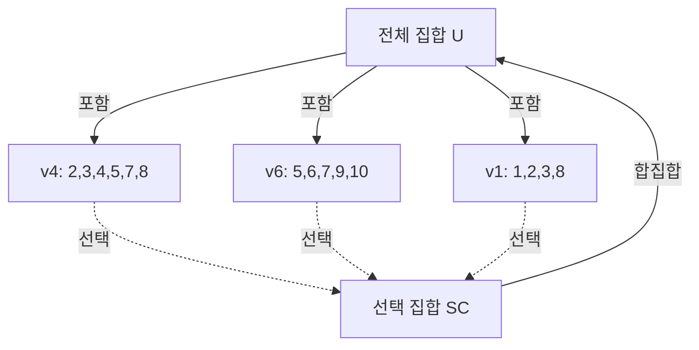
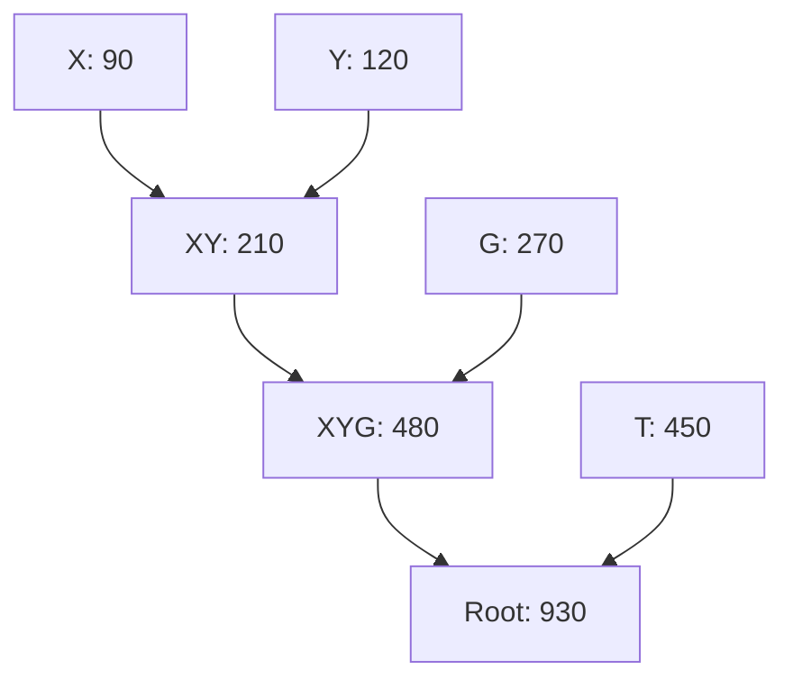

## 1. 그리디 알고리즘 개요

그리디 알고리즘(Greedy Algorithm)은 **최적화(optimization) 문제**를 해결하는 데 사용되는 알고리즘입니다.<br/ >
"탐욕적 알고리즘" 또는 "탐욕적 기법"이라고도 하며, 다음과 같은 특징이 있습니다.

### 개념

- 입력 데이터 간의 관계를 고려하지 않고, **각 단계에서 탐욕적으로(최소/최대값) 선택**
- **부분 문제의 최적해(locally optimal solution)** 를 구해가며 **전체 최적해(globally optimal solution)** 를 찾음

> 최적해란? 가능한 가장 적은 수의 부분 집합을 선택해서 전체 집합 U를 모두 커버하는 해답

### 수행 과정

1. 근시안적인 선택을 통해 부분 최적해를 찾음
2. 부분 최적해를 모아 전체 최적해를 도출
3. 가장 작은 값 또는 가장 큰 값을 반복적으로 선택

### 장점

- 알고리즘이 단순하고 해법이 빠름

### 응용 사례

- 구글 지도, 경영공학 운영 연구, 내비게이션, 로봇공학, 네트워크/통신, 교통공학, 무선 모바일 네트워크, 산업공학 등

<br/ >

---

<br/ >

## 2. 주요 그리디 알고리즘 응용 사례

### 2.1. 최소 개수 동전 교환/반환 문제

#### 동전 교환 문제 다이어그램

- **문제 정의:** 거스름돈 액수 m이 주어졌을 때, 주어진 동전 액면(500, 100, 50, 10, 1원)으로 최소 동전 수로 거스름돈을 반환
- **그리디 해법:** 남은 액수를 초과하지 않는 선에서 가장 큰 액면의 동전을 최대한 선택
- **예시:** 1,000원으로 340원 음료수 구입 시 660원 거스름돈 반환
  - 500원 × 1 (160원 남음)
  - 100원 × 1 (60원 남음)
  - 50원 × 1 (10원 남음)
  - 10원 × 1 (0원 남음)
  - **총 4개 동전(500, 100, 50, 10원)**
- **특징:** 각 단계에서 최적 선택 → 전체적으로도 최적해(항상 그런 것은 아님)

<br/ >

### 2.2. 부분 배낭(Fractional Knapsack) 문제

#### 부분 배낭 문제 다이어그램

- **문제 정의:** n개의 물건(무게, 가치)과 한정된 무게 C의 배낭이 있을 때, 최대 가치를 가지도록 물건을 담는 문제(부분적으로 담기 허용)
- **그리디 해법:** 단위 무게당 가장 값어치가 높은 물건부터 담고, 남는 용량만큼 부분적으로 담음
- **예시:** 최대 40g 배낭에 백금(10g, 6만원/g), 금(15g, 5만원/g), 은(25g, 4천원/g), 구리(50g, 1천원/g)
  - 백금 10g(60만원), 금 15g(75만원), 은 15g(6만원) → 총 141만원
- **시간 복잡도:** O(n log n)
- **응용:** 자원 할당, 암호학, 투자 포트폴리오, Merkle-Hellman 암호 등

<br/ >

### 2.3. 집합 커버(Set Cover) 문제

#### 집합 커버 문제 다이어그램

- **문제 정의:** 전체 집합 U와 부분 집합들의 집합 P에서, 가능한 적은 집합을 골라 합집합이 U가 되도록 선택(최소 집합 커버)
- **그리디 해법:** U의 원소를 가장 많이 포함하는 집합을 반복 선택, U에서 해당 원소 제거
- **예시:** 10개 마을 중 병원 2개 배치(도보 15분 이내 커버)
  - `v4(2,3,4,5,7,8) → v6(5,6,7,9,10) → v1(1,2,3,8) → SC={v4,v6,v1}`
  - 실제 최적해는 v2, v6만으로도 전체 커버 가능
- **시간 복잡도:** O(n³)
- **응용:** 도시계획, 감시카메라, 바이러스 검색, 생산 라인 등

<br/ >

### 2.4. 작업 스케줄링(Job Scheduling) 문제

#### 작업 스케줄링 문제 다이어그램

```mermaid
gantt
    dateFormat  HH:mm
    title 작업 스케줄링 예시
    section 컴퓨터1
    작업1 :done, t1, 09:00, 1h
    작업3 :done, t3, 10:00, 1h
    section 컴퓨터2
    작업2 :done, t2, 09:30, 1h
    작업4 :done, t4, 10:30, 1h
```

- **문제 정의:** n개의 작업(t1~tn, 시작/종료 시간)을 여러 컴퓨터(또는 회의실 등)에 중복 없이 배정
- **그리디 해법:** 빠른 시작시간 작업을 먼저 배치
- **수행 과정:**
  1. 작업을 시작 시간 기준 오름차순 정렬
  2. 가장 이른 시작 작업부터 배치, 가능한 컴퓨터에 할당
- **시간 복잡도:** O(n log n) + O(mn)
- **응용:** 태스크 스케줄링, 회의실/강의실 배정, 생산 공정 등

<br/ >

### 2.5. 허프만(Huffman) 압축

#### 허프만 트리 다이어그램

- **개요:** 파일 압축 방법, 자주 나타나는 문자는 짧은 이진 코드, 드문 문자는 긴 이진 코드 할당
- **접두부 특성:** 어떤 코드도 다른 코드의 접두부가 아님(구분자 불필요)
- **수행 과정:**
  1. 각 문자로 노드 생성, 빈도수 저장
  2. 우선순위 큐(최소 힙) 생성
  3. 빈도수 작은 2개 노드 합쳐 새 노드 생성, 큐에 삽입 반복
  4. 마지막 노드가 허프만 트리 루트
  5. 왼쪽 0, 오른쪽 1 할당해 코드 생성
- **예시:** T:450, X:90, Y:120, G:270 → X+Y=210, 210+G=480, 480+T=930
- **압축률 계산:** (빈도수×코드길이 합)/(총문자수×8bit)×100
- **시간 복잡도:** O(n log n)
- **응용:** 대용량 데이터 저장, 멀티미디어 압축, 정보 이론 등

<br/ >

---

<br/ >

## 3. 학습 정리

- **그리디 알고리즘:** 데이터 간 관계를 고려하지 않고 탐욕적으로 최적 값을 선택, 부분 최적해를 통해 전체 최적해를 찾는 방법
- **최소 개수 동전 교환/반환 문제:** 남은 액수를 초과하지 않는 선에서 가장 큰 액면의 동전을 취함(항상 최적해는 아님)
- **부분 배낭 문제:** 단위 무게당 가장 값나가는 물건을 우선적으로 배낭에 담고, 남는 용량에 맞춰 부분적으로 담음. 시간 복잡도 O(n log n)
- **집합 커버 문제:** 근사 알고리즘으로 U의 원소를 가장 많이 포함하는 집합을 선택. 시간 복잡도 O(n³)
- **작업 스케줄링 문제:** 빠른 시작시간 작업을 먼저 배치. 시간 복잡도 O(n log n) + O(mn)
- **허프만 압축:** 자주 나타나는 문자는 짧은 이진 코드, 드문 문자는 긴 이진 코드 할당. 시간 복잡도 O(n log n)
