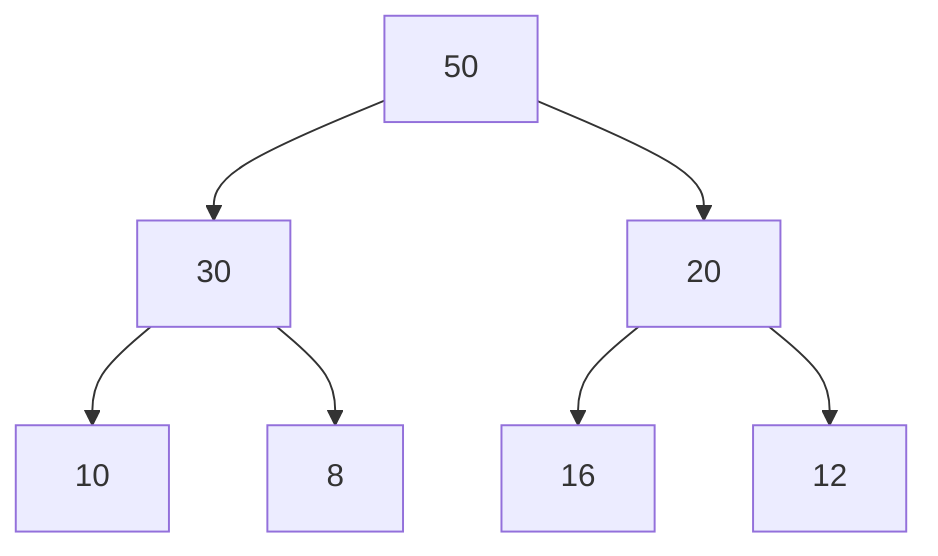
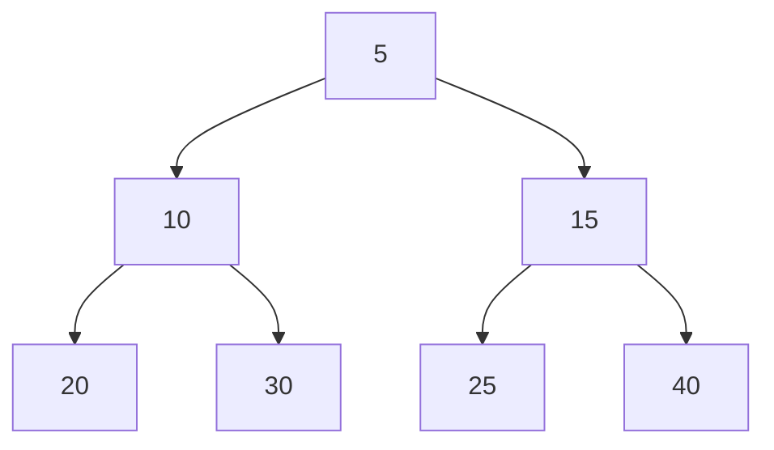
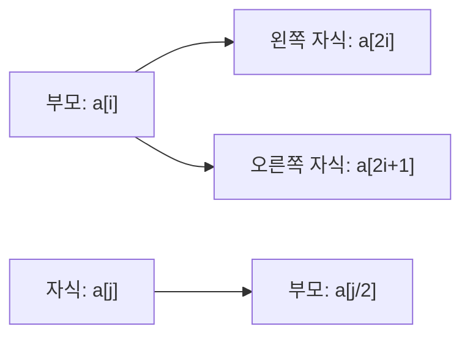
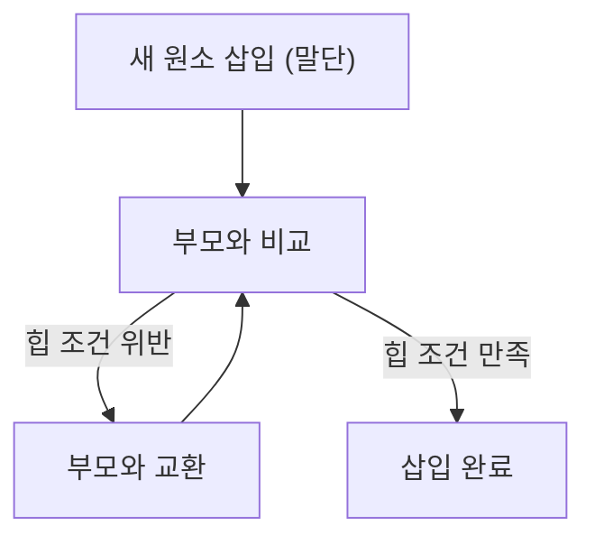
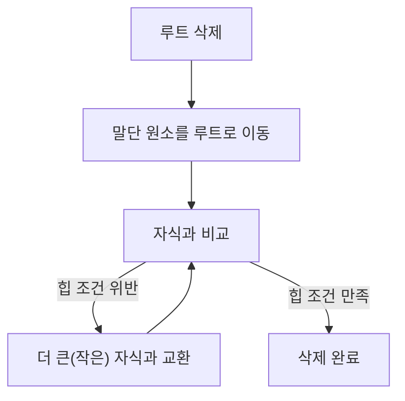
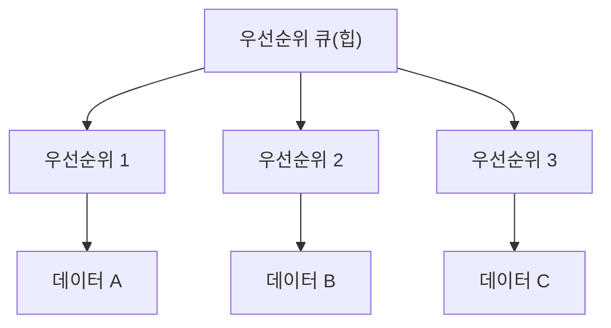

## 1. 힙(Heap)의 개념 및 구조

#### 최대 힙(Max Heap) 구조 예시

#### 최소 힙(Min Heap) 구조 예시

힙(Heap)은 **완전 이진 트리(complete binary tree)** 구조의 일종으로, 노드 중에서 **키 값이 가장 크거나 가장 작은 노드**를 빠르게 찾기 위해 고안된 자료구조입니다.

### 힙의 주요 특징

- **완전 이진 트리**: 노드를 삽입할 때 최하단 왼쪽 노드부터 차례대로 삽입
- **반 정렬 상태 유지**: 부모의 노드 키 값이 자식 노드의 키 값보다 항상 크거나(최대 힙), 작음(최소 힙)
- **중복 값 허용**: 일반적인 이진 트리와 달리 중복된 값을 허용

### 힙의 종류

| 종류                      | 설명                                                                      |
| ------------------------- | ------------------------------------------------------------------------- |
| **최대 힙 (Max Heap)**    | 부모 노드의 키 값 ≥ 자식 노드의 키 값. 루트 노드가 가장 큰 키 값을 가짐   |
| **최소 힙 (Min Heap)**    | 부모 노드의 키 값 ≤ 자식 노드의 키 값. 루트 노드가 가장 작은 키 값을 가짐 |
| **이진 힙 (Binary Heap)** | 완전 이진 트리로서 부모의 우선순위가 자식의 우선순위보다 높은 구조        |

### 힙 vs 이진 탐색 트리

|               | 힙(Heap)             | 이진 탐색 트리(BST)      |
| ------------- | -------------------- | ------------------------ |
| **최적화**    | 최대/최소값 검색     | 탐색(검색)               |
| **자식 노드** | 왼쪽/오른쪽 상관없음 | 왼쪽 < 부모 < 오른쪽     |
| **중복 값**   | 허용                 | 일반적으로 허용하지 않음 |

---

## 2. 힙의 배열 구현

힙은 일반적으로 **배열**로 구현합니다. 완전 이진 트리의 노드들은 **레벨 순회(level order traversal)** 순서에 따라 1차원 배열에 저장됩니다. (보통 `a[1]`부터 시작)

### 배열 내 노드 관계

- a[i]의 **자식 노드**: a[2i], a[2i+1]
- a[j]의 **부모 노드**: a[j/2] (j > 1, 정수 나눗셈)

---

## 3. 힙의 주요 연산

힙은 효율적인 데이터 관리를 위해 **삽입, 삭제, 키 감소** 등의 연산을 지원합니다.

### 업힙(Upheap) / 삽입 연산(Insert)

1. 새로운 원소를 힙의 가장 말단(배열의 마지막)에 삽입
2. 부모 노드와 값을 비교하여 (최대 힙: 크면, 최소 힙: 작으면) 위치를 교환
3. 루트 노드에 도달하거나, 힙 속성이 만족될 때까지 반복

### 다운힙(Downheap) / 삭제 연산(Delete)

1. 루트 노드(최대/최소값)를 제거
2. 가장 말단의 값을 루트에 위치시킴
3. 자식 노드들과 비교하여 힙 속성이 만족될 때까지 아래로 이동하며 교환

### 감소(Decrease) 키 연산

- 특정 노드의 키 값을 감소시킨 후, upheap을 수행하여 힙 속성을 복원
- 노드 위치 추적을 위해 '위치 배열'과 '키 배열'을 함께 사용

---

## 4. 힙의 장점 및 시간 복잡도

### 장점

- **최대값/최소값**을 빠르게 찾을 수 있음 (O(log n))
- **우선순위 큐** 등 최대/최소값을 빠르게 찾아야 하는 알고리즘에 활용

### 시간 복잡도

| 연산               | 시간 복잡도 |
| ------------------ | ----------- |
| 삽입/삭제/감소     | O(log n)    |
| 힙 정렬(Heap Sort) | O(n log n)  |

> 배열에서 최대/최소값 찾기는 O(n)이지만, 힙에서는 O(log n)

---

## 5. 힙의 응용 분야

- 관공서, 은행, 병원, 우체국, 대형 마트, 공항 등 이벤트 처리
- 컴퓨터 운영체제의 프로세스 처리
- 네트워크 라우터의 패킷 처리
- 실시간 급상승 검색어 제공
- 힙 정렬 알고리즘

---

## 6. 우선순위 큐(Priority Queue)

#### 우선순위 큐 구조 예시

> **우선순위 큐**: 들어간 순서와 상관없이 우선순위가 높은 데이터가 먼저 나오는 큐

- 일반 큐: FIFO(First-In, First-Out)
- 우선순위 큐: 우선순위에 따라 데이터 처리

### 주요 특징

- 가장 높은 우선순위 항목 접근/삭제, 삽입 연산 지원
- **힙**을 통해 구현하는 것이 가장 효율적 (O(log n))
- 스택/큐도 일종의 우선순위 큐로 볼 수 있으나, 임의 우선순위 삽입 시 정렬 문제 발생 → 힙 기반 우선순위 큐 필요
- 배열/연결 리스트로 구현 시 삽입 O(n), 힙 사용 시 O(log n)
- 일반 큐와 달리 트리 구조로 보는 것이 합리적

#### 응용 분야

- 시뮬레이션 시스템
- 네트워크 트래픽 제어
- 운영 체제의 작업 스케줄링

---

## 7. 룩업 테이블 (LUT: LookUp Table)

#### 룩업 테이블 활용 예시

> **룩업 테이블**: 주어진 연산에 대해 미리 계산된 결과들의 집합(배열)

### 주요 특징

- 연산 결과를 실시간 계산 대신, 미리 계산된 값을 테이블에서 조회하여 속도 극대화
- 영상 처리, **실시간 데이터 취득/프로세싱 시스템(embedded system)** 등에서 사용
- 초기화 시 연산량이 많지만, 반복 산술 연산을 회피해 고속 수행 가능
- 수정의 유연성, 데이터 집중화, 연산 없이 빠른 조회

> 실시간 시스템에서 사전 초기화 모듈이 있는 경우에 특히 유용
