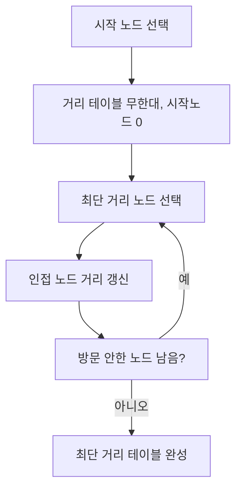
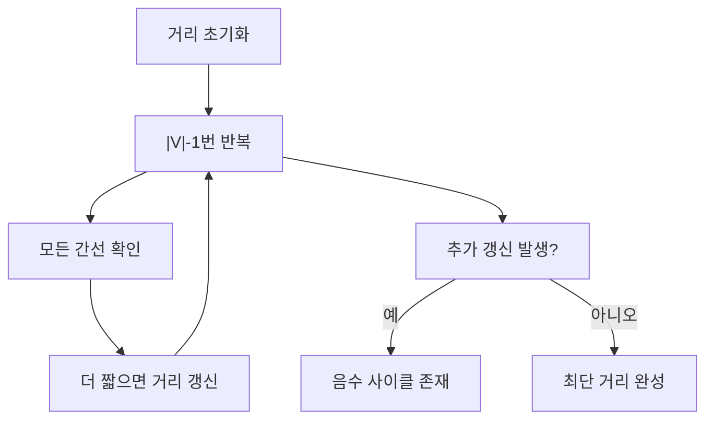
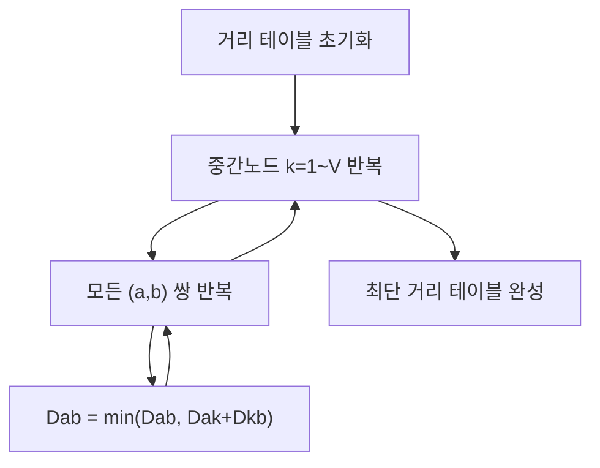

## 1. 최단 경로 알고리즘 개요

최단 경로 알고리즘은 **그래프에서 간선의 가중치(비용) 합이 최소가 되는 경로**를 찾는 알고리즘입니다.

### 주요 유형

- **단일 쌍 최단 경로**: 한 지점에서 다른 한 지점까지
- **단일 출발 최단 경로**: 한 지점에서 다른 모든 지점까지
- **모든 쌍 최단 경로**: 모든 지점에서 다른 모든 지점까지

> **유향 그래프**에서 사용. 무향 그래프는 각 간선을 양방향 유향 간선으로 간주 가능

### 대표 알고리즘

- **BFS**: 가중치가 없거나 동일할 때
- **다익스트라(Dijkstra)**: 양의 가중치, 단일 출발
- **벨만-포드(Bellman-Ford)**: 음의 가중치 허용, 단일 출발
- **플로이드-워셜(Floyd-Warshall)**: 모든 쌍, 음수 가중치 허용(순환 없을 시)

---

## 2. 다익스트라(Dijkstra) 알고리즘

> 한 정점에서 다른 모든 정점으로의 최단 경로 (양의 가중치)

### 동작 과정

1. 출발 노드의 경로 길이 0, 나머지는 무한대로 초기화
2. 방문하지 않은 노드 중 최단 거리가 가장 짧은 노드 선택
3. 해당 노드를 거쳐 다른 노드로 가는 비용 계산, 최단 거리 테이블 갱신
4. 위 과정을 반복

#### 다익스트라 알고리즘 흐름도

### 시간 복잡도

- 기본: `O(V^2)` (V: 노드 수)
- 우선순위 큐(힙) 사용: `O(E \log V)` (E: 간선 수)

> **음수 가중치 간선이 있으면 사용 불가!**

---

## 3. 벨만-포드(Bellman-Ford) 알고리즘

> 음의 가중치 간선이 있는 그래프에서 단일 출발 최단 경로

### 동작 과정

1. 시작 노드 0, 나머지 무한대로 초기화
2. 모든 간선에 대해 `|V|-1`번 반복하며 거리 갱신
3. `|V|-1`번 반복 후에도 갱신되는 노드가 있으면 음수 사이클 존재

#### 벨만-포드 알고리즘 흐름도

### 시간 복잡도

- `O(V \cdot E)`

---

## 4. 플로이드-워셜(Floyd-Warshall) 알고리즘

> 모든 노드 쌍의 최단 경로 (음수 가중치 허용, 순환 없을 시)

### 동작 과정

1. 2차원 테이블에 최단 거리 정보 저장 (직접 연결: 가중치, 아니면 무한대, 자기 자신: 0)
2. 중간 노드 k를 1~V까지 순회하며, 모든 (a, b) 쌍에 대해 `D_{ab} = \min(D_{ab}, D_{ak} + D_{kb})`로 갱신

#### 플로이드-워셜 알고리즘 흐름도

### 시간 복잡도

- `O(V^3)`

---

## 5. 최단 경로 알고리즘 비교

| 구분            | 다익스트라               | 벨만-포드                          | 플로이드-워셜               |
| --------------- | ------------------------ | ---------------------------------- | --------------------------- |
| **시간 복잡도** | `O(V^2)` / `O(E \log V)` | `O(VE)`                            | `O(V^3)`                    |
| **공간 복잡도** | `O(V)`                   | `O(V)`                             | `O(V^2)`                    |
| **특징**        | 단일 출발, 양의 가중치   | 단일 출발, 음수 가중치/사이클 감지 | 모든 쌍, 음수 가중치(순환X) |

---

## 참고 문헌

- Introduction to Algorithm, Fourth Edition – MIT Press
- 시바타 보요 저, 강민 역(2018). Do it! 자료 구조와 함께 배우는 알고리즘 입문. 이지스퍼블리싱
