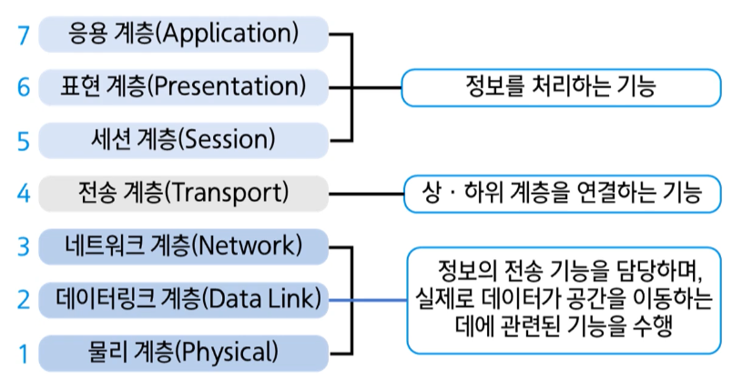
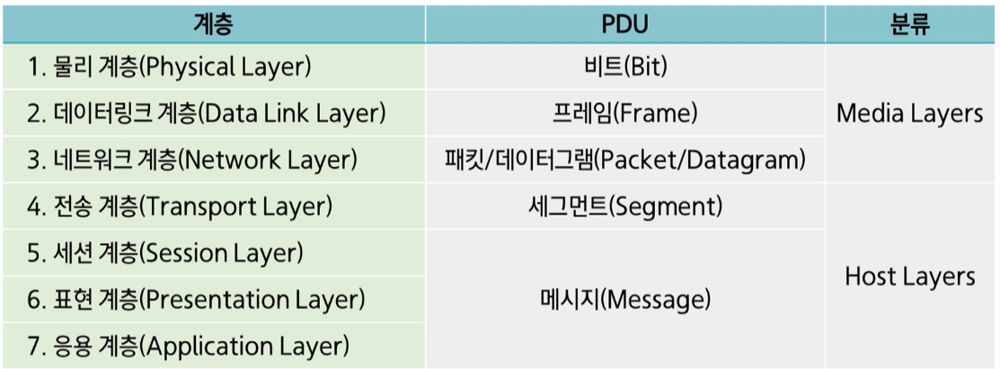

### 프로토콜 (Protocol)

    데이터 통신을 위하여 정의한 공통의 규칙
    서로 호환이 되어야 함 > 언어의 문법과 유사
    	1980년대 초 여러 가지 전용(Proprietary) 네트워킹 프로토콜들로 인하여
    	기종이 다른 컴퓨터 시스템들 간의 통신이 안됨

### OSI(Open System Interconnection) Reference Model

- 이기종 컴퓨터들 간의 통신을 가능하게 하기 위하여 개발한 통신 프로토콜
- 통신의 전 과정을 7개의 개층으로 분리 > 꼭 7계층일 필요는 없음
- OSI는 실제 사용되는 프로토콜로 개발되지 못하였으며 통신 프로토콜을 이해하고 설명하는 기준 모델로 사용됨 > reference model
- [TCP/IP]가 실제적인 표준

#### OSI 7계층의 구성

- 네트워크 통신의 전 과정을 7개의 계층으로 분리, 일정한 역할을 수행하고 하나의 네트워크 통신을 완성하도록 함
  

  1. 물리 계층: 물리적인 전송로 제공 ( 기차, 항공기, 버스등 지역으로 운반함 )
  2. 데이터 링크 계층: 인접 노드 사이의 데이터 전송 ( 인접 우체국에서 묶음 전달 )
  3. 네트워크 계층: 호스트간의 데이터 전송, 경로설정 ( 목적지 건물의 편지함까지 )
  4. 전송 계층: 프로세스와 프로세스 간의 전달 ( 주소 내에 거주하는 사람에게 )
  5. 세션 계층: 네트워크 대화 조정, 동기화 지점 ( 전달 방법 지정 )
  6. 표현 계층: 데이터의 표현을 공통된 형식으로 변환 ( 공통의 언어로 번역 )
  7. 응용 계층: 파일전송, 이메일과 같은 End-user 서비스

#### 계층화 구조와 캡슐화

1. 계층 구조(Layered arcitecture) 채택

- 하나의 일만을 수행하기 위해 관련 기능을 모아 그룹화 한 계층화 개념
- 인접한 하위 계층의 서비스를 이용하고, 바로 위 계층에 서비스를 제공

2. OSI 모델의 계층 간 상호 작용

- 중간 노드들은 3계층 까지만 동작
- 대등-대-대등 프로세스 [peer-to-peer process]

3. 데이터의 캡슐화[Encapsulation]

- 각 계층에서의 요구 ㅗ적ㄴ과 처리 정보를 포함하는 [헤더]라는 고유의 제어 정보를 전달 메시지에 추가하여 다음 계층으로 보내는 과정
- 2계층에서는 오류제어를 위한[트레일러]도 붙임

4. 프로토콜 데이터 단위
   
