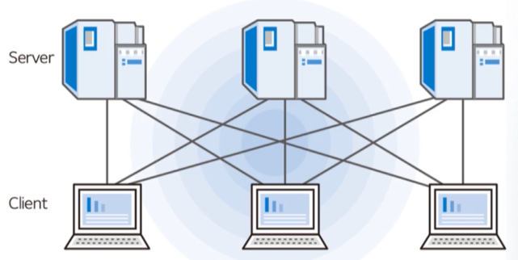

### 네트워크의 필요성

- 교환(Switching)의 개념
- <u>망과 망을 연결</u> -> [internetworking]
  

### 네트워크의 분류

거리에 따른 분류 [LAN], [MAN], [WAN]

- [LAN]: 근거리 통신망 - 개인 또는 기업이 구축하고 운영 ==사설망==
- [WAN]: 광역 통신망 - 통신사업자가 구축한 망을 임대하여 사용 ==공중망==
