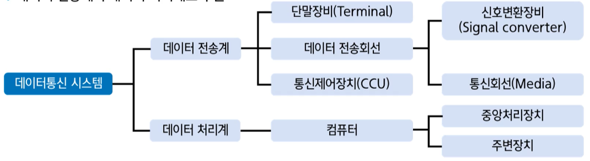
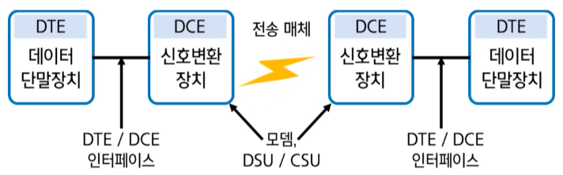

## 데이터통신 시스템의 구성 요소

- 데이터통신 시스템의 5가지 구성 요소

1. 송신기[sender]
2. 수신기[receiver]
3. 메시지[message]
4. 전송매체[medium]
5. 프로토콜[protocol]

==데이터 전송계==와 ==데이터 처리계==로 구분

### 데이터 처리 방식

1. 일괄처리[Batch processing]
2. 온라인 실시간 처리[On-line real-time processing]
3. 분산처리[Distributed processing]

### 데이터 전송계: 단말장치, 전송 회선, 통신 제어장치

#### 단말장치 [DTE]

1. 입출력 기능, 전송 제어 기능, 기억 기능 등을 수행
2. 입출력 장치와 전송 제어장치로 구성
3. 전송 제어 장치(TCU) : 데이터 전송 시에 발생하는 오류를 검출 혹은 정정하는 장치
4. 회선 접속부
5. 회선 제어부
6. 입출력 제어부

#### 신호 변환 장치 [DCE] 데이터 전송에 적합한 신호로 변환

1. MODEM: 변복조기
2. 변조 - 정보를 멀리 보내기 위해 운송수단에 싣는 과정, 복조는 반대
3. 데이터를 아날로그 신호로 변환하여 전송
4. 전화망과 같은 아날로그 망에서 사용
5. DSU/ CSU
6. 데이터를 디지털 신호로 변환하여 전송
7. [기저대역전송] - 변조하지 않고 그대로 전송

#### 통신 제어 장치 - 데이터 전송 장치와 컴퓨터 사이에 위치, 주 컴퓨터는 데이터 처리에 집중하고 컴퓨터를 대신해 데이터 전송에 관한 전반적인 제어기능 수행

1. [CCU]: 문자의 조립과 분해
2. [CCP]: 문자 및 메세지의 분해와 조립
3. [FEP]: 주 컴퓨터의 부담을 경감하기 위해 통신 회선 및 단말기 제어

#### 통신 소프트웨어 - 데이터 전송회선과 통신 제어장치를 이요하여 컴퓨터와 단말장치 사이에서 정보를 송수신하기 위한 프로그램

통신 소프트웨어의 세 가지 기본 구성 요소

1. 데이터 송수신
2. 통신 하드웨어 제어
3. 이용자 인터페이스 제어
