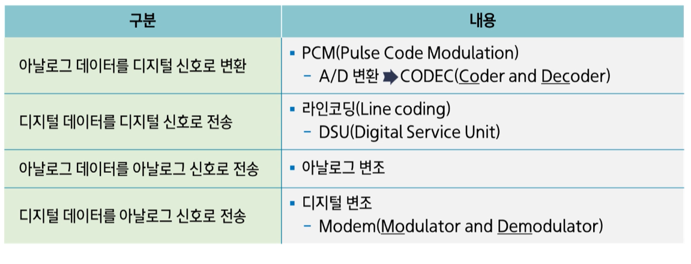

### 데이터 통신의 목적

- 정보를 <b>한 지점에서 다른 지점까지 정확하게 전달</b>하는 것

정보, 데이터 신호의 비교

1. 정보 : 특정상황이나 문제를 묘사하기 위해 조직화된 사실이나 데이터로 구성(의미 부여)
2. 데이터 : 단편적인 사실이나 자료의 단순한 나열, 추상적이고 객관적인 사실들의 모임
3. 신호 : 시간과 공간에 따라 변화하는 물리적인 양

### 아날로그와 디지털 데이터

1. 아날로그[Analog] : '비슷하다'는 말에서 유래 (연속적)

- 목소리, 화상, 음향, 영상 등
- 연속적인 파형 -> 시간에 따라 연속적으로 변화

2. 디지털[Digital] : 손가락이라는 뜻을 가진 'digit'에서 유래 (불연속적, 이산적)

- 문자, 숫자, 컴퓨터 데이터 등
- 이산적 파형 -> 순간적으로 변화

3. 아날로그 전송과 디지털 전송

- 데이터는 신호로 변환되어 전송됨
- 전송로를 이동하는 신호의 종류에 따라 아날로그 전송과 디지틸 전송 분류

1. 데이터를 디지털 신호로 변환하는 것은 **가까운 곳**
2. 데이터를 아날로그 신호로 <u>변조</u>하는 것은 **먼 곳**
3. 
