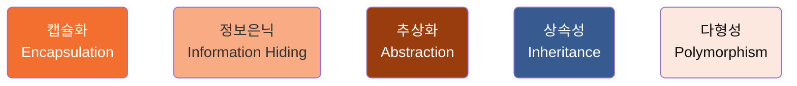
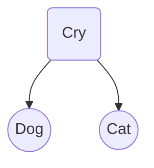
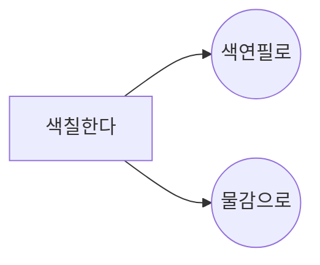
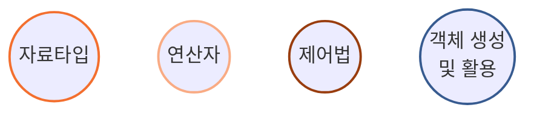
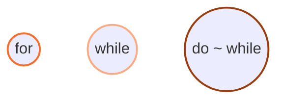

### 개요

- `객체들의 모임`으로 프로그램을 작성함
- 코드의 **재활용**성이 높음
- 시스템 **확장**이 매우 용이함

#### 종류

- JAVA
- Python
- C++
- Smalltalk 등

#### 구성 요소

- 객체(`Object`)
- 클래스(`Class`)
- 메시지(`Message`)

#### 특성

- 캡슐화
- 정보은닉
- 추상화
- 상속성
- 다형성

<br/ >

---

<br/ >

## 1. 절차형 vs 객체지향

| 절차형 프로그래밍 언어                      | 객체지향 프로그래밍 언어                                     |
| ------------------------------------------- | ------------------------------------------------------------ |
| - 작업의 순서가 중요함<br/ >- 함수들의 집합 | - 객체들 간의 상호작용이 중요함<br/ >- 클래스, 객체들의 집합 |

<br/ >

## 2. 객체지향 프로그래밍 언어의 종류별 특징

### JAVA

1. 멀티스레드 기능을 제공(동시에 여러 작업 처리 가능)
2. 분산 네트워크 환경에 적용
3. 캡슐화가 가능
4. 재사용성이 높음

### C++

1. C언어에 객체지향 개념을 적용
2. 객체를 중심으로 모델링하여 표현

### Smalltalk

1. 1세대 객체지향 프로그래밍 언어 중 하나
2. 최초로 GUI를 제공하는 언어

<br/ >

## 3. 클래스

:::danger Class

#### 객체의 모양을 선언한 틀

- 속성과 메소드를 가짐

:::

:::info Object

#### 객체

- 클래스의 모양을 토대로 생성된 실체

:::

| 속성(Attribute)                                                                                                                 | 메소드(Method)                                                                                                    |
| ------------------------------------------------------------------------------------------------------------------------------- | ----------------------------------------------------------------------------------------------------------------- |
| - 하나의 클래스 내에 속한 개체들이 가지고 있는 `데이터 값`들을 단위별로 정의함<br/ >- 성질, 분류, 식별, 수량 등의 상태를 표현함 | - `함수`와 같은 표현으로, 객체의 `실행 및 연산`을 정의함<br/ >- 객체의 상태를 참조하거나 변경하는 수단으로 사용함 |

<br/ >

## 4. 객체(Object)

#### 개념

- 클래스의 모양을 그대로 가진 실체
- 데이터 속성과 연산을 결합시킨 실체

#### 특징

- 프로그램 실행 중 생성됨
- 메모리 공간을 가짐
- '인스턴스' 라고도 함

| 클래스 | 객체                                  |
| ------ | ------------------------------------- |
| 사람   | 학생1, 학생2, 교수1, 교수2, 회사원... |
| 자동차 | 벤쓰, 비엠더, 아우리...               |
| 과자   | 고깔콘, 콘집, 양파닝...               |

- 서로 다른 속성과 메소드를 가짐

<br/ >

## 5. 객체지향 프로그래밍 언어의 특징



<br/ >

### 캡슐화

> 데이터와 데이터를 처리하는 함수를 하나로 묶은 것

- 캡슐화된 객체의 세부내용이 외부의 은폐 == 오류 위험 감소
- 캡슐화된 객체들은 재사용이 용이

:::note 상자 객체
캡슐화된 상자 안에는 복잡한 회로, 부품이 들어있을 수 있음
:::

### 정보은닉

- 캡슐화에서 가장 중요한 개념
- 다른 객체에게 자신의 정보를 숨김
- 자신의 연산만을 통하여 접근을 허용함

### 추상화

- 불필요한 부분을 생략하고 개략화하여 표현함
- 데이터의 공통된 성질을 추출하여 슈퍼클래스를 선정함

### 상속성

- 상위 클래스의 모든 속성과 연산을 하위 클래스가 물려받음
- 상속성에 의하여 하위 클래스는 상위 클래스에서 정의한 속성과 연산을 재정의하지 않고 사용할 수 있음

```ts title="JAVA"
class Cry{
  public void sound(){
    System.out.printIn("소리");
  }
}

class Dog extends Cry{
  System.out.printIn("멍멍");
}

class Cat extends Cry{
  System.out.printIn("야옹");
}
```



### 다형성

- 동일한 메소드가 객체나 클래스에 따라 다르게 작동
- 동일한 메소드를 사용하여 각 개체는 다르게 구현 가능

:::danger 이름이 같은 함수를 사용하되, 매개변수의 개수를 달리 하여 구현

- [x] 두 수를 더한다
- [x] 세 개의 수를 더한다
- [x] n 개의 수를 더한다

:::

:::warning 이름이 같은 함수를 사용하되, 내부의 내용이 모두 다를 수 있음



:::

<br/ >

## 6. JAVA를 활용한 절차적 프로그램의 핵심 문법



```js
public static void main(String[] args){
  ...
}

public : 접근 지정자. 메소드는 public (누구에게나 공개)
static: 객체 생성 전 부터 호출 가능
void: 리턴값 없음
String[]: 문자열의 배열
args: 매개 변수
```

## 7. JAVA를 활용한 객체지향 프로그램

### 자료타입

- 기본 타입

  | 타입      | 크기  | 타입   | 크기  | 타입    | 크기  |
  | --------- | ----- | ------ | ----- | ------- | ----- |
  | `Boolean` | 1bit  | `char` | 2byte | `byte`  | 1byte |
  | `short`   | 2byte | `int`  | 4byte | `float` | 4byte |
  | `double`  | 8byte |        |       |         |       |

- 레퍼런스 타입

  ```mermaid
  graph TD;
      a[배열에 대한 레퍼런스];
      b[클래스에 대한 레퍼런스];
      c[인터페이스에 대한 레퍼런스];

      style a stroke:#F36F2F,stroke-width:2px;
      style b stroke:#F9AB84,stroke-width:2px;
      style c stroke:#993D0F,stroke-width:2px;
  ```

### 연산자

| 구분   | 내용                              |
| ------ | --------------------------------- |
| 증감   | `++,` `--`                        |
| 산술   | `+`, `-`, `*`, `/`, `%`           |
| 시프트 | `>>,` `<<`                        |
| 비교   | `>`, `>=`, `<=`, `<=`, `==`, `!=` |
| 논리   | `&&`, `ㅣ`, `!`, `^`              |
| 조건   | `?`, `:`                          |
| 비트   | `&`, `ㅣ`, `!`, `^`               |

### 제어법 - 조건문

:::note 조건문
조건에 따라 실행
:::

```js title="조건문 - 단순 if"
if (val == 80) {
  System.out.printIn("average");
}
System.out.printIn("stop");
```

<details>
<summary>실행 결과</summary>

```bash
-- val 이 80인 경우
average
stop

-- val 이 80이 아닌 경우
stop
```

</details>

<br/ >

```js title="조건문 - if ~ else"
if (num % 2 == 0) System.out.printIn("even number");
else System.out.printIn("odd number");
```

<details>
<summary>실행 결과</summary>

```bash
-- num이 짝수인 경우
even number

-- num이 홀수인 경우
odd number
```

</details>

<br/ >

```js title="조건문 - cond ? stat1 : stat2;"
// if ~ else 문
if (i > j)
  max = i;
else
  max = j;

// cond ? stat1 : stat2;
int max = (i > j) ? i : j;

// 둘의 결과 값은 동일함
```

<br/ >

```js title="조건문 - switch ~ case"
int score = scanner.nextInt();
  switch (score / 10) {
    case 10:
    case 9:
      grade = 'A';
      break;
    case 8:
      grade = 'B';
      break;
    case 7:
      grade = 'C';
      break;
    default:
      grade = 'F';
  }
```

- default 문 생략 가능함
- case의 값
  - 문자
  - 정수
  - 문자열
  - 실수(x) (ex: 1.1)
  - 수식(x) (ex: i >= 100)
  - 변수(x) (ex: i)

### 제어법 - 반복문



```js title="반복문 - for"
// 1
int i;
for (i = 0; i < 10; i++){
  System.out.print(i);
}

// 2
int i, sum;
for(i= 0, sum=0; i<= 100; i++)
  sum += i;

// 3
int sum = 0;
for(int i = 0; i <= 100; i += 2)
  sum += i;

// 4
int sum = 0;
for(int i= 100; i>= 0; i--)
  sum += i;

```

<br/ >

```js title="반복문 - while"
int n = a.nextInt(); // 정수 입력
int sum = 0;
int count = 0;

while(n != -1){
  sum += n;
  count++;
  n = a.nextInt(); // 정수 입력
}
```

<br/ >

```js title="반복문 - do ~ while문 으로 A ~ Z 까지 출력"
char a = 'A';

do {
  System.out.printIn(a);
  a = (char)(a + 1);
} while {
  a <= 'Z';
}
```

<br/ >
<br/ >

:::danger 클래스

- 객체의 모양을 선언한 것
  (객체의 캡슐화)
- 메소드 : 함수
- 속성 : 변수로 구성

:::

:::info 객체

- 고유한 특성화 행동을 가짐
- 클래스의 틀대로 생성된 instance

:::

:::tip 객체의 캡슐화

- 내부의 모습을 볼 수 없게 하는 것
  (외부로부터 객체 보호)

:::

<br/ >

### 객체의 상속

1. 맴버를 **중복**하여 작성할 필요가 없음, 클래스가 간결해짐
2. 클래스들의 계층적 분류가 가능하므로 클래스 **관리가 쉬움**
3. 클래스의 재사용과 확장이 용이하므로 소프트웨어의 **생산성 향상**
4. `extends` 키워드를 사용하여 슈퍼클래스를 **확장 가능**

> 부모 클래스 : '슈퍼클래스'로 부를 수 있음  
> 자식 클래스 : '서브클래스'로 부를 수 있음

```js title="상위 클래스 예시"
class 할아버지 {
  String n;
  void walk();
  void speak();
}
```

```js title="하위 클래스 예시"
class 아빠 extends 할아버지 { // 클래스 '할아버지'를 상속받는 클래스 '아빠' 선언
  String address;
  void work();
  void learn();
}

class 아들 extends 아빠 { // 클래스 '할아버지'를 상속받는 클래스 '아빠' 선언
  String underwear;
  void cry();
  void listen();
}
```

<br/ >

### 객체의 다형성

- 같은 이름을 가진 클래스 또는 객체가 다른 동작이 가능함

:::note 메소드 오버로딩
이름이 같으나 행동이 다름
:::

```js title="메소드 오버로딩 예시"
class MethodOverloading {
  public int getSum(int i, int j){
    return i + j;
  }
  public int getSum(int i, int j, int k){
    return i + j + k;
  }
}
```

<br/ >

:::note 메소드 오버라이딩
슈퍼클래스의 메소드를 서로 다르게 구현함
:::

```js title="메소드 오버로딩 예시"
class Cry {
  public void sound() {
    System.out.printIn("Sound");
  }
}

class Dog extends Cry {
  System.out.printIn("mungmung");
}

class Cat extends Cry {
  System.out.printIn("Meow");
}
```

<br/ >

### 객체의 소멸

> new에 의하여 할당된 객체의 메모리를 반환하는 행위

1. JAVA는 자동으로 소멸
2. 가비지 콜렉션에 의해 가비지 수집 / 반환(자동으로 실행)
3. 강제 가비지 콜렉션을 시도할 경우, System.gc() 호출

<br/ >

### 객체의 활용

#### 배열

- [x] 선언

  ```js
  // 배열 타입(int), 배열 레퍼런스(test1), 배열 선언[];
  int test1[];
  char test2[]
  ```

- [x] 생성

  ```js
  // 배열 레퍼런스(test1), 배열 생성(new), 타입(int), 원소갯수(number)
  test1 = new int[10]();
  test2 = new char[20]();
  ```

- [x] 선언과 생성을 한 줄에

  ```js
  int test1[] = {0, 1, 2, 3, 4, 5, 6, 7, 8, 9} // 초기화된 값의 개수(10) 만큼의 배열 생성
  ```

<br/ >

```js title="배열을 활용하여 객체 생성"
arr[] p; // arr 배열에 대한 레퍼런스 변수 p 선언
p = new arr[5];
lg = p.length;

for(int i = 0; i < lg; i++)
  p[i] = new arr(i)
```

<details>
<summary>실행 결과</summary>

```bash
p[0] = new arr(0)
p[1] = new arr(1)
p[2] = new arr(2)
p[3] = new arr(3)
p[4] = new arr(4)
```

</details>

<br/ >

```js title="배열을 사용하여 순차적으로 접근 - for-each"
int[] val = { 1,2,3,4,5 };
int sum = 0;
for (int j: val) // 반복될 때 마다 j는 val[0], val[1], 값으로 설정
  sum += j;

System.out.println("합은" + sum);
```

<details>
<summary>실행 결과</summary>

```bash
합은 15
```

</details>

<br/ >

```js title="배열을 사용하여 순차적으로 접근 - for-each"
String names[] = { "하나", "둘", "셋", "넷", "다섯" };
for (String s: names) // 반복될 때 마다 s는 names[0], names[1], ...
  System.out.println(s + " ");
```

<details>
<summary>실행 결과</summary>

```bash
하나
둘
셋
넷
다섯
```

</details>
