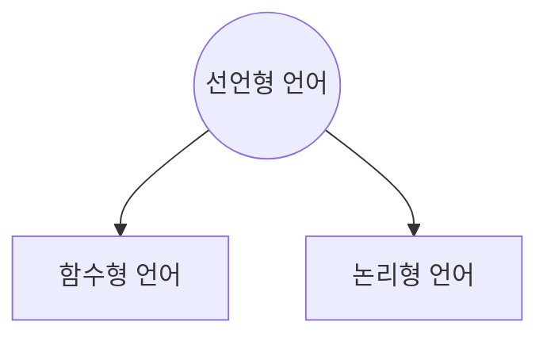

## 선언형 언어의 개요와 실행 절차

> ex. HTML, LISP, PROLOG, XML 등

### 개요

1. 프로그램이 수행해야 할 문제를 기술함

   - '어떤 방법으로' 가 아닌, '무엇과 같은지'를 설명하는 언어임
   - 제목, 글꼴, 표, 그림과 같이 '무엇'을 나타내야 하는 지 묘사함

2. 결과에 대한 목표를 명시함

3. 함수언어(Functional Language)와 논리언어(Logic Language)가 포함됨

   - 함수언어: 함수로 프로그램 구성
   - 논리언어: 기호논리기반 언어

## 선언형 언어의 특징

- 명령형 언어의 반대 개념임
- 가독성이 좋음
- 재사용성이 좋음
- 프로그램이 수행해야하는 문제를 기술함
- 목표를 명시하고, 알고리즘은 명시하지 않음



## 선언형 언어의 종류

| 종류     | 내용                                                                                                                                                                                             |
| -------- | ------------------------------------------------------------------------------------------------------------------------------------------------------------------------------------------------ |
| `HTML`   | - Hyper Text Markup Language의 약자<br/ >- 웹페이지를 위한 `마크업 언어`의 일종<br/ >- 제목, 단락 목록 등 본문의 구조적 의미뿐 아니라 링크, 인용 등을 지원하여 `구조적 문서`를 만들 수 있도록 함 |
| `LISP`   | - List Processing의 약자<br/ >- 실용적 목적 하에 컴퓨터프로그램을 활용하여 수학 표기법을 나타내기 위해 만들어졌으며 `LISP` 코드는 그 자체로 하나의 리스트임                                      |
| `XML`    | - Extensible Markup Language의 약자<br/ >- `W3C`에서 개발된 특수한 목적을 갖는 `마크업 언어`<br/ >- 다른 종류의 시스템끼리 데이터를 쉽게 주고 받을 수 있도록 함                                  |
| `PROLOG` | - programmation en logique(논리 프로그래밍)<br/ >- 논식을 토대로 오브젝트와 오브젝트 간 관계에 관한 문제를 해결함                                                                                |

- `마크업 언어`: 화면에 표시되는 형식이나 데이터의 논리적인 구조를 명시하는 언어

## 종류별 특징

### HTML

> 인터넷 표준 문서인 하이퍼텍스트문서 제작용 언어

- 특별한 데이터 타입이 없음
- 호환성이 좋고 사용이 편리함

### LISP

- 인공지능 분야에 사용됨
- 연결리스트가 기존 자료구조임
- 재귀호출이 많이 사용됨

```lisp
USE-VALUE  :R1  Input a value to be used instead.
ABORT  :R2 Abort main loop
Break 1 [5]
```

### PROLOG

- 논리학 기초의 고급언어
- 인공지능 분야에서 사용함(논리적 추론, 리스트 처리)

### XML

- HTML의 단점을 보완하여 구조화된 다양한 문서를 상호 교환할 수 있음
- 구조화가 가능함

## HTML

> 가장 단순한 Web 페이지 작성 언어

:::danger HTML

- Active-X, 플래시 등 여러 플러그인을 통하여 사용
- PC에서만 지원

:::

:::info HTML5

- 별도의 플러그인 필요 없음
- 다양한 기기를 통하여 지원됨

:::

## HTML5의 특징 (HTML 4.01 대비)

- 표준화된 웹 자원으로 사용
  - HTML 4.01의 상위버전
  - 2014년 웹 표준화 기구인 W3C에 의해 웹표준으로 선정
  - 별도의 플러그인 설치 없이 다양한 멀티미디어 콘텐츠와 앱 사용 가능
  - Active-X, 플러그인, 플래시 등 비표준 기술을 지양
- PC,모바일 단말기 등에서 모두 사용
- 시맨틱 태그를 사용함
  - 각 태그를 통해 문서의 구조와 의미를 내포
- 레이아웃 태그를 사용함
  - 페이지, 섹션 등 레이아웃을 구분
  - `<header>`,`<nav>`,`<main>`,`<article>`,`<section>`,`<aside>`,`<footer>`

## HTML5 기본구조

#### `<!DOCTYPE html>` : HTML5 표준 문서임을 선언

#### `<html>` : HTML 시작

#### `<head></head>` : 문서 제목(CSS 스타일, 메타 데이터 등 정의)

#### `<body>` : 문서의 본문(텍스트, 이미지, 동영상 등)

#### `<!- 보이지 않아요 -->` : 주석(화면에 출력되지 않음)

## CSS(Cascading Style Sheet)

1. style 태그 사용  
   `<head>~</head>사이에<style>~</style>사용`

   ```html
   <style>
     body {
       background-color: skyblue;
     }
   </style>
   ```

2. 인라인 style  
   style 속성을 태그 안에 사용

   ```html
   <div style="">content</div>
   ```

### 형식

```css
태그 {
  속성: 속성값;
  속성: 속성값;
}

h2 {
  color: blue;
}
```

## HTML5 기본 문법 및 활용

1. 대부분의 경우 태그는 쌍으로 이루어짐  
   `<table></table>`, `<i> </i>`...

2. 단독으로 사용하는 태그를 사용할 수 있음  
   `<br>`,`<hr>`...

3. 각 태그에 대하여 스타일을 지정할 수 있음  
   `<hr style="width:50%; text-align:left;">`...

<br/ >


- 문단의 제목 달기

  ```html
  <h1>제목 1</h1>
  <h2>제목 2</h2>
  <h3>제목 3</h3>
  <h4>제목 4</h4>
  <h5>제목 5</h5>
  <h6>제목 6</h6>
  ```

- 단락 나누기

  ```html
  <p>한 줄</p>
  ```

- 수평선

  ```html
  <hr />
  ```

- 줄바꾸기

  ```html
  <br />
  ```

- 포맷 그대로 출력하기

  ```html
  <pre>
    이 렇 게  하     면 
    그
    대   로
  
    나와요
  </pre>
  ```

- 한 칸 띄기, 왼쪽 꺽쇠 `<`, 오른쪽 꺽쇠 `>`

  ```html
  안&nbsp;녕&lt;하&gt;세요
  ```

- 글자 서식

  ```html
  <b> 글자굵게</b>
  <strong> 글자굵게</strong>
  <em> 글자강조</em>
  <i> 글자이텍릭</i>
  <del> 글자취소선</del>
  <ins> 글자밑줄(추가의의미) </ins>
  <sup> 윗첨자</sup>
  <sub> 아래첨자</sub>
  <mark> 형광펜으로마크</mark>
  ```

- 블록태그

  - `<p>` `<h1>` `<div>` `<ul>` `<ol>`...
  - 항상 새로운 라인에서 시작하여 출력함

- 인라인 태그

  - `<b>` `<a>` `` `<span>`...
  - 블록에 삽입되어 출력함

- 리스트

  - 순서가 있는 리스트

    - `<ol> <li>... </li>... </ol>`
    - ol type= 1,a,A,i,

  - 순서가 없는 리스트

    - `<ul><li>... </li>..~ </ul>`

- 테이블

  ```html
  <table>
    : 표전체를담는컨테이너
    <caption>
      : 표제목
    </caption>

    <thead>
      : 머리글(글자굵게)
    </thead>

    <tbody>
      : 데이터셀그룹
      <tr>
        : 행
        <th>: 열제목(헤딩) 셀</th>
        <td>: 데이터셀</td>
      </tr>
    </tbody>

    <tfoot>
      : 바닥셀그룹(글자굵게)
    </tfoot>
  </table>
  ```

  - 테이블의 셀 병합

    - rowspan : 세로 셀 합치기
    - colspan : 가로 셀 합치기

    ```html
    <table border="1">
      <tr>
        <td colspan="2">구분</td>
      </tr>
      <tr>
        <td>1학기</td>
        <td>2학기</td>
      </tr>
    </table>
    ```

- 이미지 태그

  ```html
   : 이미지출력
  
  ```

- 하이퍼 링크

  - `<a> ~ </a>`
  - href의 속성을 활용하여 어떤 웹사이트로 이동
  - `<a href="주소" target="_blank">`
    - target
      - \_blank: 새로운 브라우저 윈도우(탭) 생성
      - \_self: 현재 윈도우
      - \_parent: 부모 윈도우
      - \_top: 최상위 브라우저 윈도우

- 인라인 프레임

  - HTML 페이지 내에 HTML페이지를 삽입할 수 있음  
    `<iframe src="주소" name="윈도우 이름" width="픽셀단위 폭" height="픽셀단위 높이"></iframe>`
